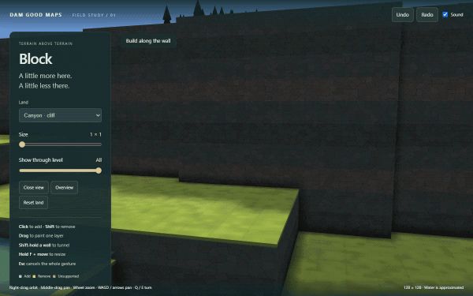

# Block

A standalone precision tool for Dam Good Maps. Point at a face. Add a little land, or hold Shift to take it away.
The ghost is the exact edit. Red means the whole step is refused; nothing is automatically supported.



## Run

Requires Node 22.12+ (tested with Node 24) and Chrome or Edge. From the repository root:

```sh
npm --prefix investigation/block-tool ci
npm --prefix investigation/block-tool run demo
```

Open the printed local address. Dependencies and generated output stay in this folder. Erode and product files
are imported unchanged. The demo is not an adopted editor feature.

## Controls

- **Click:** add against the pointed face. **Shift+click:** remove. Tops, walls and ceilings work alike.
- **Size:** square, 1×1–8×8. Use the slider, **[ / ]**, or hold **F** and move horizontally; release F to set.
- **Drag:** paint one layer on the starting face's plane. The plane stays fixed even after its blocks change.
- **Shift-hold a wall:** first cut immediately; after 420 ms, dig one block deeper every 240 ms. Release stops.
  Moving more than five screen pixels changes the gesture to a painted layer. A refusal stops the hold.
- **Show through level:** hide higher terrain, water and objects; pick and edit the visible faces. Hidden land
  still participates in support checks. The square cannot cross above the visible level.
- **Esc:** cancel the entire active gesture (or cancel F-resize). **Ctrl+Z / Ctrl+Y:** undo / redo one gesture.
- **Right-drag:** orbit. **Middle-drag** or **Shift+right-drag:** pan. Wheel zooms. WASD/arrows pan; Q/E turn.
  **Close view / Overview** move the camera only when pressed. Choosing a case explicitly opens its close view.

Land choices: Canyon seed 2's cliff; the same Canyon after replaying Erode's pinned `canyon-cave` operation;
a naturally level patch of Highlands seed 5. Every map is 128². Reset land starts its selected case again.

## Verify

```sh
npm --prefix investigation/block-tool run typecheck
npm --prefix investigation/block-tool run check
npm --prefix investigation/block-tool run build
npm --prefix investigation/block-tool run captures
```

`captures` uses installed Chrome through Playwright; no browser download or game launch. It starts and closes its
own local server. `check` writes its large action stream only to ignored `local/random-operations.json`.
`build` writes only to ignored `local/dist/`; the Vite cache is there too.

[REPORT.md](REPORT.md) has the results and limitations. [INTEGRATION.md](INTEGRATION.md) describes adoption at
3D step 3. Original generated land, procedural geometry and shader textures only. The two quiet sound slices
reuse Erode's CC0 recordings: adamgryu's `Rocks.wav` and Vrymaa's stone scrape. Sources, licences and hashes are
in [Erode's attribution](../erode/ATTRIBUTION.md); no audio is duplicated here. No Timberborn assets are used.
