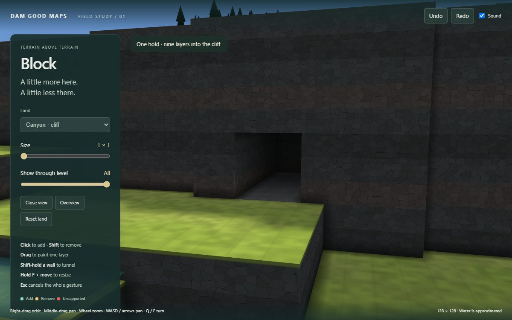
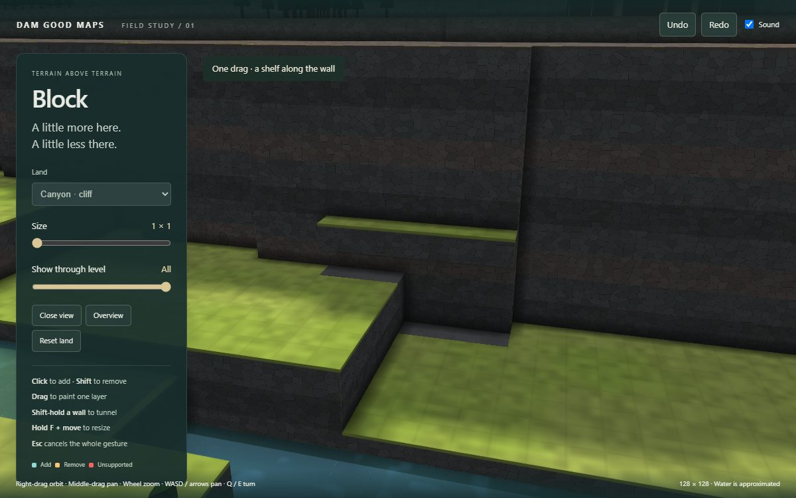
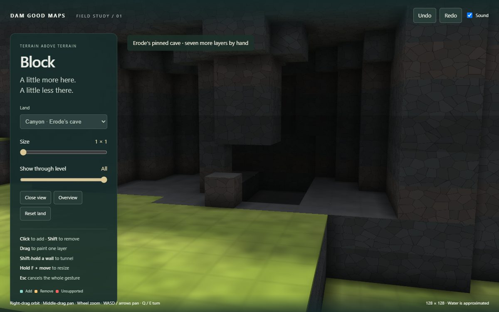
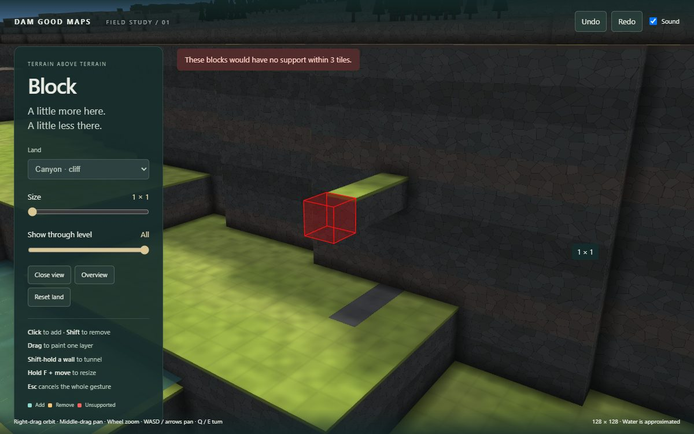

# Block: the demo

One precision tool, on Erode's shared terrain, support check and mesher. All six faces work; a fixed-plane drag
paints one layer and a stationary Shift-wall hold digs inward every 240 ms. Ghosts are the literal transaction,
including red existing roofs when their support would go. Refused steps change nothing. Undo/redo and Esc restore
the whole gesture; water and objects follow accepted steps, and a displaced start moves to valid level ground.

| Tunnel: one hold | Ledge: one drag |
|---|---|
|  |  |
| Erode's cave, hollowed further | Fourth unsupported block refused |
|  |  |

[Short building/digging GIF](captures/build-and-dig.gif). Canyon seed 2 and Highlands seed 5, both real 128² DGM
fixtures. The cave starts by replaying Erode's `canyon-cave` pin: (93.5,71.5,4.5), Power 70, Auto Size, seed 1.

**Checks:** 864 seeded gestures / 2,137 steps; 1,785 accepted, 199 refused, 153 no-ops. Every size, both directions,
all six normals and all three cases, with clicks, drags and holds. **0 dropped voxels** against the independent
game-rule oracle, **0 refusal mutations, 0 ghost mismatches, 0 replay mismatches**. Each recorded replay matches
the terrain bytes exactly. Focused checks cover dependent roofs, no automatic support, stale previews, bedrock,
slice/edge bounds, objects, start relocation, water refresh, cancel and history. [Numbers](checks/results.json).

**Browser:** Chrome 154, RTX 4080 SUPER, 1200×750. Real hold/release, Ctrl+Z/Y, Esc, fixed-plane drag, F readout,
layer slice, an underside click, refusal and unchanged camera all pass; **0 browser errors**. Across all sizes
and three cases: worst ghost **1.8 ms**, accepted edit/update **2.9 ms**, input to render submission **10.2 ms**,
next animation-frame opportunity **14.3 ms** (120 samples). This meets the one-to-two-frame aim on this machine;
it is a browser timing, not a physical display-latency measurement. [Browser results](checks/browser.json).

**Limits:** water preserves fixture elevations and uses Erode's roofed-gap approximation: no flow, pressure or
full open-surface redistribution. Start relocation uses Erode's nearest dry, clear 3×3×5 site. The view uses
Erode's procedural look and object stand-ins; lighting catches up after 320 ms. No in-game probe or 256² timing.
The final standalone Node sweep's worst preview was **7.4 ms**. An earlier concurrent run reached **114.1 ms**;
measure adversarial edits and start relocation on the target hardware at adoption, beyond ordinary pointer use.

**Regenerate:** the four commands in [README](README.md#verify) rebuild checks, production output and captures.
The capture script includes actual pointer/keyboard assertions and records the pinned tunnel operation.
Large random recordings go to gitignored `local/random-operations.json`; Vite output/cache go to `local/`.
Only this short report, source/lockfile, small check summaries, one action sample, four JPEGs and one short GIF
are committed. No copied maps, duplicated sounds, game assets, product edits or Erode edits.
