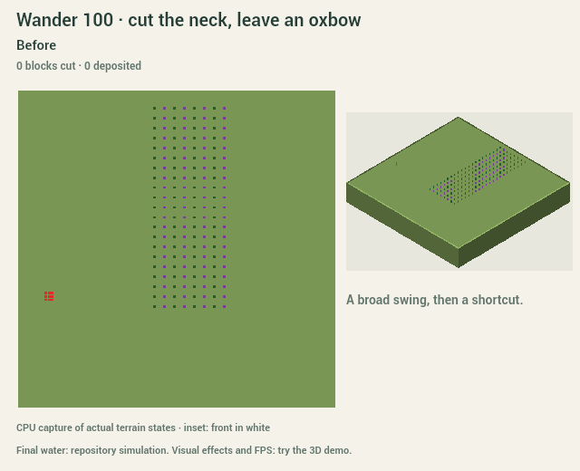
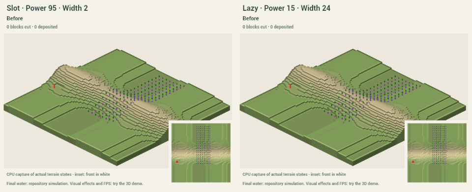

# Let the water carve

Ready for another try. From the repo root:

    npm --prefix investigation/carve run demo

Open the printed local URL (normally http://127.0.0.1:5198/).
**Unleash:** click an origin. **Aim:** click origin, then destination.
Defy gravity permits an uphill destination. Keep river is the default;
Dry canyon leaves no new source. Steep keeps gorges; Wide opens terraces.

## Character controls

- **Wander:** 0 charges ahead; 100 makes wider, more frequent swings around
  an overall heading. It no longer accumulates turns into circles. Every
  setting has the same 110° heading limit; stalled reaches straighten.
- At high Wander, a long bend can form a narrow neck. The river cuts a
  shortcut and leaves a crescent lake, sealed by sediment at both mouths.
  The moving head never crosses its earlier path; a detected neck cutoff is the one exception
  that can connect older channel sections. It happens only where the bend,
  available power, ground and protected start allow it.
- **Width follows Power** starts checked. Uncheck it to choose a nominal
  channel width of 2–24 tiles; banks extend beyond that. Try Power 95 / Width 2
  for a deep slot, or Power 15 / Width 24 for a wide, shallow river.
  The retained source follows nominal Width: a slot keeps a modest stream;
  a wide river keeps a big one (D199 on dev). Linked Width keeps the original
  Power-to-source relationship.
- Every course has smooth narrow and broad reaches, constrictions, rapids
  and occasional whole-level falls. Wider channels can divide around a
  coherent hard rock core and rejoin. Rock layers still leave benches.
- **Try another path** repeats the last kept carve's origin, destination and
  settings on its original land. It restores those settings in the controls.
  Each attempt gets the next recorded Personality seed. It does not stack
  another canyon on top. Stop whenever you like, or let it finish.

Pause and speed change playback. Stop keeps everything carved so far.
**Esc or Undo cancels the entire active carve**, including final water settling.
For an alternative, that restores the previously kept version. Finished
alternatives each undo in one step to that version; Redo assigns exact stored
terrain, entities and water. Save run / Replay run also retain the original
land for another path. Cancelling an attempt still consumes its seed.

The clean 3D view uses the editor's actual shaders, soil colours, shadows,
models and waterfall curtains. The front has whitewater, muddy flow and a
fixed pool of breaking chunks/dust. Split ribbons pass either side of the
rock core. Follow the river tracks the head; reduced motion disables effects,
water animation and camera motion. Stop and Undo remain visible while the
settings scroll. Three.js remains exactly 0.186.0.

## Captures

Small animated CPU captures of actual step states, not GPU recordings.
The inset shows the channel and moving front. Comparisons compress each
run's progress; labels give its own acknowledged time. Each GIF is capped at
18 frames and has a same-name PNG for reduced motion.
[Settings, seeds and step counts](captures/scenarios.json).

Also refreshed: [mountain to lake](captures/unleashed-mountain.gif),
[aimed ridge](captures/aimed-ridge.gif), [uphill carve](captures/defy-uphill.gif),
[low/high Power](captures/low-high-power.gif),
[split around rock](captures/split-reach.gif) and
[actual M9 Highlands seed 18](captures/generated-force.gif).

Final water comes from the repo's simulation and real sources. Ordinary runs
keep the canonical solve. A sealed oxbow keeps water simulated before its
mouths closed, then uses the repo's normal settling solve on the final terrain.
It gets no hidden source or fixed water level.
**A closed endpoint basin can fill the canyon into a lake.** Dry canyon
exposes the landform without a new source; existing water follows the game.

## Checks and decisions

    npm --prefix investigation/carve test
    npm --prefix investigation/carve run typecheck
    npm --prefix investigation/carve run build
    npm --prefix investigation/carve run captures

[26 model checks](captures/checks.json),
[909 route sweep runs](captures/course-checks.json) and
[12 actual worker checks](captures/worker-checks.json) pass. They cover winding
routes, independent width, seeded differences, fixed geology, connected split
channels, integer terrain, no new isolated pits/spikes, one direction per tile,
protected start, object removal, canonical water, portable alternatives and
exact cancel/undo/redo. The checked slot reaches 12 levels of incision; the
wide lazy example cuts one level. Browser checks exercise the controls and
alternative lifecycle in the clean view.

The sweep covers all 101 Wander values in Unleash, Aim and uphill Aim, with
low/high Power and the linked-width defaults. Every rolling 16-move reach
reduces endpoint distance or downstream drainage potential; all runs end at
a lake, edge, destination or exhausted progress/power. On whole-level flats,
downstream potential measures progress toward drainage, since height cannot
drop forever. The oxbow test verifies a wet shortcut,
deposited material at both dry mouths, and a disconnected 108-tile lake more
than three levels deep. It survives another 256 ticks of unmodified game
physics; dry canyon stays dry. Both water stages are bit-exact across slice
sizes, and the actual worker restores the whole lake with one Undo/Redo.

Isolated lakes evaporate under the game's rules. In this capture the final
solve reaches the repo's four-day limit with water still slowly receding, so
it reports settled=false. We keep that status and the actual water result.
The lake is a retained body of river water, not a permanent replenished pond.

The latest character pass measures curvature across six stations. Outer bends
scour up to two extra levels and shift the cut bank out; inner banks retain
whole-level shelves. Straights contract between those bends. The same lane
geometry drives the light effects. A terrain cross-section regression checks
the outer bank is both wider and deeper at maximum Wander.

One carve second means ten acknowledged steps. Frame rate, playback speed and
effects never enter the model. Width changes smoothly with distance; local
constrictions and fixed outcrops provide variation without tile noise. A wider
override spreads the same cutting work, while a slot concentrates it. These
are exaggerated editing rules, not calibrated landscape predictions.

The start stays on its ground. Other objects lose their ground with the cut.
Start resource checks and reachable-land status update without blocking
consequences. Deposits stay coherent; each tile keeps its first direction for
that run. A short route look-ahead reserves the mouth bars. Concurrent scour
and infill leave their net surface in place, instead of visibly digging a
mouth and raising it again. The debris count includes that sediment. Fine
sediment remains a diagnostic carried load, exported at edges.

Generation, carving, meshing, checks and water run in a worker. Main-thread
uploads use a two-chunk / 3 ms scheduling target. The measured 256² model-step
timings are recorded in captures/checks.json; they are CPU measurements.
**Judge rendered 256² frame rate on your PC using the FPS/p95 readout.**
Painting latency still needs validation in Live editing; this demo has no
painting tool. Maps include real generated seeds at 128²/256² and three Real
places, alongside labeled process studies.

All changes stay in investigation/carve on the dev-based investigation/carve
branch. M9 v2 c77026b was read without merging it into this worktree; PR #32
is now on dev. Shared geology and adoption remain proposals in [INTEGRATION.md](INTEGRATION.md).
