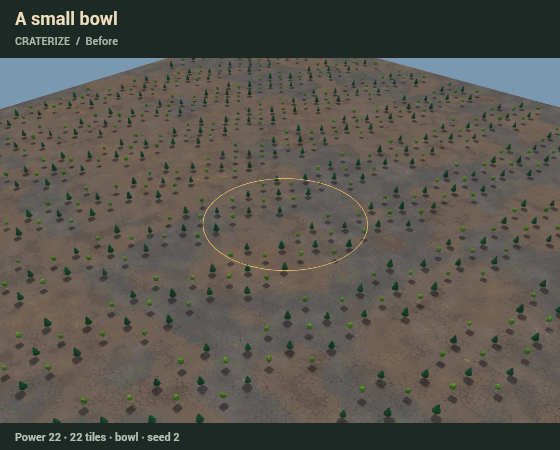
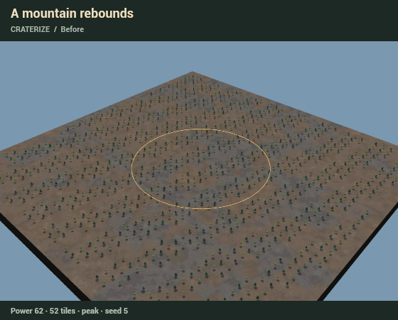
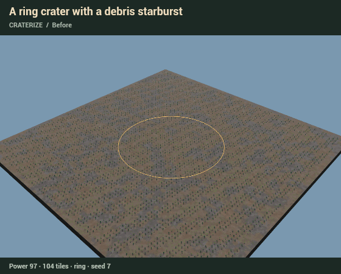
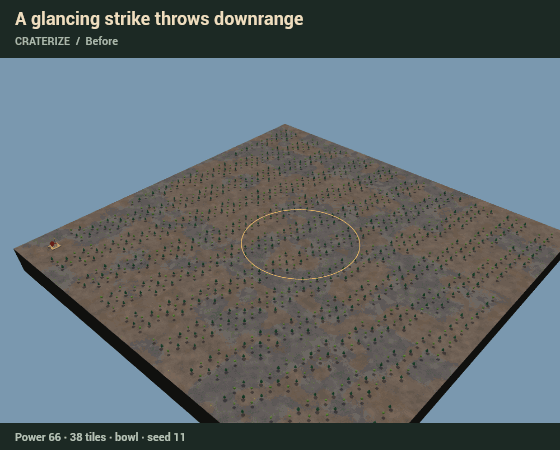
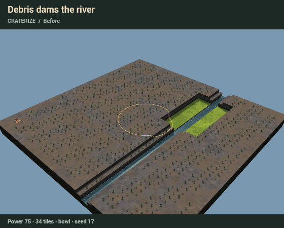
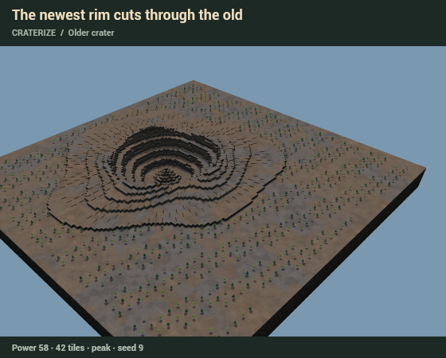
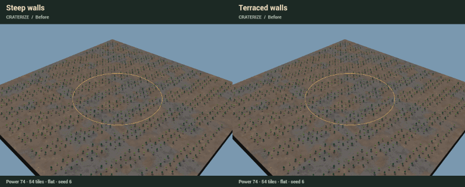

# Craterize

A working, separate impact tool. From the repository root:

    npm --prefix investigation/craterize run demo

The first run installs this folder's dependencies. Open the free local port
printed at startup. Three.js is exactly **0.186.0**, matching the repository.

**Strike:** click the land. **Aim:** drag from the hit along its travel.
A longer drag makes a more glancing, oval impact. Right drag orbits; scroll
zooms. The keyboard cursor uses arrows and Enter. Every setting is present;
Size follows Power until unchecked. Try another replaces the last impact on
its original ground, with the next recorded personality.

Esc or Undo reverts the whole impact, including water and trees. Redo and
saved replay assign the stored result exactly. The start turns the ring red
with “Start here.” Edge strikes make partial craters, and newer craters cut
through older ones. Existing sources stay unchanged; Craterize adds no water.

Rays curve into ragged, broken streaks with changing widths, tapering coverage
and scattered secondary pits. Heavy debris makes broad, raised starburst arms
with more visible pit chains; Light keeps its sparse one-level streaks.
They fade before the map border unless the
diameter reaches 65% of the shorter map side. Steep walls drop through a short
cliff face; Terraced walls have three broad benches separated by sharp scarps.

## Captures

Actual browser-rendered sequences on clearly labelled process studies.
Each shows before, the moment and the kept result; the water-settling wait
is compressed. [Settings, seeds and frame times](captures/scenarios.json).
The [still contact sheet](captures/contact-sheet.jpg) is the reduced-motion alternative.
The updated [ring and rays](captures/ring-rays.png) and
[Steep/Terraced comparison](captures/walls.png) are also available as stills.

## Checks

    npm --prefix investigation/craterize test
    npm --prefix investigation/craterize run typecheck
    npm --prefix investigation/craterize run build
    npm --prefix investigation/craterize run browser
    npm --prefix investigation/craterize run captures

To refresh only the two ray sequences and their contact-sheet panels:

    npm --prefix investigation/craterize run captures -- --rays

Browser checks/captures use installed Edge on Windows; elsewhere install the
Playwright Chromium browser first. Large work files stay in ignored folders.

[20 model checks](captures/checks.json),
[10 worker checks](captures/worker-checks.json) and
[11 browser checks](captures/browser-checks.json) pass. They cover all
anatomies, deterministic slices, whole levels, source/start protection,
exact history, cancellation during meshing/settling, saved alternatives,
pointer gestures, reduced motion and all six generated/Real-place choices.
Typechecking and the production build pass.

At the ring capture's unchanged size, seed and camera distance, Heavy rays
raise 3,173 tiles (1,434 by at least two extra levels), versus 475 one-level
tiles for Light. Secondary pits cover 595 exterior tiles versus 137.
All ten arms contribute to the starburst; the outer 16-tile border remains
free of ray changes. The checks also preserve the accepted wall profiles.

In the river study, debris raises the channel sill from **5 to 9**.
Unchanged sources then flood **777** previously dry upstream tiles.
Water settles after 2,176 repository simulation ticks.

The 256² model measured **36–52 ms** total, planned in four-row slices.
The final browser run measured **162 FPS**, **6.2 ms p95**, and **1.0 ms**
for cached Undo at 256². These are local headless-browser measurements, not a
guarantee for every GPU. The demo's live readout is the useful check on yours.
Initial generation of the 256² River Valley seed took about 20 seconds here,
in the worker; subsequent impacts do not regenerate it.

## Decisions

- Based on dev `18a38d9` (D202). The outer checkout has unrelated untracked work, so this branch uses an isolated checkout under `.work/`.
- All authored files, dependencies, reports and captures stay here. Root living documents and contact sheets remain untouched under the explicit task scope; integration changes are proposals only.
- Carve source read at `investigation/carve` (`3594f9c`): reuse its worker epochs, integer results, exact operation snapshots, dirty chunks, clean shaders, fixed effects pools and horizontal hard layers. No PR review was performed.
- Power sets energy and default diameter. A manual diameter redistributes that energy into broad shallow or narrow deep impacts. Auto centre follows diameter.
- Geology stays fixed through successive impacts and personality changes. Try another replaces the last impact from its original ground; cancelling restores the kept version.
- Ray density fades through irregular lobes and soft edges. Heavy uses wider, longer bands with one to three levels of raised relief, short breaks and larger pit chains, so the starburst remains visible at map scale. Light retains its sparse one-level rubble patches. Curved paths carry offset secondary pits; ordinary impacts leave an edge margin. Steep and Terraced use independent wall profiles; Bowl retains its rounded inner floor in either mode.
- Existing water continues from its stored depth through the repository WaterSim. No source or prefilling is introduced by an impact.
- Height limit is 22, with layer 22 empty. Start footprint and entrance margin remain untouched even when ejecta reaches them.
- Auto chooses Bowl below diameter 28, Peak below 68, then Ring. These are deliberately compressed editing thresholds. The shape language follows [NASA's crater overview](https://www.nasa.gov/solar-system/asteroid-day-and-impact-craters/) and [secondary-chain observations](https://science.nasa.gov/photojournal/crater-ejecta-and-chains-of-secondary-impacts/); this is not calibrated shock physics or a material-conserving ejecta solver.
- Fallen trees retain dead-tree components and radial preview poses. Native export of horizontal trees needs an explicit choice. This demo does not export .timber files or handle caves; [INTEGRATION.md](INTEGRATION.md) gives adoption proposals only.

## Progress

1. Read the requested plans, format, simulation and Carve source. Created the isolated dev-based branch and standalone package.
2. Built the deterministic impact model and exact result format. Seventeen model checks pass. In the river study, ejecta raises the sill from level 5 to 9; unchanged sources raise upstream water from 0.26 to 2.52 levels after 768 simulation ticks.
3. Added the clean 3D demo, sliced worker, fixed effects pool, immediate view restoration, saved replay and browser checks. Ten worker lifecycle checks and eleven browser checks pass. The river study now includes an upstream floodplain; its 777 newly flooded tiles settle after 2,176 ticks. The earlier narrow-channel measurement above remains as the first model-step result.
4. Recorded seven browser sequences and one still contact sheet (under 4 MB together). Frame inspection caught and fixed premature cave shading and rim shadows during deformation; old lighting now transitions with the land, and trees remain standing until impact. Refreshed browser checks, typechecking and the production build pass. Integration remains a proposal.
5. Replaced straight ray fences with curved, tapering, broken bands and scattered pits. Separated the wall profiles into near-vertical cliffs and broad terraces. Nineteen model checks and ten worker checks pass, including ray breakup, edge clearance, cliff height, terrace width, exact replay and unchanged river damming.
6. Refreshed all seven sequences and the contact sheet to match the revised morphology, with dedicated ring/rays and side-by-side wall stills. Inspected the final renders; all eleven browser checks, typechecking and the production build pass. Captures and check reports total about 4.3 MB.
7. Strengthened Heavy rays into coherent, curved starburst arms with visible raised relief and pit chains; Light and the accepted wall profiles stay unchanged. Twenty model checks and ten worker checks pass, including Heavy/Light contrast, all ten arms, distance fade, protected borders and exact replay. Tuned at the ring capture's original camera distance; refreshed only the ring and glancing ray sequences and their contact-sheet panels.
8. Visually checked the refreshed ring at the original framing. All eleven browser checks, typechecking and the production build pass with the stronger rays; 256² rendering measured 162 FPS / 6.2 ms p95. The local demo remains on the same port.
