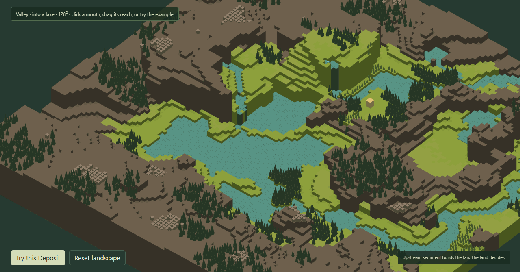
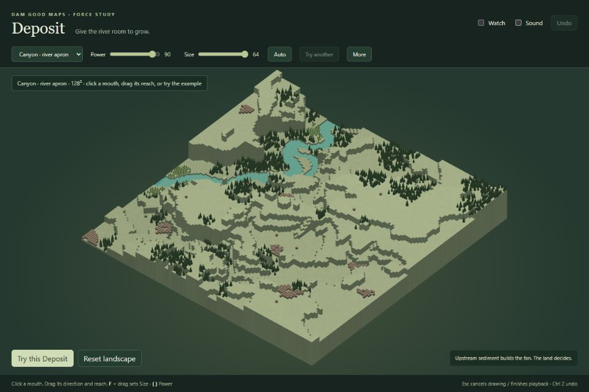
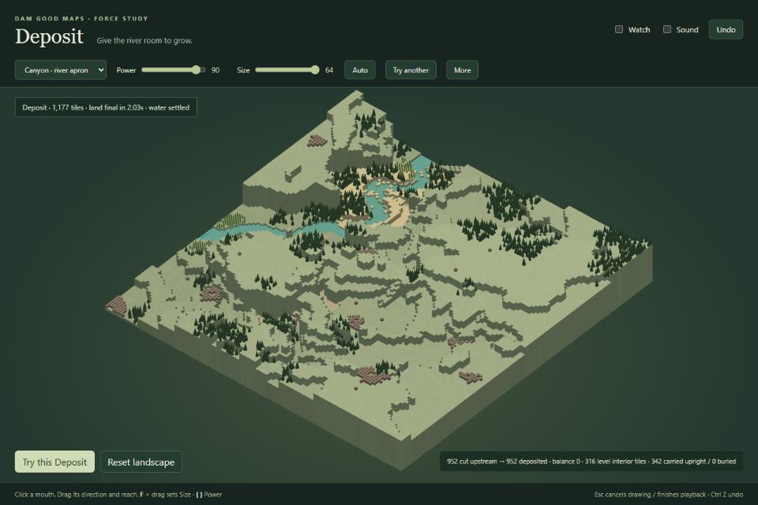
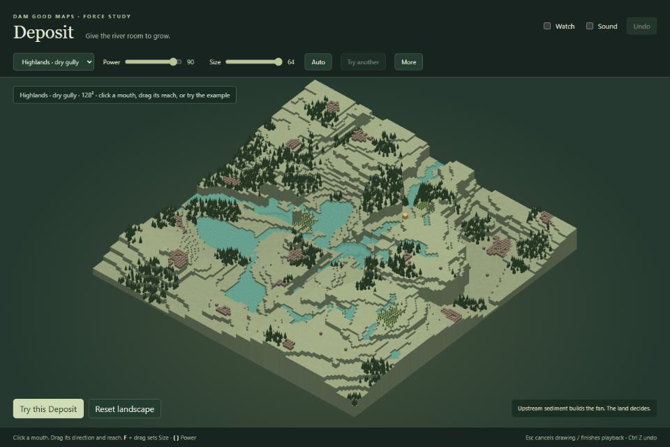
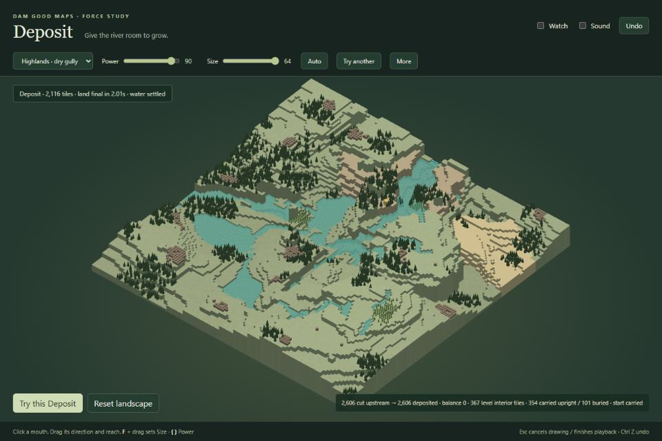
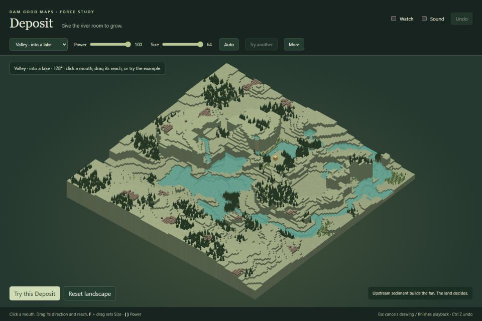
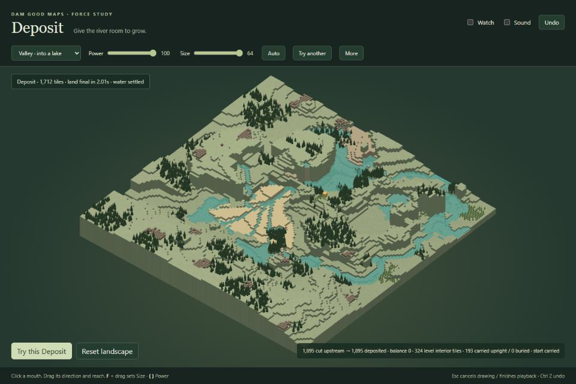

# Deposit

Click a valley mouth. Sediment builds a fan below it, while the valley above deepens a little.
Drag to set direction and reach. Three original Dam Good Maps landscapes, each at 128².

From the repository root on this branch:

```powershell
npm --prefix investigation/deposit ci
npm --prefix investigation/deposit run demo -- --port 5177
```

Open the printed localhost address. Choose a landscape and **Try this Deposit**, or draw anywhere.
**Power** sets sediment supply. **Size** sets a click's width; Auto follows Power.
A drag sets its own reach and spread. The band shows the gesture, with no circle.

**More** has Channels (Auto, Few, Many) and the shared Floor (1–22).
Floor uses **Default**, following the forces core. Ground already below it stays safe.
If no upstream sediment can be cut above Floor, the fan receives none.

**Watch** grows the fan four times slower, with drainage threads filling and shifting.
**Try another** replaces the last fan with a different seed. **Undo / Ctrl Z** restores everything,
even during planning, growth or water settlement. **Esc** cancels drawing or finishes playback.
Hold **F** and drag horizontally for Size; **{ / }** change Power. Both numbers stay visible.
The camera stays still during Deposit; the wheel zooms when wanted.

The balance panel reports sediment cut and deposited, level land, carried objects and burial.
Sources always ride their ground. Shrubs bury at two levels, trees at three, other objects at four;
survivors stay upright. The start moves to dry level ground when needed.

Checks and regeneration:

```powershell
npm --prefix investigation/deposit run typecheck
npm --prefix investigation/deposit run build
npm --prefix investigation/deposit run check
npm --prefix investigation/deposit run check:water
npm --prefix investigation/deposit run samples
npm --prefix investigation/deposit run captures
```

Captures require the running demo and Microsoft Edge. Set `DEPOSIT_URL` for another address.
The script renders at 1280×854, downscales the six JPEGs to 960×640, and writes a 520px Watch GIF.
`samples.ts` regenerates Highlands seed 5, Canyon seed 2 (badwater off), and Lake Basin seed 4
with the real generator. The compressed fixtures include their full specs.
Dependencies and build output are ignored. Exploratory scripts, frames and bulk results belong
in the gitignored `local/` folder.
Four small recorded gestures in `checks/water-regressions.json` reproduce the slow lake settlements;
`check:water` verifies their convergence and identical results in worker-sized slices.



| Case | Before | After |
| --- | --- | --- |
| Canyon river |  |  |
| Dry Highlands gully |  |  |
| Valley into a lake |  |  |

[Findings](REPORT.md) · [Adoption](INTEGRATION.md) · [Asset licences](ATTRIBUTION.md)
