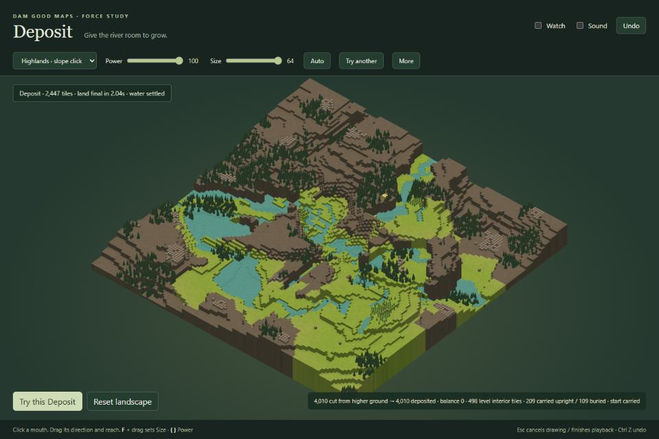
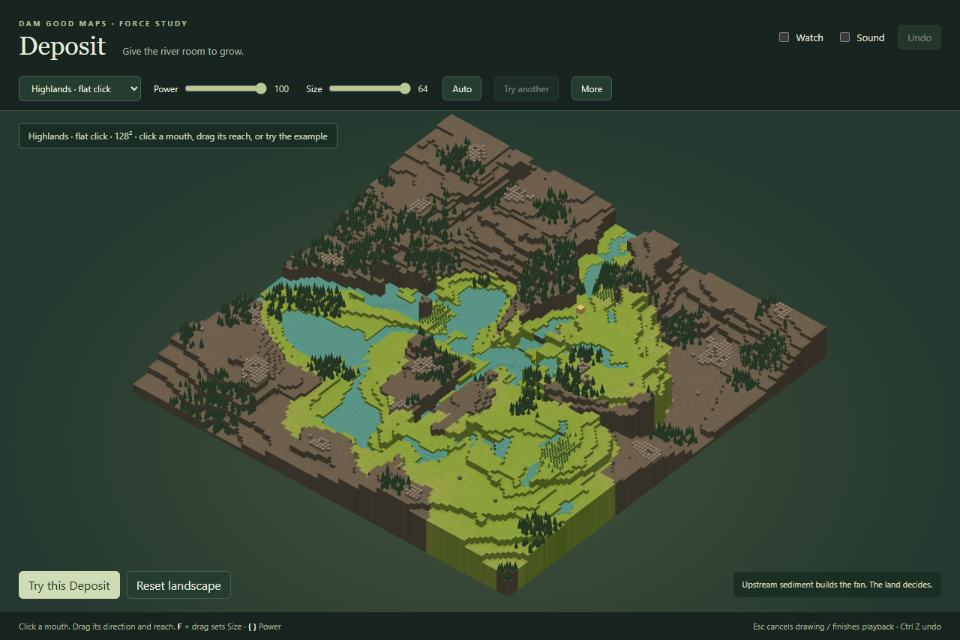
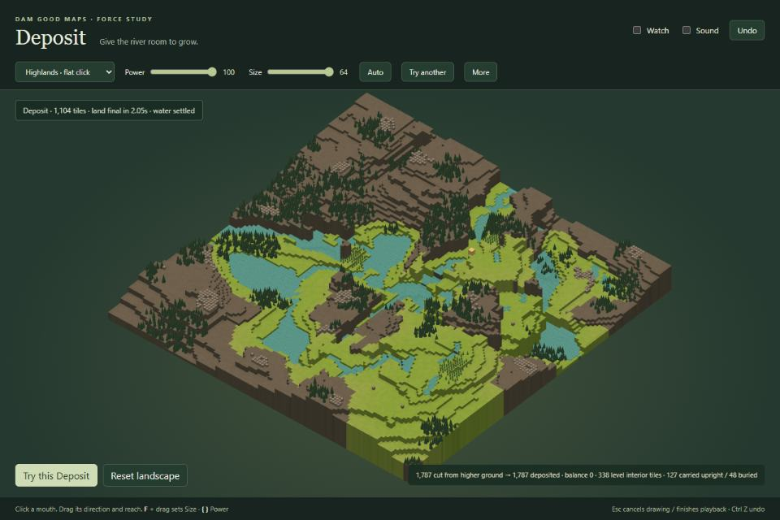
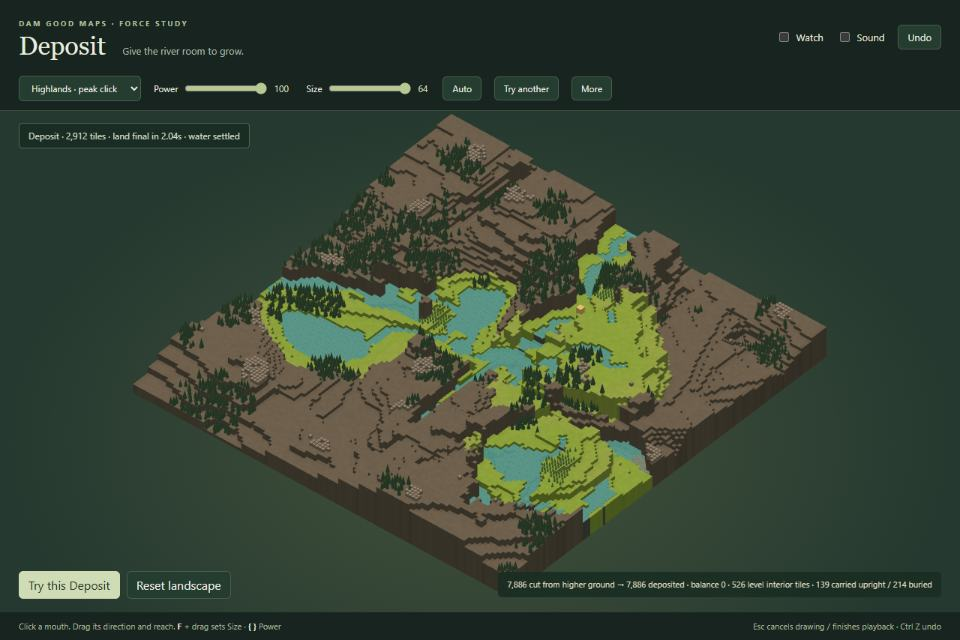

# Deposit

Round 2: real relief and water, with no sediment tint. Click anywhere: a mouth builds a fan,
a slope sends sediment to its foot, a flat receives a spreading sheet, water receives a delta,
and a peak gathers sediment in a nearby hollow. All six presets use original Dam Good Maps
128² generator land. The main three start at full Power.

From the repository root on this branch:

```powershell
npm --prefix investigation/deposit ci
npm --prefix investigation/deposit run demo -- --port 5177
```

Open the printed localhost address. Choose a preset and **Try this Deposit**, or draw anywhere.
**Power** scales supply, footprint and relief; zero retains a small apron. **Size** sets a click's
width; Auto follows Power. A drag sets direction and reach, shown as a band with no circle.
**More** has Channels (Auto/Few/Many) and shared Floor (1–22, **Default**). Material comes from
higher upstream banks or nearby higher shoulders, with the exact balance shown.

**Watch** grows alternating lobes, switches drainage beds left then right, and previews real
source-driven water with a soft CC0 rushing recording. **Fast** finishes land in about two seconds;
water keeps simulating until it actually settles. **Try another** replaces the last result with
another seed. **Undo / Ctrl Z** restores land, water and objects at any moment. **Esc** cancels a
stroke or finishes playback. Hold **F** and drag for Size; **{ / }** change Power, with numbers shown.
The camera stays still during the force; the wheel zooms when wanted.

Sources ride their ground without changing strength. Shrubs bury at +2, trees at +3, other objects
at +4; survivors stay upright. The start moves to dry level ground when needed. Floor is binding:
if it prohibits every available cut, conservation forbids a deposit. The every-click check uses
Default Floor, including Power 0; it does not claim that an exhausted/protected map can supply land.

Checks and regeneration:

```powershell
npm --prefix investigation/deposit run typecheck
npm --prefix investigation/deposit run build
npm --prefix investigation/deposit run check
npm --prefix investigation/deposit run check:clicks
npm --prefix investigation/deposit run check:water
npm --prefix investigation/deposit run samples
npm --prefix investigation/deposit run captures
```

Captures require the running demo and Microsoft Edge; set `DEPOSIT_URL` for another address.
They use full Power, Size 64, Default Floor, seed 2, no sediment tint, a fixed overview camera,
and identical manually selected close-up cameras before/after. The GIF samples 24 evenly spaced
Watch poses on the same renderer; screenshot encoding does not consume the playback clock. The runner downscales 18 JPEGs
from 1280×854 to 960×640, plus one 520px Watch GIF. Bulk output and experiments stay gitignored
under `local/`. `samples.ts` reproduces Highlands seed 5, Canyon seed 2 (badwater off), and Lake
Basin seed 4 using the product generator and stored specs. Four round-one slow-water operations
remain in `checks/water-regressions.json`; `check:water` verifies convergence and identical worker
slices under the new planner. Historical check summaries are in `checks/round-one/`.


| Click | Before overview | After overview | Close up |
| --- | --- | --- | --- |
| Canyon mouth |  |  | [Before](captures/canyon-close-before.jpg) · [After](captures/canyon-close-after.jpg) |
| Dry gully |  |  | [Before](captures/dry-close-before.jpg) · [After](captures/dry-close-after.jpg) |
| Valley into lake |  |  | [Before](captures/lake-close-before.jpg) · [After](captures/lake-close-after.jpg) |
| Slope (100, 79) |  |  | — |
| Flat (112, 35) |  |  | — |
| Peak (104, 80) |  |  | — |

[Findings](REPORT.md) · [Adoption](INTEGRATION.md) · [Asset licences](ATTRIBUTION.md)
