# Erode: the report

## Round 8: large sweeps

The replay selected **one gallery floor at level 10 for the entire stroke**: only 34/152 sampled stroke tiles changed, wearing 861 blocks. Length did not dilute Power.
Rounds 6 and 7 produced byte-identical land on the fresh crater. On an existing cave, Round 7's whole-stroke roof dispatch could also discard the non-roof part (47 blocks worn in the mixed replay).

Mixed sweeps now combine full-strength local galleries, shallow downhill washes and roof wear into one supported operation. Cliff patches reach the face's outside floor regardless of hit height; overlaps do not stack Power. The pinned replay at **Power 72 / Auto Size 68** wears **6,597 blocks**, changing **152/152** sampled stroke tiles.

| Before | After |
|---|---|
| 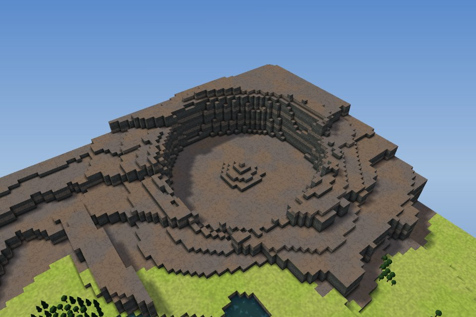 | 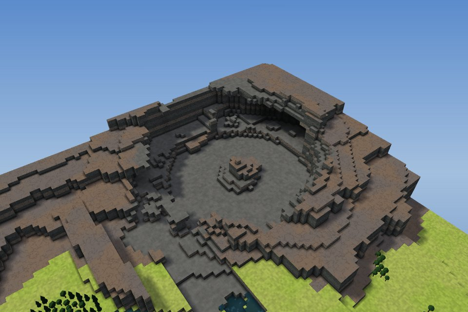 |

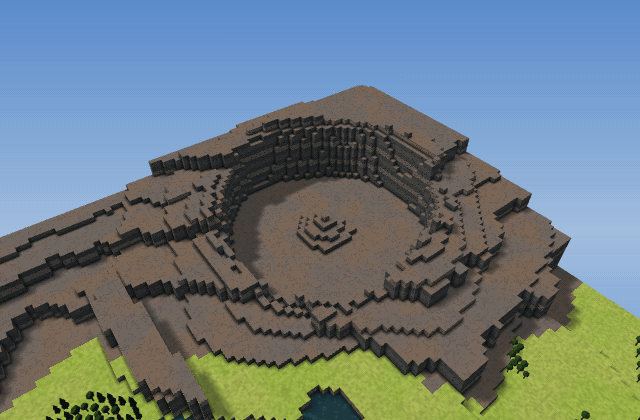

**PASS:** existing suite, including 160 random gestures and their Floor variants, plus **43 long/mixed gestures / 1,032 displayed buckets** (36 seeded crater, plateau-to-cliff and canyon sweeps): **0 dropped voxels, 0 leftover single blocks, 0 cuts below Floor**. Source ground, objects/start, single Undo, Redo/Esc/Try another, fixed camera, TypeScript and demo pass. Longest tested: **399 tiles at 128², Power 100 / Size 100; 0.99 s worst release-to-final-land across three runs**. Kyler replay: **0.67 s**. [Checks](checks/results.json) · [Demo timings](checks/round8-browser.json).

**12/13 Round 7 pinned terrain results remain byte-identical.** Exception: `wash-step` now adds a cliff gallery to the crossing wash; its old local wash still passes the original drainage/depth checks. The three roof fixtures are unchanged.

Choice: pin a 133-tile route matching Kyler's description; no pointer recording was supplied.
Choice: a shallow wash inside a closed crater ends at local low ground, preserving the rim rather than cutting a deep outlet.
Still short: voxel terraces remain angular; a closed basin can retain water, and water settling remains the demo approximation.

Regenerate from the repo root: `npm --prefix investigation/erode run check`; for these captures, `cd investigation/erode` then `node --import tsx scripts/captures-round8.ts` (installed Chrome). Two 960×640 JPEGs total 181 KB; the 640×420 GIF is 2.49 MB. Frames stay in memory; throwaway logs/cache stay in ignored `local/`.

## Round 7: roofs

Erode follows the touched rock face: thin roof beds open into irregular skylights, a larger collapse retains thicker spanning rock, and an inside stroke raises a domed ceiling. Fallen rock leaves supported rubble; roof objects go with their ground and the start moves to the nearest valid dry 3×3×5 site. Floor and source ground still hold.

| Skylight · Power 25 / Size 45 | Bridge · 100 / 100 | Ceiling from inside · 65 / 60 |
|---|---|---|
| 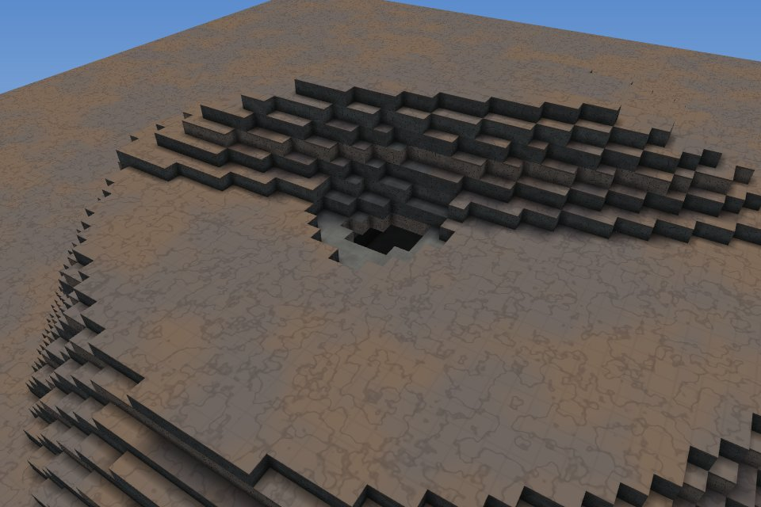 | 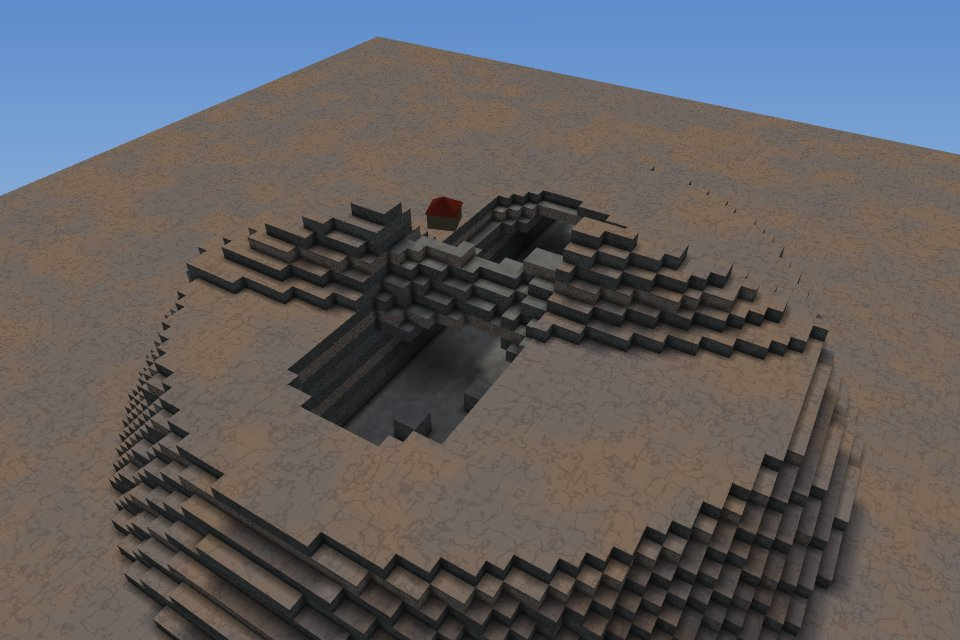 | 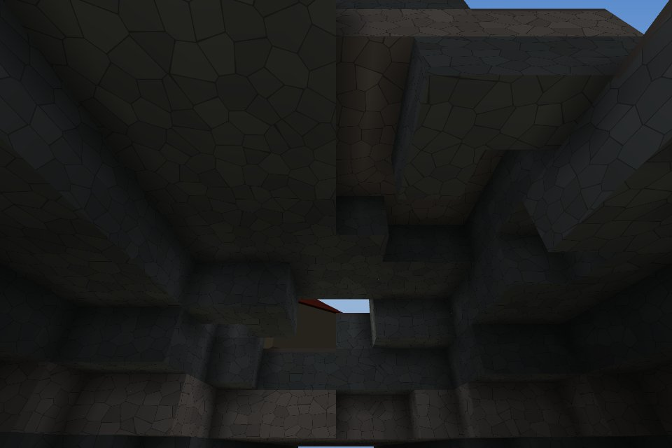 |

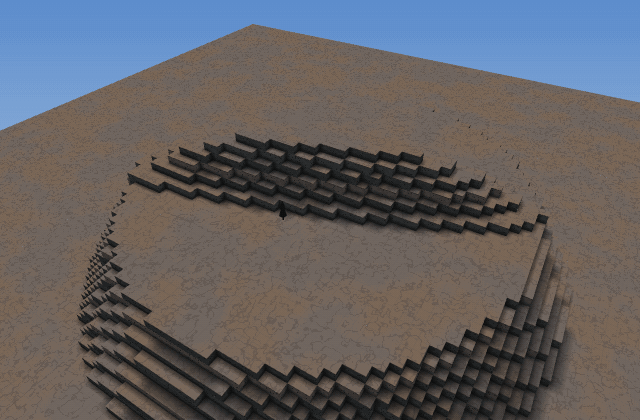

**PASS:** existing checks plus **88 roof gestures / 2,112 animation frames**, including 48 random roof/ceiling gestures and 24 on the existing crater, cave and arch: **0 dropped voxels, 0 leftover single blocks, 0 cuts below Floor**. The pinned skylight opens 15 tiles; the bridge leaves 32 rubble voxels; the dome raises 89 ceiling tiles. All ten Round 6 fixtures remain byte-identical: **no exceptions**. Real pointer hits, source ground, carried start, water refresh, Undo/Redo/Esc/Try another, unchanged camera and TypeScript pass. The same 24 buckets finish in **0.66 s** at 128². [Checks](checks/results.json) · [Demo checks](checks/round7-browser.json).

Choice: original procedural cave only; retain a few broad rubble clusters, with most worn material leaving as fines. Existing dust/stones fall downward and the existing heavy fall closes the collapse; no new assets or sounds.

Still short: voxel steps remain visible; rubble is suggestive rather than a mass-conserving rock simulation, and water uses the existing approximation, not an in-game check.

Regenerate checks from the repo root with `npm --prefix investigation/erode run check`; regenerate these four captures with `cd investigation/erode` then `node --import tsx scripts/captures-round7.ts` (installed Chrome). JPEGs are 43–95 KB; the GIF is 2.74 MB. Transient frames stay in memory, with throwaway logs/cache in ignored `local/`.

## Round 6

**Floor** in More sets the minimum cut level for every Erode form: default **1**, range **1–22**, pinnable with a fixed-default reset (never Auto). Washes run shallower where it limits depth.
**PASS:** support, bottom layer and chosen Floor across 240 case/repeated gestures, 160 additional random gestures and 240 animation buckets; prior default results unchanged. Pin/reload/reset and TypeScript pass; giant wash final in **0.662 s**. [Checks](checks/results.json) · [Control and timing checks](checks/round6-browser.json).

## Round 5

Every Erode gesture now preserves the bottom voxel. Uneven washes cut **one to three levels at most**, measured from the local ground; a crest feeds separate downhill runs instead of being notched through. These two 128² captures use Power 100 / Size 100, Auto details, seed 1.

| Across terraces: after | Low along the wash |
|---|---|
| 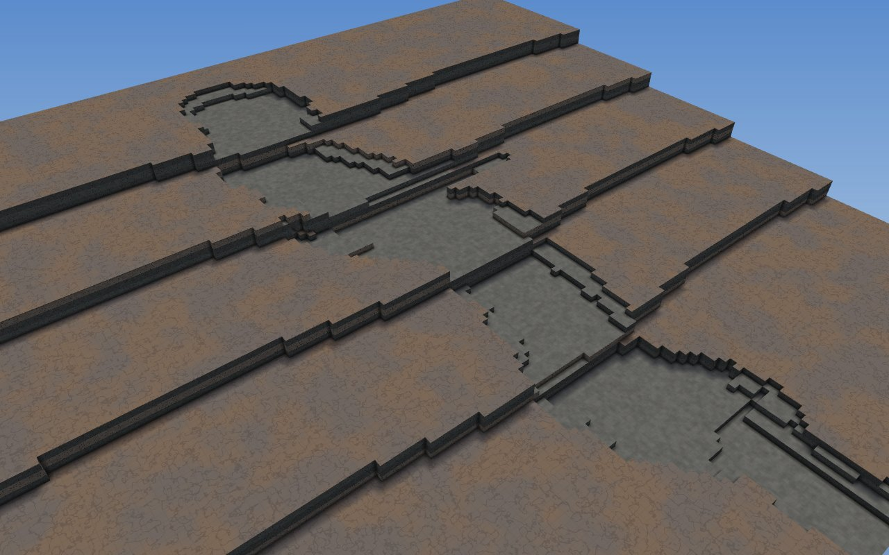 | 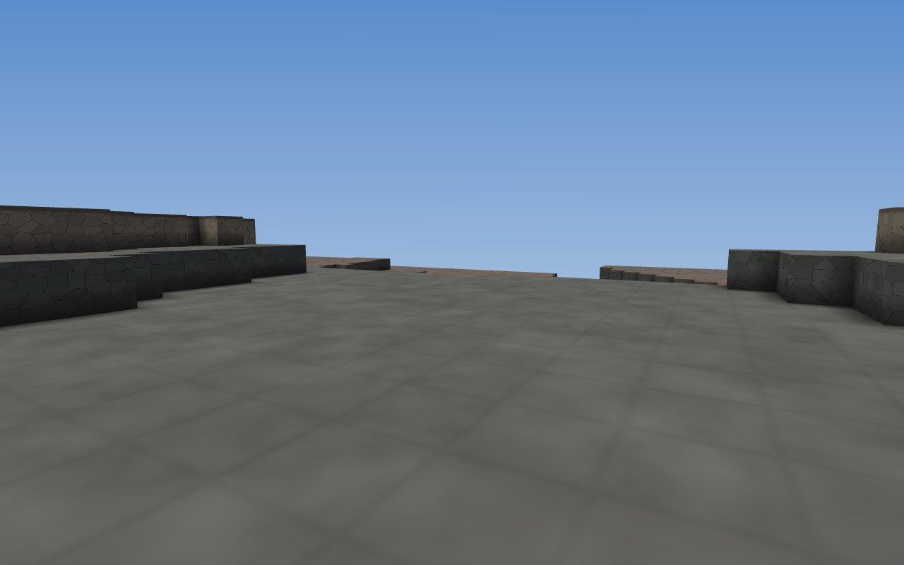 |
| Over a rise: after, two downhill runs | Low along one run |
| 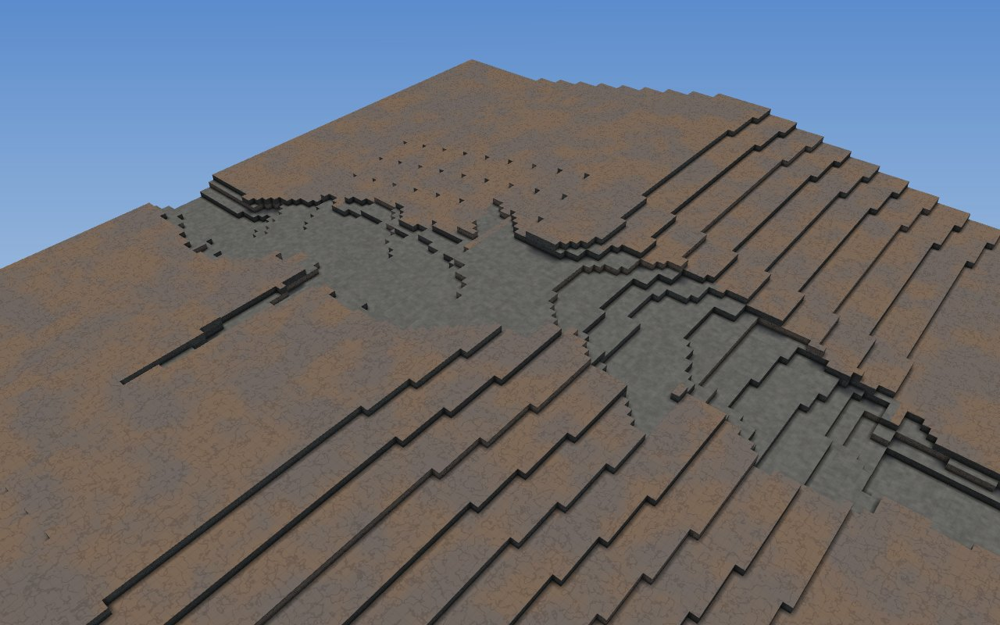 | 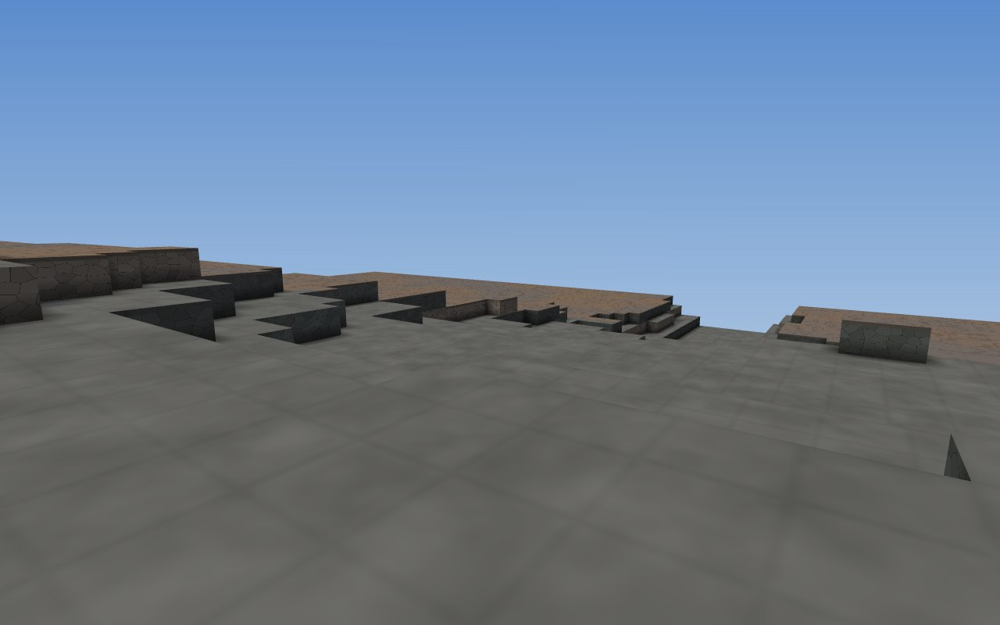 |

**PASS — support and bottom layer:** all ten cases and three extra seeds each, 160 random gestures, 48 uneven variants in both directions, and 54 repeated gestures on thin ground have **0 dropped voxels and 0 bottom voxels removed**. Animation buckets preserve the floor too. The review cases have **0 debris clusters, 0 downstream rises and 0 trapped carved tiles**; measured depth is 1 / 2 / 3 at Power 30 / 85 / 100, and the rise has two opposite outlets. Six existing fixtures and 16 flat variants remain byte-identical; protected source ground and TypeScript pass. Final land at 128²: **0.663–0.668 s**, with immediate next action. [Checks](checks/results.json) · [Timings](checks/round5-browser.json).

- Choice: apply the shallow cap to uneven washes; preserve the flat-ground profile except for the required bottom-layer safeguard, and keep the cliff planner and round 4's face selection unchanged.
- Choice: follow existing downhill terrain to an edge or water; adjust proposed cuts shallower when necessary to keep drainage within the cap.

Still short: existing tall terrain steps still make tall dry falls. Closed basins without a downhill outlet stay uncut; flow is checked geometrically, not in Timberborn.

---

## Round 4

Erode now chooses one face from the whole sweep's direction across or along the terrain's contours. Uneven washes run from the higher end, follow each terrace's ground level, notch intervening rises and drop at steps; the tall-step case has a twelve-level dry fall. Round 3's flat washes and existing cliff results remain unchanged.

| Terraces: drawn uphill, after | Low along that wash, looking uphill |
|---|---|
|  | 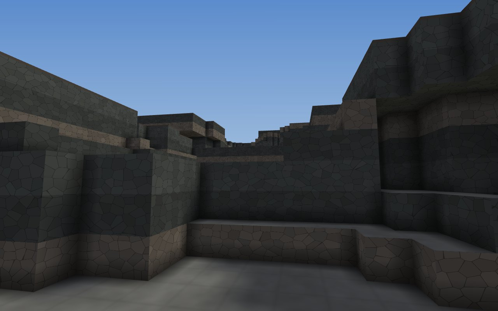 |
| Same sweep drawn downhill, after | Low along that wash, looking downhill |
| 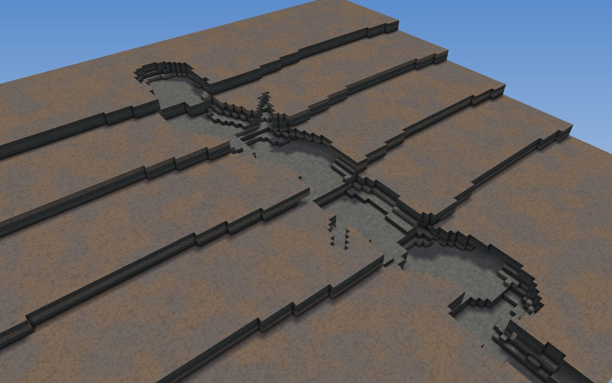 | 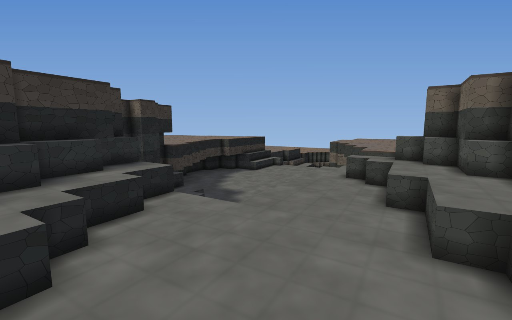 |

Across the tall step, after:

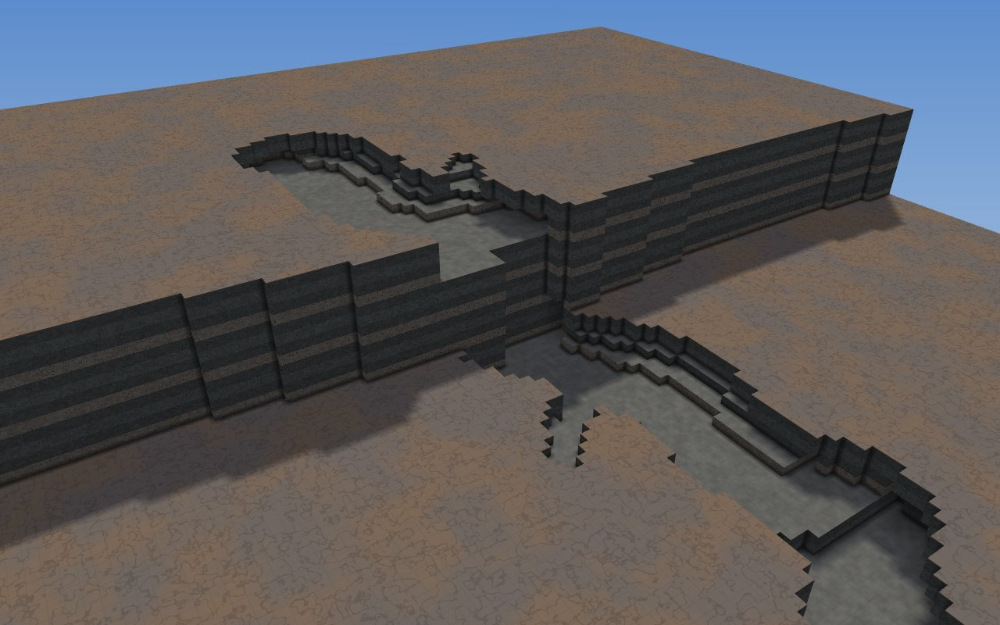

**PASS:** all nine cases and three extra seeds each, all 160 random gestures, and 48 uneven variants in both directions drop **0 voxels**. Review cases leave **0 single blocks or small debris clusters**; wash beds have **0 downstream rises or trapped carved tiles**. Reversed sweeps match exactly, including slopes and intervening rises; six round 3 fixtures and 16 flat click/sweep variants are byte-identical. Animation support, cliff-foot classification, step-face pointer hits and TypeScript pass. Browser final land: **0.661–0.669 s**, including 100/100 at 128²; immediate next action passes. [Checks](checks/results.json) · [Timings](checks/round4-browser.json).

- Choice: capture the same terrace path in opposite directions at Power 85 / Size 80, Auto details, seed 1, on original dry 128² fixtures; time 100/100 separately.
- Choice: natural terrain steps set required drops; equal-height ends use a stable tile-order tie-break, so reversing a sweep still produces the same wash.

Still short: the voxel grid makes the dry falls abrupt; drainage is checked geometrically, not in Timberborn's water simulation.

---

## Round 3

Large washes now expose sheer reaches, broad shelves, slumped banks and undercuts, with longer tributaries and two two-level dry falls in the 100/100 Auto case; flat bed reaches drain between the falls. The thin-ridge opening now clears a level **3×3 footprint with five air levels**, with supports beside it.

| Giant wash, Power 100 / Size 100 | Low along the wash |
|---|---|
| 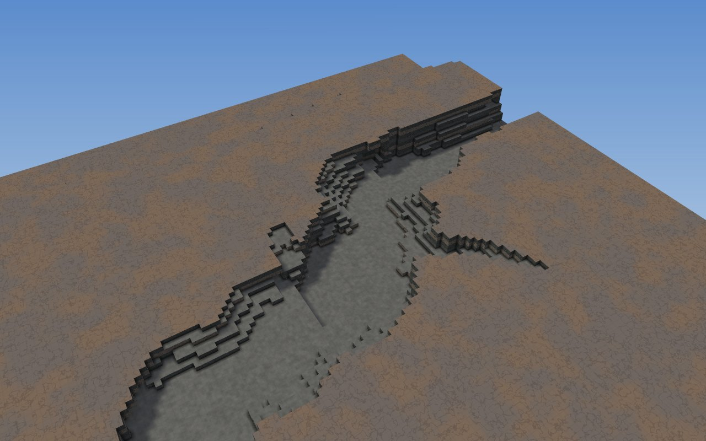 | 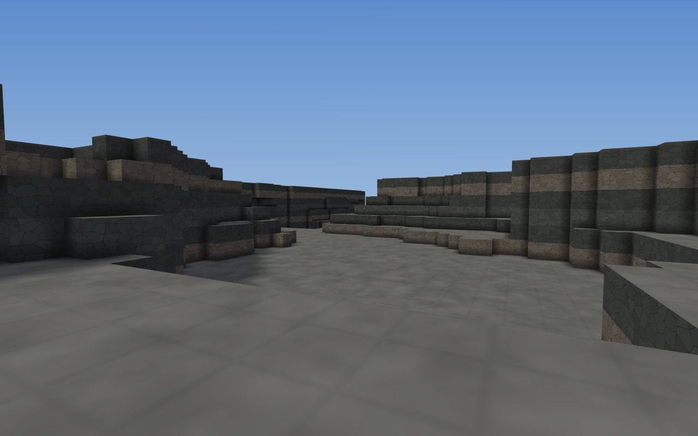 |
| Arch, original Power 70 / Size 45 | Through the opening |
| 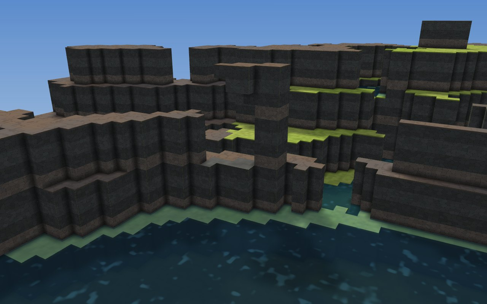 | 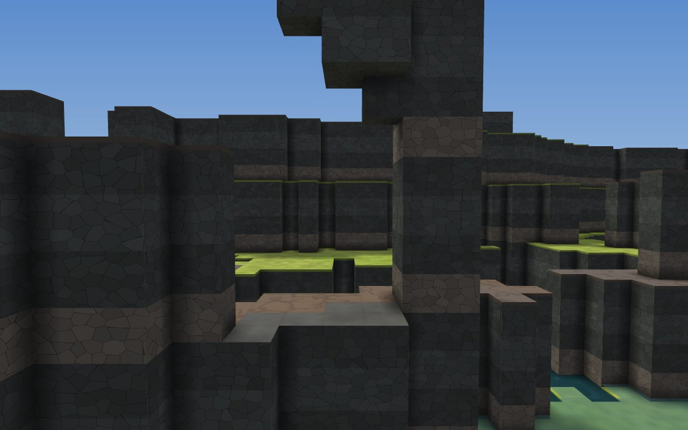 |

**PASS:** all six cases, three extra seeds each, and all 160 random gestures drop **0 voxels**; review cases leave **0 single blocks or small debris clusters**. Drainage, animation support, Auto/pin extremes and TypeScript pass. Final land: **0.660 s** for the largest checked 128² Auto wash (13,647 blocks), **0.669 s** for the arch; immediate next action passes. [Automatic results](checks/results.json) · [Browser timing](checks/round3-browser.json).

- Choice: scale bank relief only above Power/Size 45; the 30/30 wash and the crater, cave and shoreline fixtures remain byte-identical to round 2.
- Choice: keep the arch's outside floor at level 8 and reserve its building footprint before placing supports; retain the existing controls, details, gestures, timing, effects and sounds.

Still short: the thin ridge roofs only five of the footprint's nine tiles; the building extends beyond it. Voxel steps and the existing stone material remain visible; water flow is checked geometrically, not in Timberborn.

---

## Round 2

| Crater rim: before, Power 100 / Size 100 | After the sweep |
|---|---|
|  | 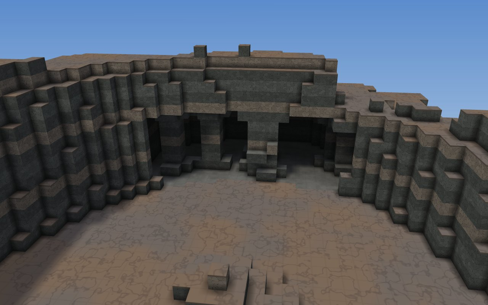 |
| Under the overhang | One click, Power 100 / Size 100 |
| 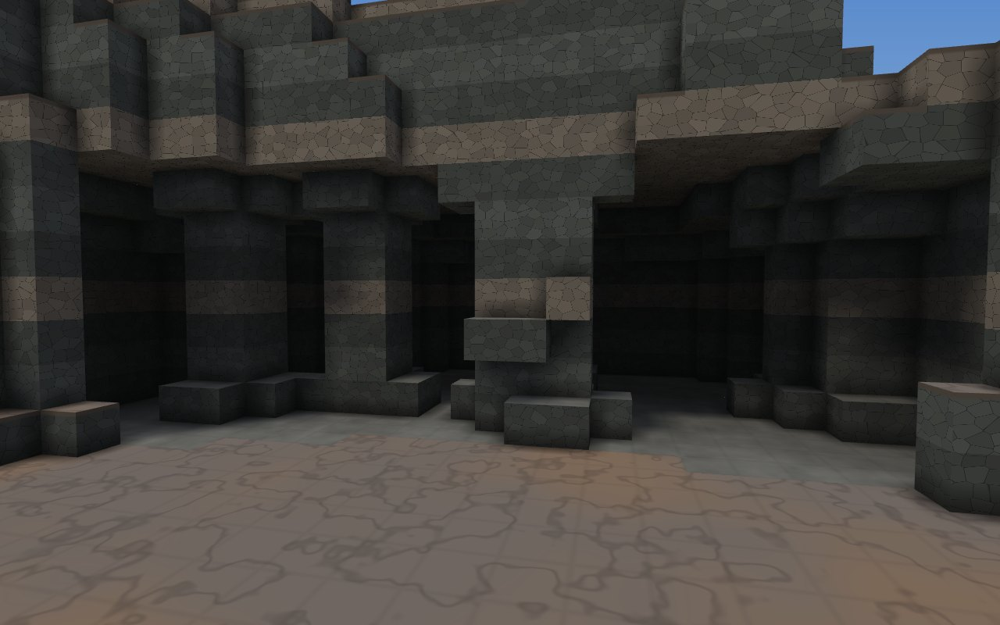 | 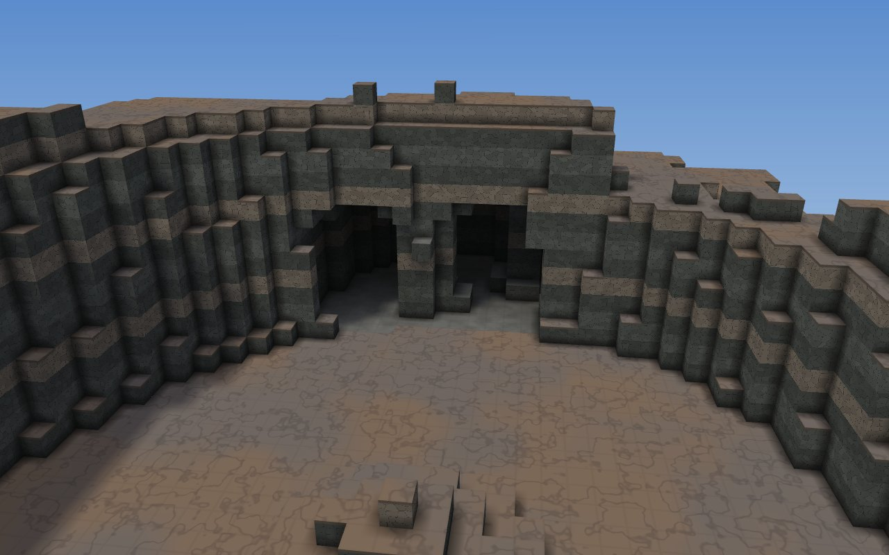 |

| Small wash: Power 30 / Size 30 | Giant wash: Power 100 / Size 100 |
|---|---|
| 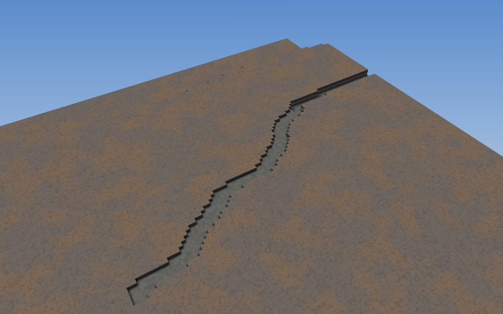 | 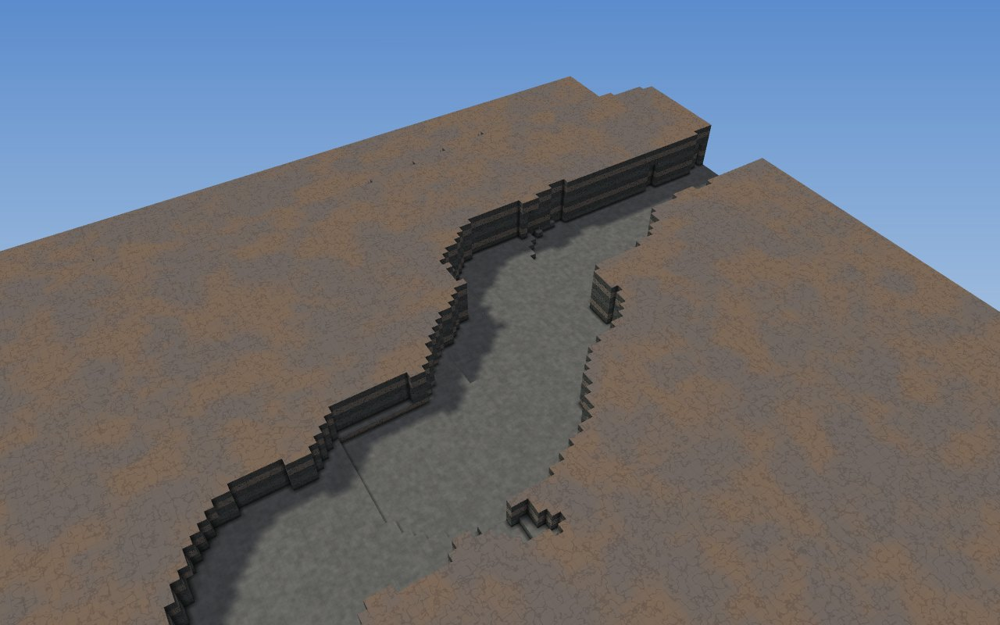 |

Along the giant wash:

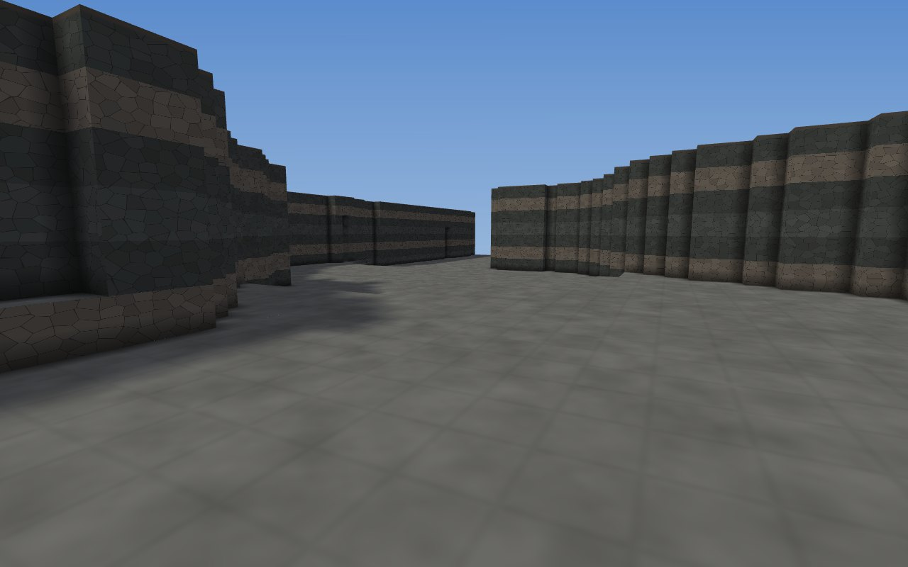

| Case | Dropped voxels | Buildable floor tiles under a roof | Leftover single blocks (goal 0) | Gesture end → final land, 128² |
|---|---:|---:|---:|---|
| Crater rim, 100/100 (sweep / click) | 0 / 0 | 175 / 98 | 0 / 0 | 0.661 / 0.663 s |
| Cliff-foot cave, 100/100 | 0 | 89 | 0 | — |
| Arch, original 70/45 | 0 | 3 | 0 | — |
| Wash, 30/30 / 100/100 | 0 / 0 | 0 / 7 | 0 / 0 | **0.660 s** for the largest checked 128² case (Auto seed 2, 15,940 blocks) |

**PASS:** all six cases, their three additional seeds, and all 160 random gestures drop **0 voxels**; all 160 gestures act.
**PASS:** review cases leave no single blocks or small debris clusters; 24 animation buckets stay supported; low Power is smaller; short overhangs need no columns; ordinary 1–3-level steps wear.
**PASS:** wash beds have zero downstream rises and zero trapped carved tiles, including random washes, clicks and eight extreme pinned-detail variants; Auto/pins/persistence, immediate next action, Undo/Redo/Esc and TypeScript checks pass. Exact results: [automatic checks](checks/results.json), [browser timings](checks/browser.json).

- Choice: replay the demo's pinned crater sweep at 100/100; the single click is its midpoint, with the same seed.
- Choice: target five air levels from `GAME_RULES.md` §5's 3×3×5 starting building; count only roofed tiles with that clearance and level access (61 possible 3×3 footprints in the sweep).
- Choice: one outside floor per shelter; continuous wear crosses hard beds, with broad, staggered supports and irregular shoulders only where needed.
- Choice: washes use an original dry 128² floodplain; Power sets incision, Size sets width, and a narrower outlet continues to the edge or existing water; no slopes, stairs or water are added.
- Choice: Winding, Side gullies, Dry falls and Undercut banks start on Auto; More and pins persist locally, and each operation records the values used (D309).
- Choice: land finishes on a fixed 0.65-second clock from gesture end; existing dust/stone/sounds may linger, and the next gesture interrupts them.
- Choice: only these seven new JPEG captures, each under 0.14 MB; no new assets or sounds.

Still short: the voxel grid and existing masonry-like material keep the curves visibly stepped.
The original thin arch has only three five-level roofed tiles, too narrow for a 3×3 building; short banks cannot supply full building headroom.
Drainage is checked geometrically; the demo still approximates water and has not been verified in Timberborn.

---

Kyler's brief (2026-09-27): a force where wind and water wear rock, and the land decides the form: a cave at a
cliff's foot, an overhanging lip where hard rock caps soft, an arch where a ridge is thin. Every shape obeys the
game's support rule. Built by Claude on `investigation/erode`, held until Kyler has tried it.

**The critical check passes:** every case, three more personalities of each (Try another) and 160 random
gestures on the four maps drop **0 voxels** under the game's support rule, checked over every voxel of the final
land with terrain3d's port of the rule (`investigation/terrain3d/proto/support.ts`, the model in
GAME_RULES.md §2). `npm --prefix investigation/erode run check` reproduces it; `checks/results.json` holds it.

## The cases

Real Dam Good Maps land at 128²: the Highlands (with a crater struck by Craterize), Canyon, and a tall map.

### 1. A crater's rim becomes an overhanging lip

Highlands seed 5, struck with Craterize (investigation/craterize's engine: Strike at 96,102, Power 42, steep
walls). Erode, dragged along the crater's east inner wall at level 13, Power 72, Size Auto. The soft rock under
the hard bed at level 14 wears back 7 to 11 tiles; the hard bed and the rim above it stay as a lip, held by
pillars of the rock that wore least, set a few tiles back from the lip's edge.

| Before | After |
|---|---|
| 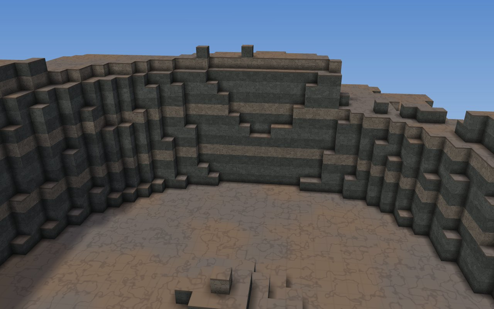 | 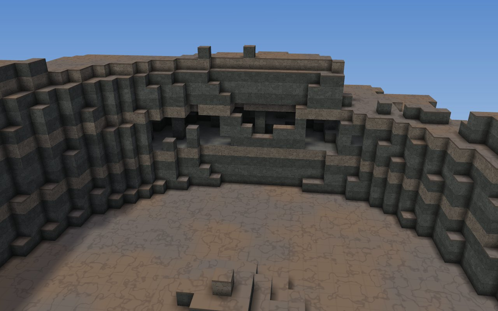 |
| **Under the lip** | **From inside, looking out** |
| 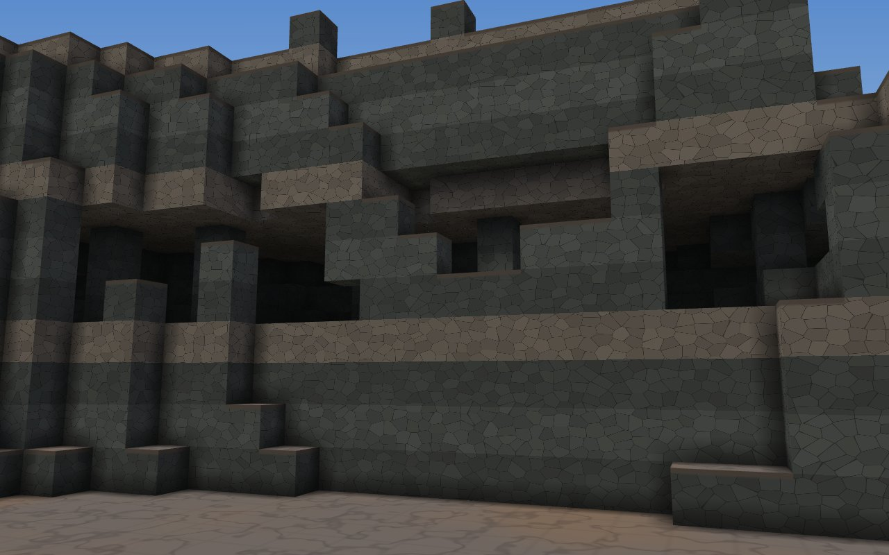 | 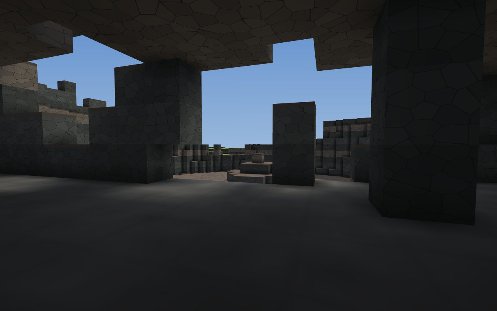 |

The moment (`captures/crater-moment.gif`, 5 seconds at 10 frames a second, 3.1 MB):

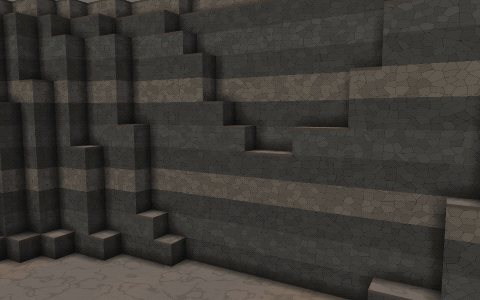

### 2. A cliff's foot becomes a cave

Canyon seed 2. One click at the foot of the canyon's north wall (93, 71), Power 70, Size Auto. The three soft
levels over the floor wear into the wall under the hard bed at level 7: a cave up to 10 tiles deep, its roof held
by pillars.

| Before | After |
|---|---|
| 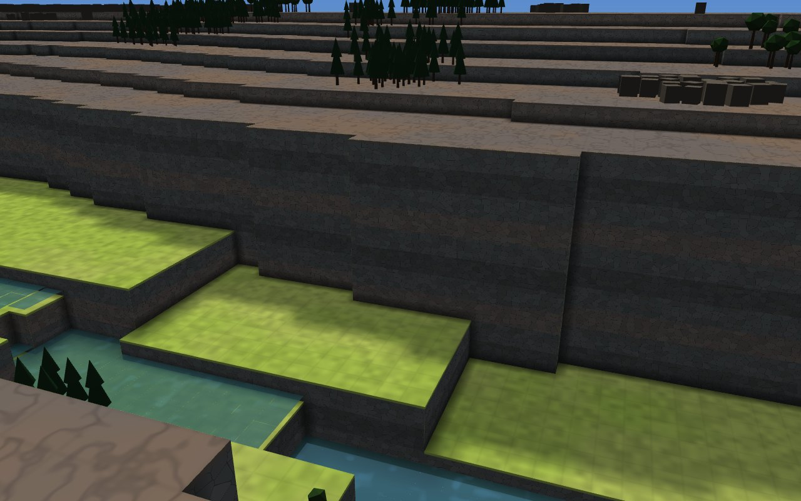 | 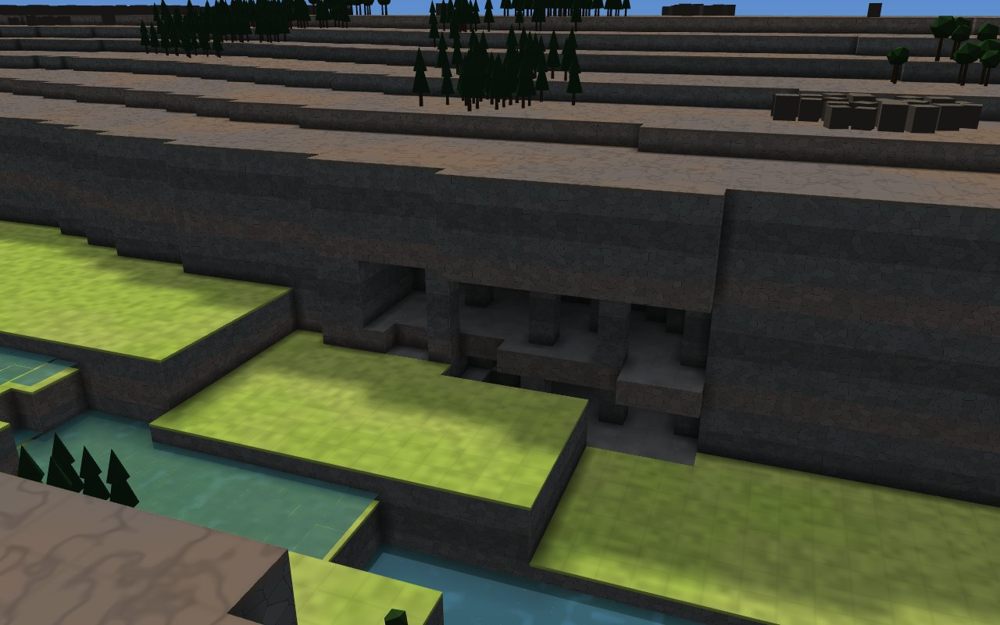 |
| **Into the cave** | **From inside, looking out** |
| 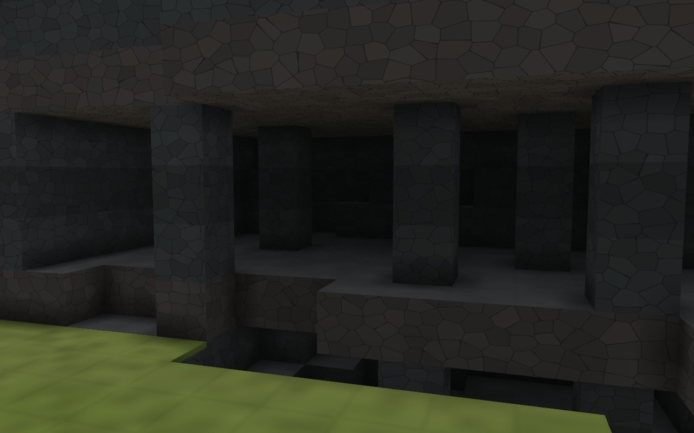 | 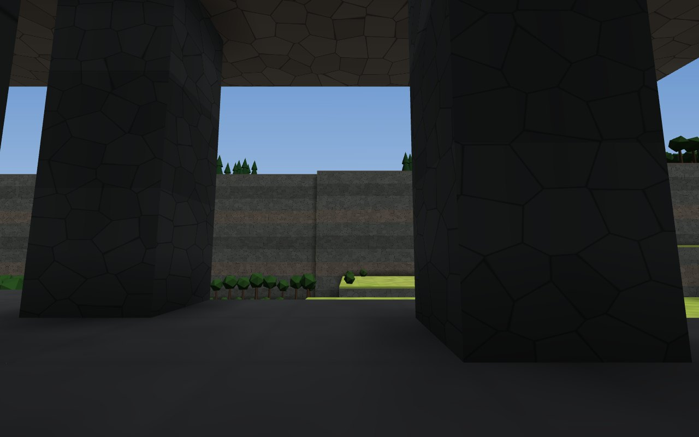 |

### 3. A thin ridge becomes an arch

The tall map (design version 2, Verticality 85, seed 2). A drag across the thin ridge that stands between two
lakes (around 30, 87), Power 70, Size 45. The ridge is 2 to 3 tiles thick where it stands 16 high; it wears
from both sides at once, under the hard bed at level 12, and opens right through.

| Before | After |
|---|---|
|  | 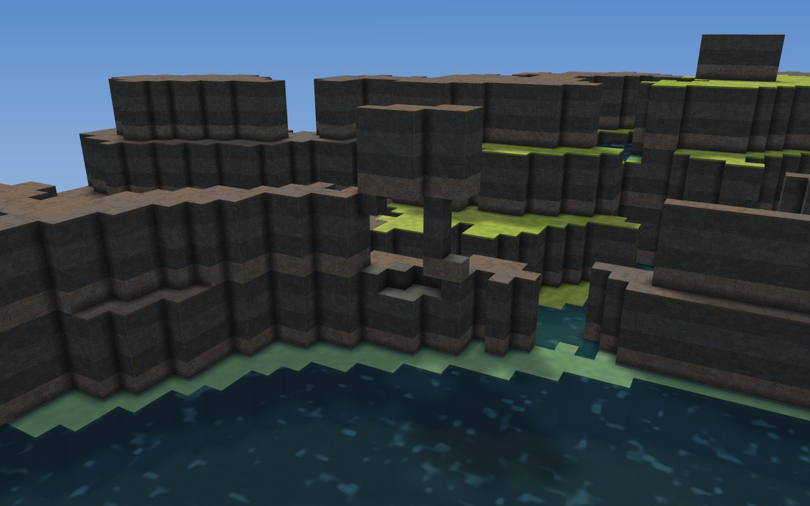 |
| **Through the arch** | |
| 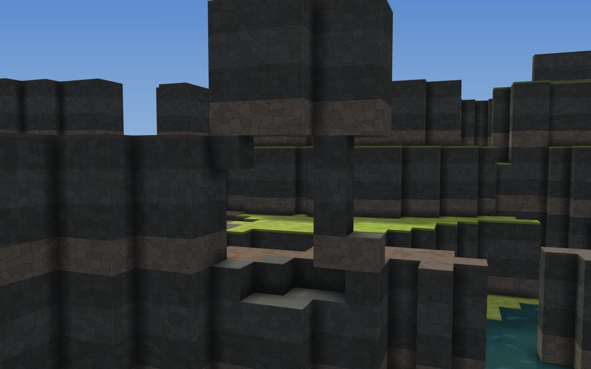 | |

### 4. The waterline becomes a flooded cave (the water is approximated)

The tall map again: a click at the waterline of a bank three tiles wide between two pools (90, 16), Power 75,
Size 55. The hollow opens below the water's level, so it fills. **This water is an approximation** until the
water engine lands (see "Water under the roofs" below). From above, before and after look alike: the cave is
under the bank.

| Before | After | Into the flooded cave |
|---|---|---|
| 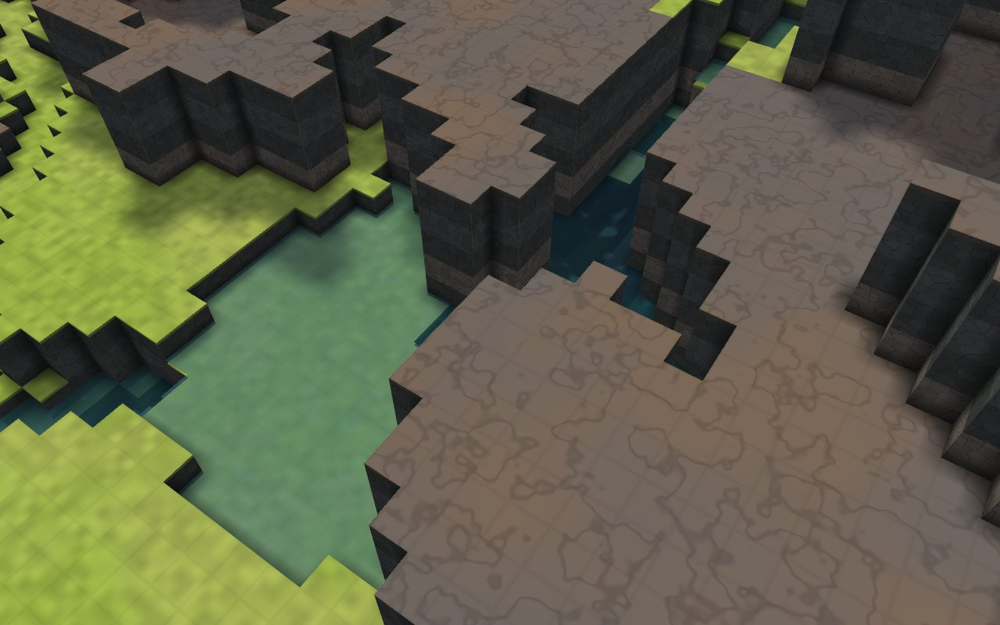 |  | 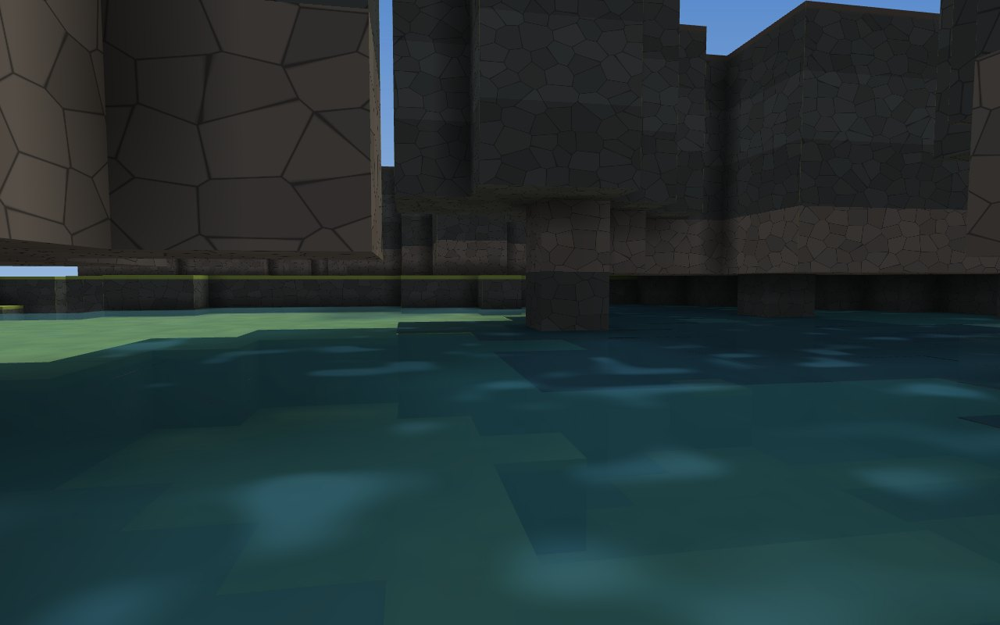 |

## The numbers

| Case | Dropped on load | Largest overhang's reach from support | Deepest hollow | Worn | Kept to hold a roof | Time to the final land at 128² |
|---|---|---|---|---|---|---|
| Crater lip | **0** | 3 tiles | 11 tiles | 490 | 21 | 100 ms (Node), 125 ms (browser) |
| Canyon cave | **0** | 3 tiles | 10 tiles | 380 | 20 | 85 ms, 130 ms |
| Tall arch | **0** | 2 tiles | 2 tiles | 35 | 6 | 31 ms, 16 ms |
| Tall flooded cave | **0** | 3 tiles | 8 tiles | 312 | 13 | 21 ms, 14 ms |

- **Reach from support** is the most tiles any block over air sits, in its own layer, from rock that stands on
  held rock: the game's own measure, which it allows up to 3. The planner keeps every result within it, so the
  big overhangs are roofs held by pillars or anchored along their length, never a shelf in mid-air.
- **Deepest hollow**: the most tiles an air cell under a roof lies from open sky, walking through air.
- **Time to the final land**: the planner alone, from the gesture to the final blocks, on this machine (Node:
  median of 5 runs; browser: the worker in installed Chrome, one run, `checks/browser.json`). The machine was
  shared with other work, so the numbers move by tens of milliseconds between runs. The dust and the grind start
  on pointer-down, before the plan is back. The support check over the whole map takes another 10 to 100 ms;
  the demo shows its result ("dropped on load: 0").
- **Try another** on each case (seeds 2 to 4): 36 to 490 blocks worn, 0 dropped every time.

Random gestures, 40 a map (clicks and 4 to 20 tile strokes anywhere, at any height, Power, Size and seed):

| Map | Acted | Dropped | Largest reach | Slowest |
|---|---|---|---|---|
| Highlands | 16 of 40 | 0 | 3 | 54 ms |
| Canyon | 12 of 40 | 0 | 3 | 163 ms |
| Crater | 20 of 40 | 0 | 3 | 22 ms |
| Tall | 28 of 40 | 0 | 3 | 66 ms |

The rest found no rock to wear within 12 tiles, or only steps too low to hold a roof, and said so with a word by
the pointer ("No rock to wear here").

## The choices

**One rule set; the land chooses.** There is no "cave", "overhang" or "arch" mode. Every solid block with open
air beside it gathers wear each step from each open side:
- more near the foot of the face the air stands on (sand-laden wind and splash wear hardest near the ground):
  this hollows caves at cliff feet;
- more just under a hard bed (seepage along the contact, as in real rock shelters): this undercuts caprock and
  leaves the hard bed as a lip or a roof;
- less the deeper the air lies inside the rock: Power sets how far in it reaches;
- only where the gesture touched the face, and round the height it touched it: Size sets how wide and how tall
  the openings are;
- hard rock (the forces core's beds, every fourth level) wears at a tenth of the rate.

A thin fin is open on both sides, so it wears from both at once and opens through: an arch. A block goes when
its wear passes its own resistance, 3D noise from the seed, so no two results share their seams (Try another
changes the seed). The same input always gives the same land.

**Only rock under a roof wears.** A column's top two blocks always stay, and a block wears only under three
blocks of rock, or one hard one. Erode hollows; it never flattens. So the map's surface, its water and every
object on it stay exactly where they were (no start ever needs carrying, D257), no hollow is left under a thin
soft crust, and nothing wears within two tiles of the map's edge or under a water source's ground (sources
stand on the top of run 0, GAME_RULES.md §3.4).

**Held, not dropped.** The game deletes any block more than 3 tiles sideways from support on load. After the
wear, the planner checks the rule layer by layer. Where a roof would be left too far from support, it restores
the rock that wore least under it: a stub under the roof's edge (a corbel) or a pillar down to the floor,
preferring supports about three tiles in from the open air, so a lip's edge overhangs freely. Anything still
loose would fall as rubble (the safety net): it never happened in any case or random gesture here (`fell` is 0
throughout).

**Nothing shown that the game would drop, not even for a frame.** The rock goes in 24 buckets over 2 to 4
seconds (Power sets the length), at a steady pace, face first. The land at the end of every bucket is checked
with the rule too; a block that would hang there goes in that bucket. Adding rock never takes support away, so
every block of the final land is held in every frame.

**The gesture.** A click wears where you click; if it lands on open ground, it looks up to 12 tiles away for the
nearest face. A drag paints the sweep, drawn as a thin line while you draw it (the gesture itself, D258). No
outline or prediction. The cursor ring shows where it will act. The camera never moves by itself (D265). Esc
takes back a playing erode at once; each erode is one undo step; Try another replaces the last erode with a new
personality of the same gesture from the same land.

**The moment.** On pointer-down, before the plan is back: a puff of dust at the rock and the grind starting. Then
the rock wears away in the order it wore, with dust drifting out of the opening and stones dropping from it,
bouncing once where they land, each landing a recorded stone sound; the grind swells with how much is going, and
a heavier fall closes it. Visual only (D240): the final land never depends on the effects. With reduced motion,
the stones and most of the dust are off.

**The view.** `core/mesher.ts` meshes terrain as runs: every face of a block toward air, tops, undersides and
walls alike, greedy-merged per plane in 32 × 32 chunks, so cave ceilings, the roof of an overhang and the inside
of an arch are ordinary faces. The light is a small 3D texture (sky light walked through air, sun light marched
toward the editor's north-west sun), sampled half a cell in front of each face: caves darken toward their
backs, overhangs cast their shadows, corners take a little occlusion, and no merge is ever broken. The shader
follows the editor's Standard look: its palette, its lighting formula, dark cobbled walls with every other level
darker and a lip of the top's ground, grass and cracked earth on the tops, the product's own water colours; the
hard beds are a paler, warmer stone so the caprock reads.

**Water under the roofs.** An approximation, said on screen: the map's own water (its canonical settle) stays
exactly where it was on every open top, since no surface changes; a hollow opened beside water fills to the
level of the water beside it, capped by its roof, and passes that level on to the hollows it touches. No
pressure, no flow. Nothing is hidden: in case 4 the flooded cave shows as it is.

**Sounds.** Four CC0 recordings from Freesound (two stone-on-stone scrapes for the grind, two crumbling-rock
mixes for falling stone), played through Web Audio. Their authors, sources and hashes are in ATTRIBUTION.md.

**The maps.** Highlands seed 5 and Canyon seed 2 come from the editor's generator (`src/core/gen/generate.ts`)
with their water, soil and objects. The crater is Craterize's investigation engine on that Highlands, its water
settled again. The tall map is design version 2 at Verticality 85, unlocked: the land before the build, since the
dev generator can't build above 16 yet (as glaciate's tall fixture); springs at its planned rivers' heads, its
water by the canonical settle, and no other objects.

## Where it falls short

1. **Blocky, regular forms.** The grain is one tile by one level, and the rock's beds are every fourth level, so
   hollows come out as galleries two or three levels high between hard beds, often in rows. A "lip" is a
   pillared gallery under a hard bed rather than one sweeping curve. The pillars are what the support rule
   demands for anything deeper than 3 tiles; they can read as a colonnade.
2. **Arches are small on today's maps.** Thin, tall ridges are rare: the Canyon map has almost none, the
   Highlands few. The arch case is 35 blocks through a ridge 16 high for 5 tiles. A ridge must stand at least a
   hard bed plus three blocks above the hole to hold one.
3. **Low steps can't be worn.** A face under about four levels has no room under the protected top for a
   hollow, so on the terraced Highlands many clicks do nothing (16 of 40 random gestures acted). That is the roof
   rule doing its job, but it can feel like the force refusing.
4. **Water is approximated** under the new roofs (no pressure, no flow, no draining through the edge). The real
   game settles those columns by its own rules (GAME_RULES.md §3), which can differ: a sealed pocket
   pressurises, water in a passage can siphon.
5. **Not seen in the game.** The support rule is checked with the port of the game's code, not in Timberborn;
   GAME_RULES.md §8's probe maps (a cantilever of 3 kept, 4 dropped; a corbelled arch standing) are still
   unrun.
6. **The view is the Standard look's style, not its shader.** No soil blending between tiles, contact shadows,
   contamination, overlays or the cutaway; up close the cobbles read as masonry more than rock. Trees and objects
   are simple stand-ins. Deep caves are dim by design and need the low views to be seen: there is no level
   slice in the demo.
7. **Rubble is visual only.** Worn rock never lands as a scree slope (D240 keeps the final land free of
   effects); a real undercut would leave talus at its foot.
8. **Timing is for 128²** on this machine, while other work ran; 256² is not measured. The page relights the
   worn area every few buckets, and patches the light of newly opened cells in between.
9. **Sounds are compressed previews** (Freesound's public MP3s, not the lossless originals), and only four.
10. **The tall map is pre-build land** with springs but no trees, start or other objects, as in glaciate.

## How to regenerate

- `npm --prefix investigation/erode run maps` rebuilds `maps/` (about 30 s).
- `npm --prefix investigation/erode run check` rebuilds `checks/results.json` (about 30 s).
- `npm --prefix investigation/erode run captures` rebuilds `captures/` and `checks/browser.json` (about 2 min;
  installed Google Chrome, headless, on a free local port).

Everything here is small (captures 60 KB to 3.1 MB each); nothing large was generated.
