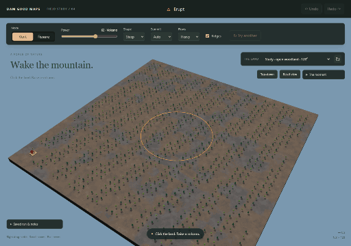
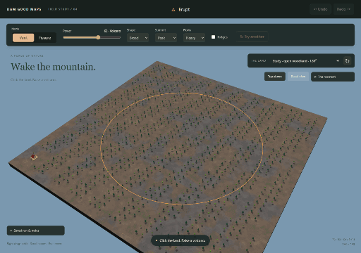
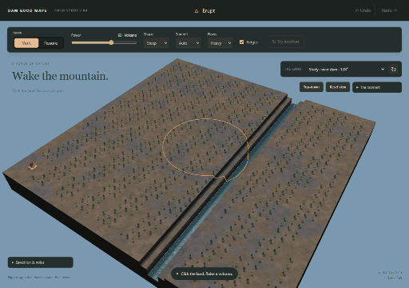
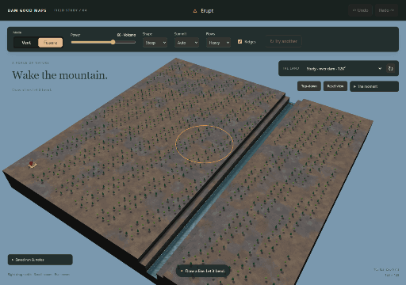
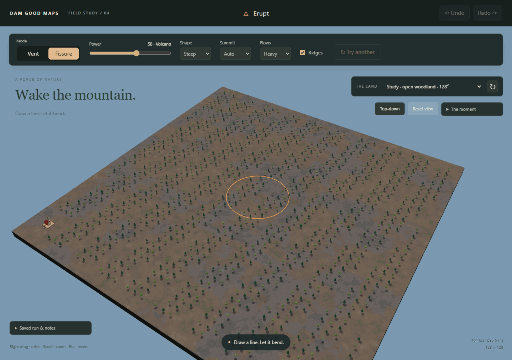
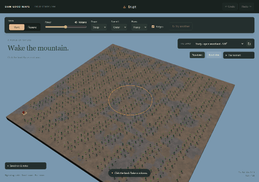

# Erupt

A working standalone volcano tool, based on dev f770936. All changes stay in this directory.

```sh
npm --prefix investigation/erupt run demo
```

The command installs its own dependencies on first use and prints a free localhost port.
It uses three.js **0.186.0**, matching the repo. Choose a generated 128²/256² map, a study map,
or one of three Real places. Click for a vent; choose Fissure and draw a bent line for a ridge.
Esc cancels the complete event; Undo and Redo restore exact saved results. Right drag orbits.
The notes menu saves/replays runs; [this small run](samples/vent-32.json) exercises portable replay.

## What works

- Mode comes first, followed by Power, Shape, Summit, Flows/Ridges and Try another.
- Whole-level cones, broad shields, summit craters, large calderas and a fissure crater row.
  Heights stay in 0–22; layer 22 remains empty. Edge eruptions clip naturally.
- Steep peaks narrow and steepen towards the summit. With Power 62, Light flows and no ridges,
  Steep rises 19 levels versus Broad's 7; width at half-height is 13 versus 31 tiles, on the same land/seed.
  Vent lava lobes wind downhill with irregular spacing, 4–10 Heavy lobes across tested personalities,
  variable reach and rounded, widening tongues. Uphill obstacles beyond the cone stop a lobe.
- Immediate cracks and ash, eight smoothly interpolated terrain stages, live runoff, cooling, dead radial trees,
  optional follow/shake, and reduced motion. No audio is needed.
- Real terrain stays lit during uplift. Soft smoke puffs rise, roll outward, drift and thin; fissures open
  with a glow/smoke curtain along their path. Lava cools from orange through red and dark stone into
  ordinary terrain over 6.4 seconds after uplift. Ash dust fades too. Cooling continues independently
  of water settling and never blocks another action; reduced motion skips all visual effects.
- Objects ride supporting terraces. Sources keep their settings and ride vertically too.
  The start's footprint and buffer stay fixed; vents or fissures through them are refused.
- Overlapping eruptions build on old flanks. New lava records hard occupied levels per tile.
  The reused Carve engine reads that hardness and cuts more slowly or bends around it.
- Erupt creates no water or sources. The final water is exactly the repo's canonical settled result.
- One operation stores terrain, lava, entities, fallen trees and exact water. Replay runs no simulation.

## Captures

These are short sequences from the actual clean 3D demo, using clearly labelled process-study maps.
They are illustrative setups; generated maps and Real places are also tested.

[Steep against Broad at the same Power](captures/steep-broad.png) ·
[Heavy flows with Ridges, from above](captures/heavy-lobes.png) ·
[Plume and cooling contact sheet](captures/eruption-cooling.png).
The comparison holds Power 62, seed 891, Peak, Light flows and Ridges off constant; only Shape changes.

| Scene | Sequence |
|---|---|
| Steep vent, summit crater |  |
| Broad shield |  |
| Huge caldera |  |
| Bent fissure across a valley |  |
| Flows dam a river into a lake |  |
| Overlapping volcanic field |  |
| Carve bends around lava |  |

[Larger caldera view](captures/hero.png). Settings and paths are in [scenarios.ts](scenarios.ts).
`npm --prefix investigation/erupt run captures` reproduces all seven sequences and the three new comparisons; browser checks and captures need
Google Chrome. Bulk output, dependencies and build files are ignored.

## Evidence

`npm --prefix investigation/erupt test`, `run typecheck`, `run build` and `run browser` pass.
The tests cover 32 option combinations, fixed seeds, different personalities, bounds, edge clips,
overlap, start refusal, objects, exact JSON replay, real worker cancellation races and canonical water.

On this host in headless Chrome, the generated 256² event first changed terrain in **0.84 s**,
with **6.2 ms p95 frames**, **54.7 ms worst sampled frame**, and **0.5 ms cached-view undo**.
Full completion, including water settling, took **14.6 s**. All **2,311 frames** across the event were sampled;
these are host-specific measurements, not a hardware guarantee.

The river study's upstream depth rises **0.259 → 4.151 levels** with unchanged emitters.
Carve crosses **13** lava stations with hard rock enabled versus **29** on the identical terrain with
lava hardness removed. Near Yosemite (96²), Geirangerfjord (128²), and Grand Canyon (256²) all load.
Detailed results: [model](captures/checks.json), [worker](captures/worker-checks.json),
[water/rock](captures/water-rock-checks.json), [browser](captures/browser-checks.json),
[shape and preservation regressions](captures/morphology-checks.json).

## Choices and limits

This is a coherent terrain model, not a magma physics solver. Auto uses a peak below Power 32,
a crater below 80, then a caldera. Fissures keep a crater row even with Peak selected, using shallower vents.
The revised cone and lobe model applies to vents. Four exact regression fingerprints preserve Fissure's
terrain, lava and objects across both shapes and flow settings; the original supervolcano basin is preserved too.
Fissure drawing previews the line immediately; the eruption begins on release. New clicks get new recorded
seeds; Try another advances a deterministic seed from the original input land.

Live water retains existing volume on rising cells and runs the repo simulation between stages.
Canonical settling then replaces the preview; a large map can take several more seconds while Esc remains instant.
The demo runs one force session at a time. It has no .timber export, imported cave editing or production editor
integration. Rigid footprints get small supporting terraces. Existing sources survive even at a vent.
Final buildability and full editor validation belong to adoption, described in [INTEGRATION.md](INTEGRATION.md).

## Reuse and steps

1. Reused Craterize's sliced plan, map/operation shape and foundation; added volcanic anatomy and local lava.
2. Adapted its worker, cached view history, clean renderer, particle pools and demo shell. Quake informed
   curved paths and riding footprints. Carve at b14e23f supplies the actual geology comparison engine.
3. Added interaction checks, all seven captures, a portable sample, and the shared four-force proposal.
4. Revised vent anatomy and lava lobes, preserved Fissure and the caldera basin, and replaced the
   eruption's shading mismatch and abrupt cutoff with terrain-bound heat and an independent plume/cooling tail.

Production rendering, generation and water modules are imported directly. See [credits](ATTRIBUTION.md).
The task's directory-only rule takes precedence over general instructions to edit living docs or docs/sheets;
all investigation documentation and captures stay here. Nothing is deployed or merged.
