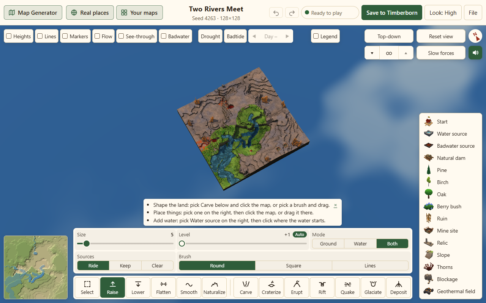

# First request to editable map

| Target/input | Cold before → after | Warm before → after |
|---|---:|---:|
| dev / generate + Refine | 6.98 s → 6.94 s | 2.75 s → 2.74 s |
| dev / stored reopen | 4.53 s → 5.00 s | 0.70 s → 0.71 s |
| feature/page / generate | 4.50 s → 2.99 s | 2.33 s → 2.22 s |
| feature/page / stored reopen | 3.00 s → 2.75 s | 0.60 s → 0.52 s |

| Generation stage (wall ms; overlaps) | Page cold before / after | Page warm before / after | Dev cold before / after |
|---|---:|---:|---:|
| Generator ready after construction | 2102.8 / 197.7 | 116.9 / 100.0 | 199.0 / 219.3 |
| Generator begins (final document clock) | 2173.4 / 287.4 | 251.4 / 171.2 | 247.7 / 297.8 |
| Generate worker RPC | 1757.7 / 1946.2 | 1772.3 / 1744.9 | 1762.9 / 1756.8 |
| Open/refine worker RPC | 29.8 / 26.6 | 35.3 / 26.8 | 33.2 / 32.6 |
| Renderer warmup | 2017.5 / 2156.5 | 143.1 / 131.2 | — / — |
| Renderer setMap/first frame | 133.4 / 122.2 | 131.3 / 153.3 | 3788.6 / 3763.1 |
| JS parse trace CPU | 243.2 / 239.4 | 192.2 / 161.3 | 259.7 / 254.7 |
| Compile trace CPU | 291.1 / 300.2 | 207.9 / 193.9 | 338.5 / 345.6 |
| Wasm Module calls summed across workers | 8.7 / 7.9 | 8.7 / 8.7 | 13.6 / 15.0 |
| Cold/warm request bodies started before editable (KiB) | 2294.0 / 1756.9 | 1.1 / 2.1 | 2287.4 / 2289.6 |

| Page startup resource | Before raw / gzip KiB | After raw / gzip KiB |
|---|---:|---:|
| generator.worker.js | 3004.3 / 1099.5 | 3004.4 / 1099.6 |
| checks.worker.js | 1413.3 / 539.8 | 4.3 / 1.9 |
| checksReplica.js | — | 1409.1 / 538.2 |
| waterStrip.worker.js | 277.3 / 108.8 | 277.3 / 108.8 |
| main.js | 30.8 / 12.0 | 30.8 / 12.1 |
| jsxRuntime.module.js | 427.8 / 167.0 | 428.1 / 167.0 |
| Tooltip.js | 884.2 / 250.4 | 884.2 / 250.4 |
| Editor.js | 287.8 / 98.6 | 288.2 / 98.7 |
| bake.worker.js | 10.0 / 4.3 | 10.0 / 4.3 |

Times are the midpoint of two samples, not a performance promise. Every individual sample is in [measurements.csv](measurements.csv); selected markers, map hashes and correctness evidence are in [evidence.json](evidence.json). Stage spans overlap and CPU costs must not be added to wall time. Raw/gzip sizes above come from the instrumented production build; the measurement wrappers add a small amount of JS to both targets.

## Method

On 2026-10-06 UTC (2026-10-06 shortly after midnight Pacific), installed headed Chrome 154.0.0.0, Windows, 1280×800 viewport, Ryzen 5 3600, 32 GiB RAM, NVIDIA RTX 2070 SUPER via ANGLE/D3D11. One investigation agent, one Chrome context at a time, one Vitest worker; the production app retains its normal water-worker allocation. Other sessions on this PC were not stopped. No CPU/network throttling, DNS/TLS latency, driver reset or OS cache purge. Cold means a fresh Chrome profile with empty HTTP/CacheStorage/IDB caches; warm means a new document in that profile, retaining HTTP, SW, shader and engine caches. Profiles never use the player's Chrome data.

Ran npm ci and npm run build on each pinned checkout. Measurement builds use that same Vite production configuration with mark-only transforms in disposable local copies; no instrumentation goes into adoption patches. HTTP server gzips JS/CSS/HTML and sends no isolation headers, exercising the real first-control service-worker reload. The interval begins with CDP's first document request, includes that reload, and ends two animation frames after setMap has drawn and useReady has attached the actual editing handlers. A real keyboard brush selection confirms the editor accepts input; the polling/key delay is outside the timing endpoint. These browser timeouts are harness failure bounds, not speed tests.

Input is the real production share link #s=4263&z=128&d=n&t=riverValley. Dev's existing workflow requires Refine this map; the harness clicks it as soon as available, so its number includes that transition and automation scheduling. Feature/page opens directly. Stored reopen uses a same-version stored-map fixture in each branch's real autosave/Your maps IndexedDB, prepared on a blank origin document before the measured navigation. Only this size/theme and this stored fixture were sampled, not every seed, imported Timberborn map or real-place download. Stored-map decoding avoids generation as D367/D455 intend.

## Findings and adoption

Feature/page calls prepareRenderer synchronously before starting its async current-map lookup. Cold GPU preparation occupies about 2.0 s, and generator readiness is observed about 2.1 s after construction. Waiting only for the generator's first sessionInfo RPC moves renderer preparation behind worker startup: generation begins near 0.29 s rather than 2.17 s on the final-document clock, and then overlaps ~2.16 s of warmup. The map still waits for the prepared renderer and complete editor setup. Generation itself is slightly slower cold during the overlap, but total wait drops by ~1.51 s. Warm gains are small. No renderer, water mathematics, generated layouts, styles or visible loading states change.

The 1.38 MiB raw / 540 KiB gzip checks worker initially imports the full replica. A tiny 4.3 KiB bootstrap lazily imports only its two facade exports, retaining tree shaking. Page startup opts out of replica following before generate/open, then attaches after the editable frame and retains the existing 700 ms advisory debounce. The generator's port wrapper is reused across edits. About 537 KiB of requests move beyond the editable boundary: page cold bodies for requests begun before editing fall from 2294 to 1757 KiB. The total capture still downloads about 3.37 MiB, including deferred checks and ~1.13 MiB of sound preload. Nothing claims total bytes vanished. Downloads overlap; server body sizes do not include HTTP headers or precisely identify bytes received at the boundary.

JS parsing and compilation remain hundreds of CPU ms across threads. Chrome's Wasm trace category did not expose useful compile spans, so the probe also wraps the actual new WebAssembly.Module calls. Their synchronous call durations sum to ~8–15 ms across concurrent workers in generation captures; individual calls are typically below a few ms. This excludes base64 decoding, instance construction and any later optimized tier compilation, and may reflect process-wide engine reuse even in a fresh browser profile. There are no separate WASM fetches in the adopted builds: the committed modules are embedded in JS.

Dev's first renderer setMap remains ~3.8 s cold versus ~0.27 s warm, largely outside the small mesh-build span. Moving or rewriting that renderer is the renderer owner's work. The milestone-only patch preserves dev's existing eager page behavior; dev does not opt into the new after-editable handshake. Its stored-reopen cold samples are worse, and this investigation does not establish a dev startup improvement. Adopt the milestone prerequisites together with the feature/page page patch for the demonstrated result; do not promote a dev-only speed claim. Reassess the lazy replica chunk in the owner's combined build if this regression persists. No timing gate is proposed.

The water-settled event now updates the page's waterPending flag and calls onChange for the current version, causing Your maps to save the canonical stored map again. Existing background-check refresh and waterPending-aware save deduplication remain intact. Version guards reject stale settle events. Save/export retain the existing full check path even with the advisory worker disabled.

D397 caching shares the current #281 isolation service worker and its sole fetch handler. Only same-origin, scoped, content-hashed JS/CSS/WASM 200 responses enter a bounded 64-entry cache; queries, ranges, partial bodies, redirects, navigations, projects, remote data, sounds and unversioned maps remain network requests. Both network and cache hits still receive COOP/COEP. Failed optional storage falls back to the network. Updates no longer skipWaiting over live editing clients; first installation still activates/claims normally. On hosts already sending isolation headers, the page registers this same worker after editing is ready. This host-header registration path is typechecked and specified for adoption CI; the live measurements exercised the no-header/isolation-worker path.

An extra warm visit cleared Chrome's HTTP cache while preserving CacheStorage. Page assets were SW-served, no JS/CSS asset request reached the local server, crossOriginIsolated stayed true, and there were no page errors. Its stored reopen was 0.51 s. Sounds still used the network, deliberately. Preview scoping, byte identity, headers, bounded eviction and storage failures have four functional Node cases.

## Experiment retained, not adopted

[browser-wasm.mjs](browser-wasm.mjs) extracts byte-identical embedded WASM to hashed assets and uses compileStreaming with a MIME fallback, while leaving Node embeds intact. Async worker loading required a tiny bootstrap to queue early messages and transferred ports; without it an initial RPC was lost. The experiment cut cold capture downloads from ~3.37 to ~2.51 MiB, but page samples were 4.28–5.59 s cold and 2.85–2.99 s warm, with no reliable improvement. It is excluded from both adoption patches. Intermediate all-session dynamic imports also defeated tree shaking; the final replica facade avoids that. Traces and intermediate candidates remain ignored under local/, with regeneration instructions.

## Correctness evidence and limits

The final browser probe uses a real Raise stroke and Ctrl+Z, compares exact terrain arrays, changes the document, waits for water settle, and decompresses the actual persisted Your maps project to verify stored is present. Export succeeds with checks disabled; removing the start feature makes export refuse with zero bytes and its existing error. Within each target, all generated before/after SHA-256 hashes match. Contract suites storedMap and sessionWaterJobs passed 11 cases; both scratch owner candidates typecheck, production builds pass, four cache tests pass, and page.patch/milestone.patch apply checks pass on their pins and together against page. Existing CI has not yet evaluated owner adoption. This investigation PR contains no product-file edits and no timing tests.

The regeneration uses one browser at a time. Shared-PC/GPU load changed absolute samples across batches: an earlier page batch was ~4.19 s cold/~2.14 s warm, and the earlier adopted batch ~3.49/~2.63 s. The final adjacent generation batches above include explicit Wasm-call instrumentation and the real candidate SW. Treat the final table as measurements on this PC, not a universal claim. No physical slow-network or deployment rollout measurement was performed.

