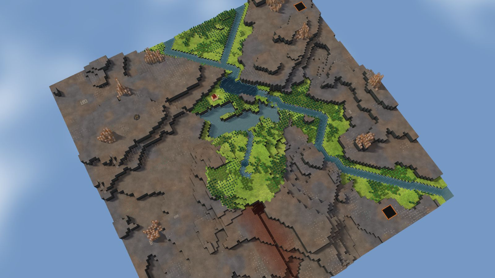

# 1. Mesa Field

River Valley, 128², designed for Normal, seed 36, Verticality 17 (the theme's default). Prototype 0.7.0-proto2.1.
File: [out/v2/Mesa Field (River Valley 36).timber](../../out/v2/Mesa%20Field%20(River%20Valley%2036).timber).

*Rendered with the app's 3D view, in the clean look.*

## Intention

- The start sits under a cliff, with water below (Kyler's own). **Emerged** (52 tiles 2+ levels above within 7, cliff yes, water 4 tiles' walk).

## How it plays

- You start by a river, 4 tiles away on your level.
- It lasts through the first drought; in a 26-day Hard drought it is gone by day 18.
- A 6-tile dam 15 tiles south holds a drought's water.
- Badwater lies 54 tiles south.
- 142 logs of wood within 20 tiles' walk, mixed woods; plus about 110 logs growing.
- You start under a cliff, with your water below.
- Expand to the east, west and south, on narrow ledges.
- Most of the high ground needs stairs.
- Further out: mine sites, a geothermal field, relics and most of the ruins.

## Terrain

- **Land:** plateau, basin, escarpment, ridge, trough over land with no one regional slope.
- **Relief:** 12 levels (p5–p95), 7 levels in use, highest 15; 22% cliff, 58% flat; tallest fall 3.91 levels.
- **Water:** 3 rivers (2 from the edge, 1 from springs), 1 lake, 5 falls; water covers 6% of the map.
- **Reach:** 1% of the dry land is reached on foot from the start; 99% needs stairs (8 natural ramps, 2 uplands left to stairs).
- **Badwater:** a hollow on high ground, draining by its own ditch.

## Cycle timeline

The exact cycle model (`investigation/cycles`), before anything is built; the worst of weather seeds 1729, 7, 99 (seed 1729).

| Weather | At its end | The start's pumpable water | Afterwards |
|---|---|---|---|
| First drought, Normal (3 days) | 45% of the water left | keeps it throughout | back within a day |
| Later drought, Hard (26 days) | 13% of the water left | gone by day 18 | back within a day |
| First badtide, Normal (2 days) | 1,288 tiles of badwater | gone by day 1 | back in 3 days |

## Strategy axes

The verified mechanics study's eight axes (`investigation/mechanics`, measurement version 3) and the woods (D164), each in its fixed bins (bin 0 is the lowest).

| Axis | Value | Bin |
|---|---|---|
| Storage work | 0.96 × a Normal drought's need kept by the land within 40 tiles | 1 of 3 |
| Power location | 0.67 blocks/s through the best water-wheel spot within reach | 1 of 3 |
| Land and height | 206 dry tiles on the start's level within 40 tiles' walk | 1 of 3 |
| Fertile land | 77% of the moist land near the start still moist after a drought | 2 of 2 |
| Threat exposure | 53.9 tiles to the nearest badwater or contaminated soil | 2 of 3 |
| Resource timing | 140 logs standing within 20 tiles' walk | 1 of 3 |
| Expansion choice | 0 separate regions to expand into beyond 20 tiles | 0 of 2 |
| Faction opportunity | 1 extra shore tiles an Iron Teeth deep pump reaches | 1 of 3 |
| Resource timing: the woods | 51% of the starting wood is oak (plenty of wood, slow to regrow; the rest pine and birch, quick) | 1 of 2 |

Its position suits: Hard (docs/m9-design.md §11, a proposal).

## Name

**Mesa Field**, by the names study's rule `mesa-field`: Several flat-topped mesas overlook the lower ground. Choose one shelf to settle, then connect its height to the river.
