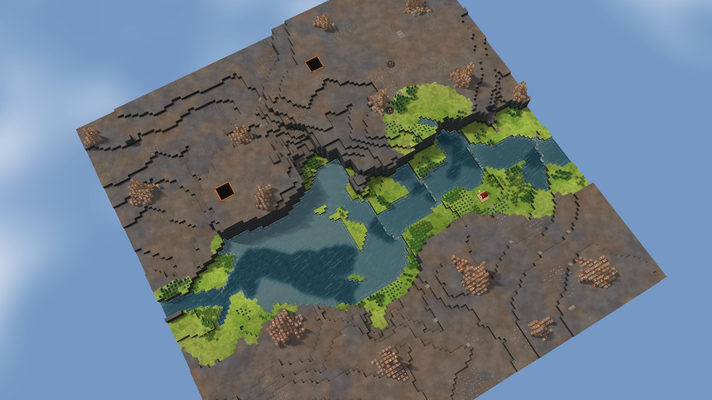
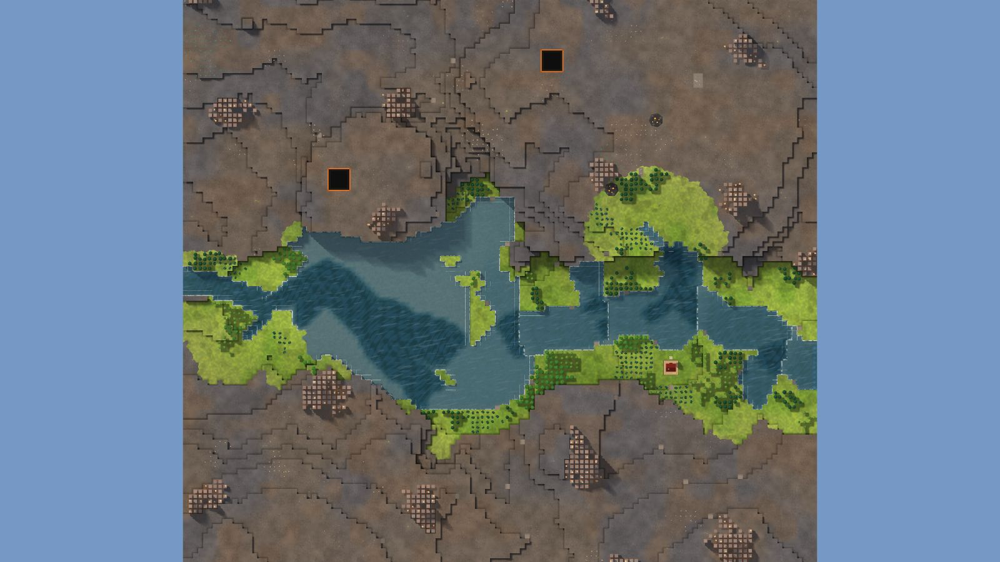

# 2. Berry Bend

Delta, 128², designed for Normal, seed 39, Verticality 10 (the theme's default). Prototype 0.7.0-proto2.1.
File: [out/v2/Berry Bend (Delta 39).timber](../../out/v2/Berry%20Bend%20(Delta%2039).timber).

*Rendered with the app's 3D view, in the clean look.*

## Intention

- A snaking river winds down a hill, dropping a level at its bends (Kyler's own). **Emerged** (a river turns 4 times, back and forth, over 28 tiles while its bed drops 3 levels (a level dropped at 2 bends)).

## How it plays

- You start above water: a pump shore 16 tiles' walk away, down a slope.
- In the first drought it is gone by day 1: store water before it.
- A 19-tile dam by the start holds a drought's water.
- 171 logs of wood within 20 tiles' walk, mixed woods; plus about 110 logs growing.
- A river snakes down a hill, dropping a level at its bends.
- Expand to the west and south, on some level land.
- Further out: mine sites, a geothermal field, relics, another lake or river and most of the ruins.

## Terrain

- **Land:** plateau, basin over land falling toward the west.
- **Relief:** 11 levels (p5–p95), 13 levels in use, highest 12; 6% cliff, 63% flat; tallest fall 7.99 levels.
- **Water:** 2 rivers (1 from the edge, 1 from springs), 4 lakes, 1 fall, a river island, a delta; water covers 10% of the map.
- **Reach:** 41% of the dry land is reached on foot from the start; 59% needs stairs (1 natural ramp, 2 uplands left to stairs).
- **Badwater:** none.

## Cycle timeline

The exact cycle model (`investigation/cycles`), before anything is built; the worst of weather seeds 1729, 7, 99 (seed 1729).

| Weather | At its end | The start's pumpable water | Afterwards |
|---|---|---|---|
| First drought, Normal (3 days) | 12% of the water left | none from the first day | back within a day |
| Later drought, Hard (26 days) | 0% of the water left | none from the first day | back within a day |
| First badtide, Normal (2 days) | 1,865 tiles of badwater | none from the first day | back within a day |

## Strategy axes

The verified mechanics study's eight axes (`investigation/mechanics`, measurement version 3) and the woods (D164), each in its fixed bins (bin 0 is the lowest).

| Axis | Value | Bin |
|---|---|---|
| Storage work | 0.23 × a Normal drought's need kept by the land within 40 tiles | 0 of 3 |
| Power location | 1 blocks/s through the best water-wheel spot within reach | 1 of 3 |
| Land and height | 145 dry tiles on the start's level within 40 tiles' walk | 0 of 3 |
| Fertile land | 29% of the moist land near the start still moist after a drought | 1 of 2 |
| Threat exposure | none found | – |
| Resource timing | 159 logs standing within 20 tiles' walk | 1 of 3 |
| Expansion choice | 5 separate regions to expand into beyond 20 tiles | 2 of 2 |
| Faction opportunity | 0 extra shore tiles an Iron Teeth deep pump reaches | 0 of 3 |
| Resource timing: the woods | 42% of the starting wood is oak (plenty of wood, slow to regrow; the rest pine and birch, quick) | 1 of 2 |

Its position suits: none of the proposed difficulty positions (docs/m9-design.md §11, a proposal).

## Name

**Berry Bend**, by the names study's rule `berry-bend`: A river bend passes abundant berries near the start. Secure food early, then follow the curve toward the next dam site.
