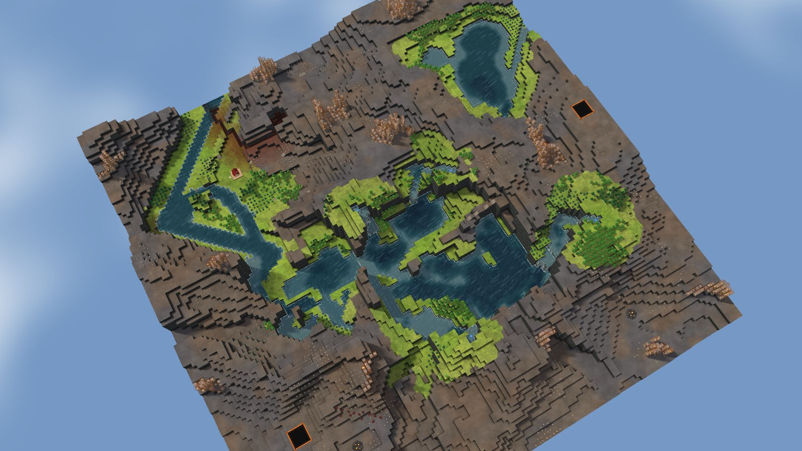
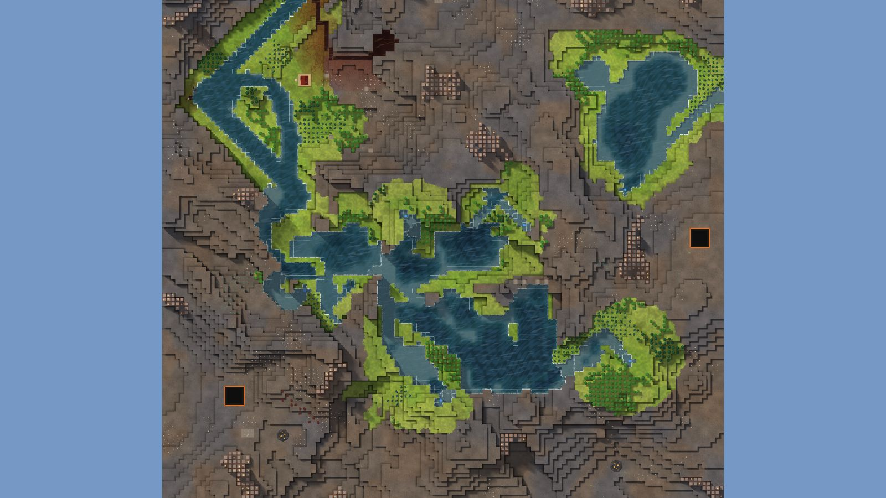

# 3. Moat Isle

Lake Basin, 128², designed for Normal, seed 44, Verticality 13 (the theme's default). Prototype 0.7.0-proto2.1.
File: [out/v2/Moat Isle (Lake Basin 44).timber](../../out/v2/Moat%20Isle%20(Lake%20Basin%2044).timber).

*Rendered with the app's 3D view, in the clean look.*

## Intention

- A large crater gathers two or more rivers into its lake, which leaves through a gap in the rim (Kyler's own). **Emerged** (a 992-tile lake: rim on 16 of 16 rays (falling again outside on 16), 3 rivers in, 1 way out).

## How it plays

- You start by a lake, 4 tiles away on your level.
- In the first drought it is gone by day 1: store water before it.
- A 19-tile dam 11 tiles south-west holds a drought's water.
- Badwater lies 7 tiles north-east, and some reaches your water.
- 592 logs of wood within 20 tiles' walk, mostly oak: plenty of wood, slow to regrow; plus about 90 logs growing.
- Rivers meet in a crater lake that spills out through one gap in its rim.
- Expand on every side, on narrow ledges.
- Most of the high ground needs stairs.
- Further out: mine sites, a geothermal field, relics, another lake or river, waterfalls and most of the ruins.

## Terrain

- **Land:** caldera, basin, escarpment over land with no one regional slope.
- **Relief:** 12 levels (p5–p95), 15 levels in use, highest 14; 15% cliff, 24% flat; tallest fall 6.05 levels.
- **Water:** 7 rivers (1 from the edge, 6 from springs), 4 lakes, 2 falls, a river island; water covers 14% of the map.
- **Reach:** 8% of the dry land is reached on foot from the start; 92% needs stairs (1 natural ramp, 4 uplands left to stairs).
- **Badwater:** a hollow on high ground, draining by its own ditch.

## Cycle timeline

The exact cycle model (`investigation/cycles`), before anything is built; the worst of weather seeds 1729, 7, 99 (seed 1729).

| Weather | At its end | The start's pumpable water | Afterwards |
|---|---|---|---|
| First drought, Normal (3 days) | 61% of the water left | gone by day 1 | back within a day |
| Later drought, Hard (26 days) | 10% of the water left | gone by day 1 | back in 2 days |
| First badtide, Normal (2 days) | 2,305 tiles of badwater | gone by day 1 | back in 5 days |

## Strategy axes

The verified mechanics study's eight axes (`investigation/mechanics`, measurement version 3) and the woods (D164), each in its fixed bins (bin 0 is the lowest).

| Axis | Value | Bin |
|---|---|---|
| Storage work | 0.06 × a Normal drought's need kept by the land within 40 tiles | 0 of 3 |
| Power location | 3.19 blocks/s through the best water-wheel spot within reach | 3 of 3 |
| Land and height | 192 dry tiles on the start's level within 40 tiles' walk | 1 of 3 |
| Fertile land | 0% of the moist land near the start still moist after a drought | 0 of 2 |
| Threat exposure | 0 tiles to the nearest badwater or contaminated soil | 0 of 3 |
| Resource timing | 548 logs standing within 20 tiles' walk | 3 of 3 |
| Expansion choice | 4 separate regions to expand into beyond 20 tiles | 2 of 2 |
| Faction opportunity | 0 extra shore tiles an Iron Teeth deep pump reaches | 0 of 3 |
| Resource timing: the woods | 96% of the starting wood is oak (plenty of wood, slow to regrow; the rest pine and birch, quick) | 2 of 2 |

Its position suits: Hard (docs/m9-design.md §11, a proposal).

## Name

**Moat Isle**, by the names study's rule `moat-isle`: Water circles a high central island. Settle its shore first, then choose a crossing to reach the outer bank.
