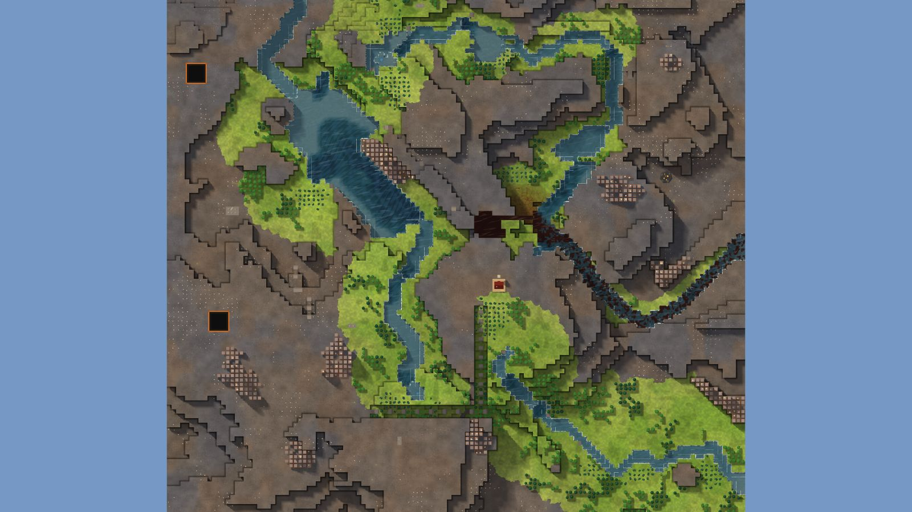

# 5. Mesa Crown

Highlands, 128², designed for Normal, seed 37, Verticality 44 (the theme's default). Prototype 0.7.0-proto2.1.
File: [out/v2/Mesa Crown (Highlands 37).timber](../../out/v2/Mesa%20Crown%20(Highlands%2037).timber).

*Rendered with the app's 3D view, in the clean look.*

## Intention

- A signature landmark stands out: a spire, a mesa, a peak or a tall waterfall. **Emerged** (18 standing forms of 300 tiles or fewer (the most prominent 8 levels over its ring), tallest fall 10.2).
- The start looks out from high ground over the land below. **Emerged** (start at level 15 (map's 75th percentile 12), 15 levels above the lowest ground within 15 tiles).

## How it plays

- You start by a river, 12 tiles away on your level.
- In the first drought it is gone by day 1: store water before it.
- A 4-tile dam 12 tiles north-east holds a drought's water.
- Badwater lies 10 tiles north.
- 570 logs of wood within 20 tiles' walk, mostly oak: plenty of wood, slow to regrow; plus about 170 logs growing.
- A landmark stands out: you can see it from anywhere on the map.
- You start on high ground, looking out over the land below.
- Expand to the south-west, south and south-east, on some level land.
- Further out: mine sites, a geothermal field, relics, other lakes and rivers, waterfalls and most of the ruins.

## Terrain

- **Land:** mesa, spiral, ridge, escarpment, basin, plateau over land falling toward the east; recipe: hanging-lake.
- **Relief:** 14 levels (p5–p95), 12 levels in use, highest 15; 29% cliff, 53% flat; tallest fall 10.24 levels.
- **Water:** 4 rivers (0 from the edge, 4 from springs), 1 lake, 9 falls; water covers 8% of the map.
- **Reach:** 41% of the dry land is reached on foot from the start; 59% needs stairs (8 natural ramps, 3 uplands left to stairs).
- **Badwater:** a hollow on high ground, draining by its own ditch.

## Cycle timeline

The exact cycle model (`investigation/cycles`), before anything is built; the worst of weather seeds 1729, 7, 99 (seed 1729).

| Weather | At its end | The start's pumpable water | Afterwards |
|---|---|---|---|
| First drought, Normal (3 days) | 50% of the water left | none from the first day | back within a day |
| Later drought, Hard (26 days) | 13% of the water left | none from the first day | back in 2 days |
| First badtide, Normal (2 days) | 1,641 tiles of badwater | gone by day 1 | back in 3 days |

## Strategy axes

The verified mechanics study's eight axes (`investigation/mechanics`, measurement version 3) and the woods (D164), each in its fixed bins (bin 0 is the lowest).

| Axis | Value | Bin |
|---|---|---|
| Storage work | 1.03 × a Normal drought's need kept by the land within 40 tiles | 2 of 3 |
| Power location | 0.98 blocks/s through the best water-wheel spot within reach | 1 of 3 |
| Land and height | 754 dry tiles on the start's level within 40 tiles' walk | 2 of 3 |
| Fertile land | 0% of the moist land near the start still moist after a drought | 0 of 2 |
| Threat exposure | 10 tiles to the nearest badwater or contaminated soil | 0 of 3 |
| Resource timing | 398 logs standing within 20 tiles' walk | 3 of 3 |
| Expansion choice | 1 separate regions to expand into beyond 20 tiles | 0 of 2 |
| Faction opportunity | 5 extra shore tiles an Iron Teeth deep pump reaches | 1 of 3 |
| Resource timing: the woods | 90% of the starting wood is oak (plenty of wood, slow to regrow; the rest pine and birch, quick) | 2 of 2 |

Its position suits: none of the proposed difficulty positions (docs/m9-design.md §11, a proposal).

## Name

**Mesa Crown**, by the names study's rule `mesa-crown`: A lake sits high on a flat-topped mesa. Reach the rim first, then decide when to open its spillway.
