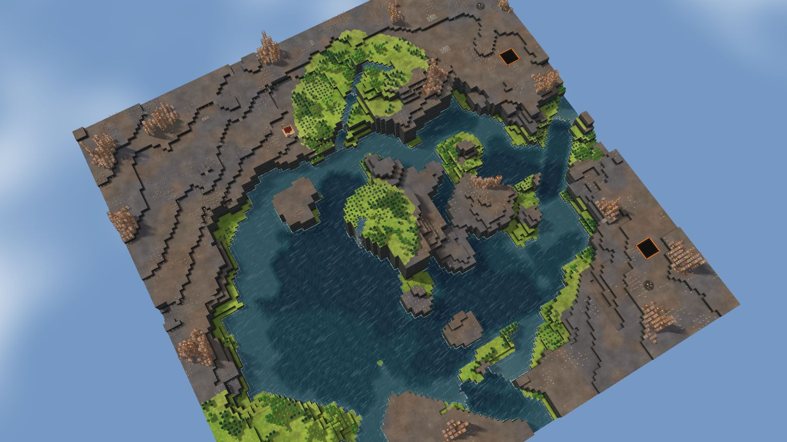
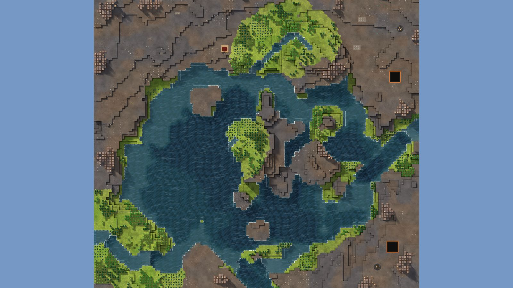

# 6. Paired Falls

Islands, 128², designed for Normal, seed 8, Verticality 17 (the theme's default). Prototype 0.7.0-proto2.1.
File: [out/v2/Paired Falls (Islands 8).timber](../../out/v2/Paired%20Falls%20(Islands%208).timber).

*Rendered with the app's 3D view, in the clean look.*

## Intention

- A lake high on the heights spills over a fall. **Emerged** (a 5275-tile lake 6 levels above the map's middle spills over a fall).

## How it plays

- You start by a lake, 14 tiles away on your level.
- In the first drought it is gone by day 1: store water before it.
- A 2-tile dam 16 tiles south holds a drought's water.
- 617 logs of wood within 20 tiles' walk, mostly oak: plenty of wood, slow to regrow; plus about 140 logs growing.
- A lake high on the heights spills over a fall.
- Expand to the north and west, on some level land.
- Further out: mine sites, a geothermal field, relics, waterfalls and most of the ruins.

## Terrain

- **Land:** trough, basin, mesa, cone over a bowl draining toward the south.
- **Relief:** 12 levels (p5–p95), 15 levels in use, highest 15; 14% cliff, 56% flat; tallest fall 10.79 levels.
- **Water:** 4 rivers (2 from the edge, 2 from springs), 2 lakes, 4 falls; water covers 32% of the map.
- **Reach:** 44% of the dry land is reached on foot from the start; 56% needs stairs (0 natural ramps, 4 uplands left to stairs).
- **Badwater:** none.

## Cycle timeline

The exact cycle model (`investigation/cycles`), before anything is built; the worst of weather seeds 1729, 7, 99 (seed 1729).

| Weather | At its end | The start's pumpable water | Afterwards |
|---|---|---|---|
| First drought, Normal (3 days) | 66% of the water left | none from the first day | back in 2 days |
| Later drought, Hard (26 days) | 17% of the water left | none from the first day | back in 2 days |
| First badtide, Normal (2 days) | 4,539 tiles of badwater | gone by day 1 | not back within 5 days |

## Strategy axes

The verified mechanics study's eight axes (`investigation/mechanics`, measurement version 3) and the woods (D164), each in its fixed bins (bin 0 is the lowest).

| Axis | Value | Bin |
|---|---|---|
| Storage work | 2.88 × a Normal drought's need kept by the land within 40 tiles | 2 of 3 |
| Power location | 0.66 blocks/s through the best water-wheel spot within reach | 1 of 3 |
| Land and height | 464 dry tiles on the start's level within 40 tiles' walk | 1 of 3 |
| Fertile land | 0% of the moist land near the start still moist after a drought | 0 of 2 |
| Threat exposure | none found | – |
| Resource timing | 563 logs standing within 20 tiles' walk | 3 of 3 |
| Expansion choice | 3 separate regions to expand into beyond 20 tiles | 1 of 2 |
| Faction opportunity | 23 extra shore tiles an Iron Teeth deep pump reaches | 2 of 3 |
| Resource timing: the woods | 75% of the starting wood is oak (plenty of wood, slow to regrow; the rest pine and birch, quick) | 2 of 2 |

Its position suits: Easy, Normal (docs/m9-design.md §11, a proposal).

## Name

**Paired Falls**, by the names study's rule `paired-falls`: Two falls break the river into separate levels. Build crossings between them before spreading along both banks.
