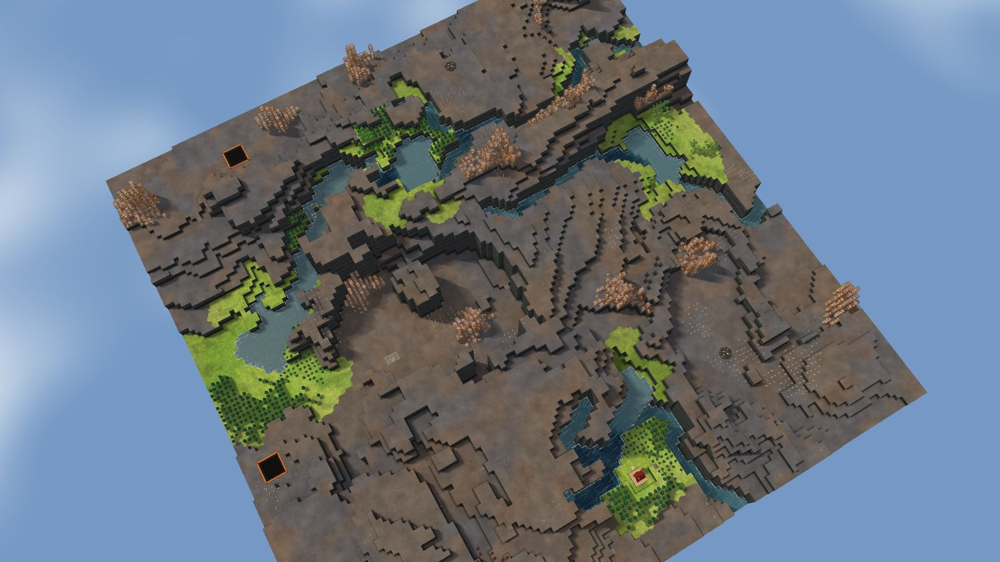

# 7. Lake Steps

River Valley, 128², designed for Normal, seed 15, Verticality 83 (set to 85: high). Prototype 0.7.0-proto2.1.
File: [out/v2/Lake Steps (River Valley 15, Verticality 85).timber](../../out/v2/Lake%20Steps%20(River%20Valley%2015,%20Verticality%2085).timber).

*Rendered with the app's 3D view, in the clean look.*

## Intention

- A hidden valley up the cliffs, reached only by stairs, holds riches. **Emerged** (3 uplands cut off by cliffs, reached only by stairs, with riches (largest 1337 tiles)).

## How it plays

- You start by a river, 2 tiles away on your level.
- It lasts through the first drought; in a 26-day Hard drought it is gone by day 13.
- A 9-tile dam 15 tiles north-east holds a drought's water.
- Thorns bar the way west, 25 tiles out.
- 130 logs of wood within 20 tiles' walk, mostly pine and birch: little wood a tree, quick to regrow; plus about 60 logs growing.
- A valley up the cliffs holds riches: build stairs to reach it.
- Expand to the north-east, south-west, south and south-east, on narrow ledges.
- Most of the high ground needs stairs.
- Further out: mine sites, a geothermal field, relics, other lakes and rivers, waterfalls and most of the ruins.

## Terrain

- **Land:** ridge, plateau, caldera, mesaField, basin over land with no one regional slope.
- **Relief:** 12 levels (p5–p95), 14 levels in use, highest 15; 30% cliff, 45% flat; tallest fall 5.99 levels.
- **Water:** 5 rivers (0 from the edge, 5 from springs), 0 lakes, 8 falls; water covers 5% of the map.
- **Reach:** 3% of the dry land is reached on foot from the start; 97% needs stairs (0 natural ramps, 5 uplands left to stairs).
- **Badwater:** none.

## Cycle timeline

The exact cycle model (`investigation/cycles`), before anything is built; the worst of weather seeds 1729, 7, 99 (seed 1729).

| Weather | At its end | The start's pumpable water | Afterwards |
|---|---|---|---|
| First drought, Normal (3 days) | 60% of the water left | keeps it throughout | back within a day |
| Later drought, Hard (26 days) | 27% of the water left | gone by day 13 | back within a day |
| First badtide, Normal (2 days) | 1,223 tiles of badwater | gone by day 1 | back within a day |

## Strategy axes

The verified mechanics study's eight axes (`investigation/mechanics`, measurement version 3) and the woods (D164), each in its fixed bins (bin 0 is the lowest).

| Axis | Value | Bin |
|---|---|---|
| Storage work | 1.05 × a Normal drought's need kept by the land within 40 tiles | 2 of 3 |
| Power location | 1.58 blocks/s through the best water-wheel spot within reach | 2 of 3 |
| Land and height | 186 dry tiles on the start's level within 40 tiles' walk | 1 of 3 |
| Fertile land | 45% of the moist land near the start still moist after a drought | 1 of 2 |
| Threat exposure | none found | – |
| Resource timing | 130 logs standing within 20 tiles' walk | 1 of 3 |
| Expansion choice | 1 separate regions to expand into beyond 20 tiles | 0 of 2 |
| Faction opportunity | 28 extra shore tiles an Iron Teeth deep pump reaches | 2 of 3 |
| Resource timing: the woods | 0% of the starting wood is oak (plenty of wood, slow to regrow; the rest pine and birch, quick) | 0 of 2 |

Its position suits: none of the proposed difficulty positions (docs/m9-design.md §11, a proposal).

## Name

**Lake Steps**, by the names study's rule `lake-steps`: A chain of lakes descends through short channels. Secure the upper outlets first; each lower basin drains sooner.
