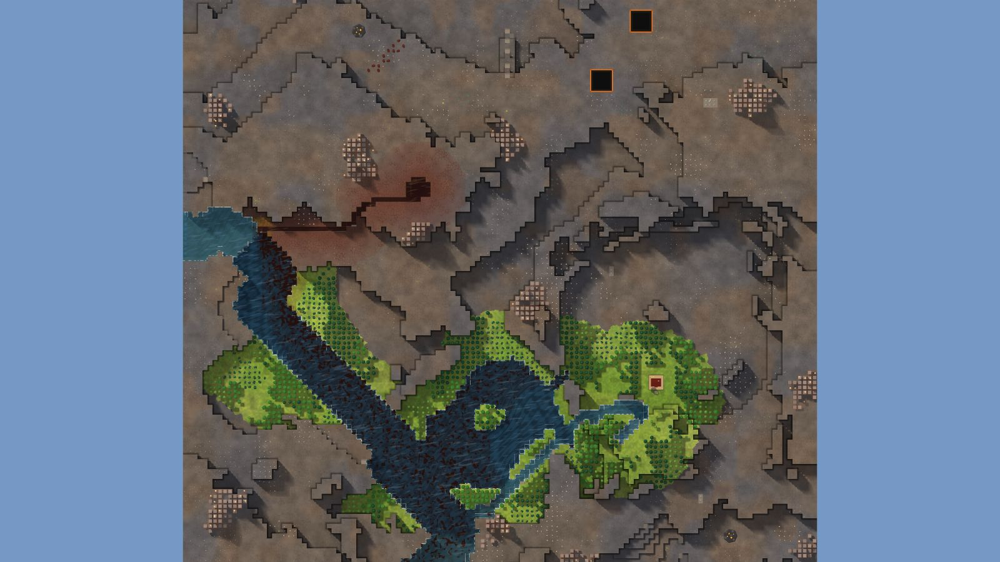

# 8. Highland Stair

Lake Basin, 128², designed for Normal, seed 39, Verticality 85 (set to 85: high). Prototype 0.7.0-proto2.1.
File: [out/v2/Highland Stair (Lake Basin 39, Verticality 85).timber](../../out/v2/Highland%20Stair%20(Lake%20Basin%2039,%20Verticality%2085).timber).

*Rendered with the app's 3D view, in the clean look.*

## Intention

- A waterfall shields the start: its cliff stands between the start and the nearest threat. **Emerged** (a fall 9 tiles away; the threat 53 tiles off is out of reach on foot).

## How it plays

- You start by a lake, 3 tiles away on your level.
- It lasts through the first drought; in a 26-day Hard drought it is gone by day 6.
- A 10-tile dam 10 tiles south-west holds a drought's water.
- Badwater lies 54 tiles west, and some reaches your water.
- 1172 logs of wood within 20 tiles' walk, mostly oak: plenty of wood, slow to regrow; plus about 370 logs growing.
- A waterfall's cliff stands between you and the nearest threat.
- Expand to the east and north, on some level land.
- Most of the high ground needs stairs.
- Further out: mine sites, a geothermal field, relics, waterfalls and most of the ruins.

## Terrain

- **Land:** basin, caldera over a bowl draining toward the south-east.
- **Relief:** 14 levels (p5–p95), 6 levels in use, highest 15; 21% cliff, 67% flat; tallest fall 9.81 levels.
- **Water:** 2 rivers (1 from the edge, 1 from springs), 2 lakes, 4 falls; water covers 10% of the map.
- **Reach:** 11% of the dry land is reached on foot from the start; 89% needs stairs (2 natural ramps, 9 uplands left to stairs).
- **Badwater:** a hollow on high ground, draining by its own ditch.

## Cycle timeline

The exact cycle model (`investigation/cycles`), before anything is built; the worst of weather seeds 1729, 7, 99 (seed 1729).

| Weather | At its end | The start's pumpable water | Afterwards |
|---|---|---|---|
| First drought, Normal (3 days) | 79% of the water left | keeps it throughout | not back within 5 days |
| Later drought, Hard (26 days) | 43% of the water left | gone by day 6 | not back within 5 days |
| First badtide, Normal (2 days) | 1,667 tiles of badwater | gone by day 1 | not back within 5 days |

## Strategy axes

The verified mechanics study's eight axes (`investigation/mechanics`, measurement version 3) and the woods (D164), each in its fixed bins (bin 0 is the lowest).

| Axis | Value | Bin |
|---|---|---|
| Storage work | 1.91 × a Normal drought's need kept by the land within 40 tiles | 2 of 3 |
| Power location | 0.63 blocks/s through the best water-wheel spot within reach | 1 of 3 |
| Land and height | 1439 dry tiles on the start's level within 40 tiles' walk | 3 of 3 |
| Fertile land | 12% of the moist land near the start still moist after a drought | 0 of 2 |
| Threat exposure | 17 tiles to the nearest badwater or contaminated soil | 1 of 3 |
| Resource timing | 1077 logs standing within 20 tiles' walk | 3 of 3 |
| Expansion choice | 3 separate regions to expand into beyond 20 tiles | 1 of 2 |
| Faction opportunity | 0 extra shore tiles an Iron Teeth deep pump reaches | 0 of 3 |
| Resource timing: the woods | 76% of the starting wood is oak (plenty of wood, slow to regrow; the rest pine and birch, quick) | 2 of 2 |

Its position suits: Normal (docs/m9-design.md §11, a proposal).

## Name

**Highland Stair**, by the names study's rule `highland-stair`: A stream drops over several high terraces. Follow it down for clean water and connect the shelves with slopes.
