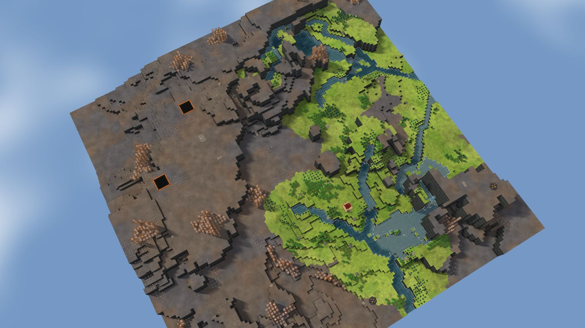

# 9. Beaver Cascade

Highlands, 128², designed for Normal, seed 9, Verticality 85 (set to 85: high). Prototype 0.7.0-proto2.1.
File: [out/v2/Beaver Cascade (Highlands 9, Verticality 85).timber](../../out/v2/Beaver%20Cascade%20(Highlands%209,%20Verticality%2085).timber).

*Rendered with the app's 3D view, in the clean look.*

## Intention

- Two rivers meet by the start. **Emerged** (a confluence 12 tiles from the start).

## How it plays

- You start by a river, 6 tiles away on your level.
- In the first drought it is gone by day 1: store water before it.
- No short dam holds a drought's water near the start: build levees or dig a reservoir.
- 327 logs of wood within 20 tiles' walk, mostly oak: plenty of wood, slow to regrow; plus about 190 logs growing.
- Two rivers meet by the start.
- Expand to the north and west, on some level land.
- Further out: mine sites, a geothermal field, relics, another lake or river, waterfalls and most of the ruins.

## Terrain

- **Land:** mesaField, cone, plateau over land with no one regional slope.
- **Relief:** 11 levels (p5–p95), 15 levels in use, highest 16; 19% cliff, 50% flat; tallest fall 6.03 levels.
- **Water:** 6 rivers (0 from the edge, 6 from springs), 1 lake, 10 falls; water covers 6% of the map.
- **Reach:** 28% of the dry land is reached on foot from the start; 72% needs stairs (5 natural ramps, 5 uplands left to stairs).
- **Badwater:** none.

## Cycle timeline

The exact cycle model (`investigation/cycles`), before anything is built; the worst of weather seeds 1729, 7, 99 (seed 1729).

| Weather | At its end | The start's pumpable water | Afterwards |
|---|---|---|---|
| First drought, Normal (3 days) | 38% of the water left | none from the first day | back within a day |
| Later drought, Hard (26 days) | 12% of the water left | none from the first day | back within a day |
| First badtide, Normal (2 days) | 1,074 tiles of badwater | gone by day 1 | back in 2 days |

## Strategy axes

The verified mechanics study's eight axes (`investigation/mechanics`, measurement version 3) and the woods (D164), each in its fixed bins (bin 0 is the lowest).

| Axis | Value | Bin |
|---|---|---|
| Storage work | 0 × a Normal drought's need kept by the land within 40 tiles | 0 of 3 |
| Power location | 1.03 blocks/s through the best water-wheel spot within reach | 2 of 3 |
| Land and height | 197 dry tiles on the start's level within 40 tiles' walk | 1 of 3 |
| Fertile land | 0% of the moist land near the start still moist after a drought | 0 of 2 |
| Threat exposure | none found | – |
| Resource timing | 318 logs standing within 20 tiles' walk | 2 of 3 |
| Expansion choice | 1 separate regions to expand into beyond 20 tiles | 0 of 2 |
| Faction opportunity | 11 extra shore tiles an Iron Teeth deep pump reaches | 2 of 3 |
| Resource timing: the woods | 95% of the starting wood is oak (plenty of wood, slow to regrow; the rest pine and birch, quick) | 2 of 2 |

Its position suits: none of the proposed difficulty positions (docs/m9-design.md §11, a proposal).

## Name

**Beaver Cascade**, by the names study's rule `fallback:beaver+cascade`: The start has clean water within reach. Follow the main river and choose a nearby place to store water before drought.
