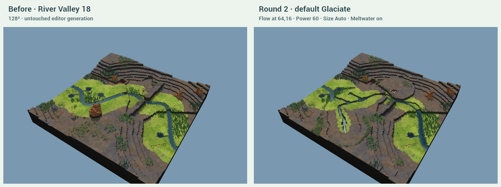
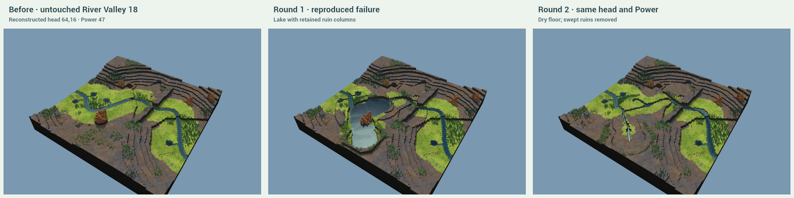
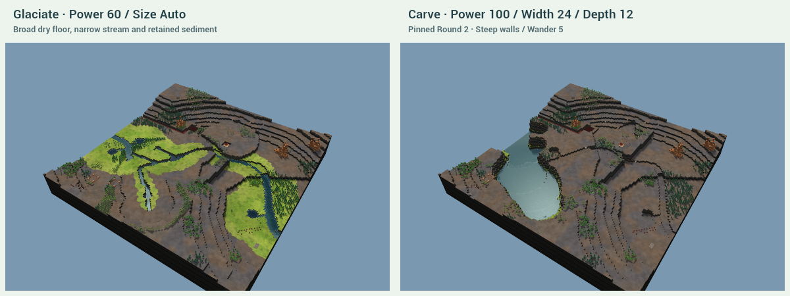
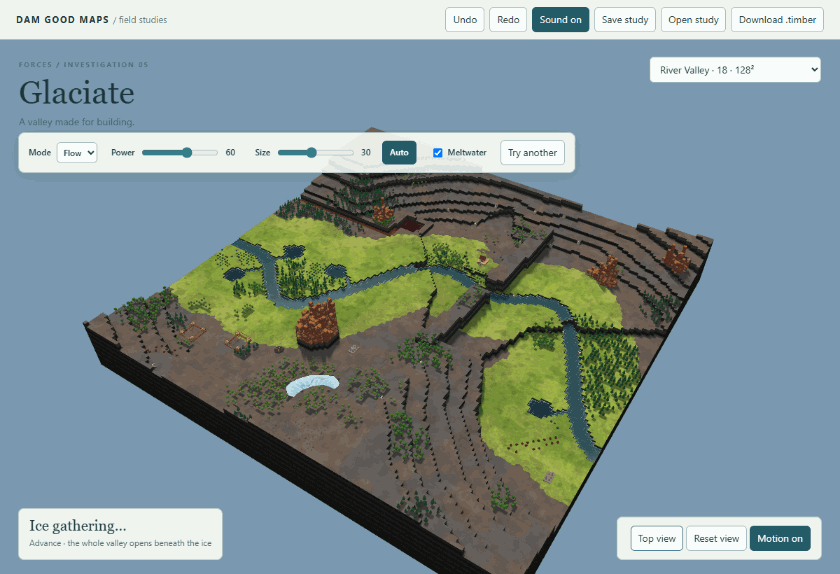
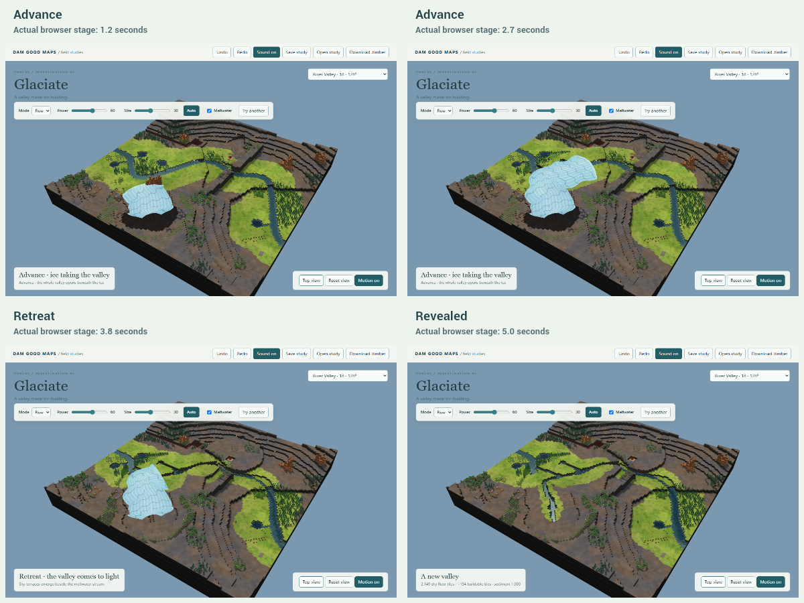
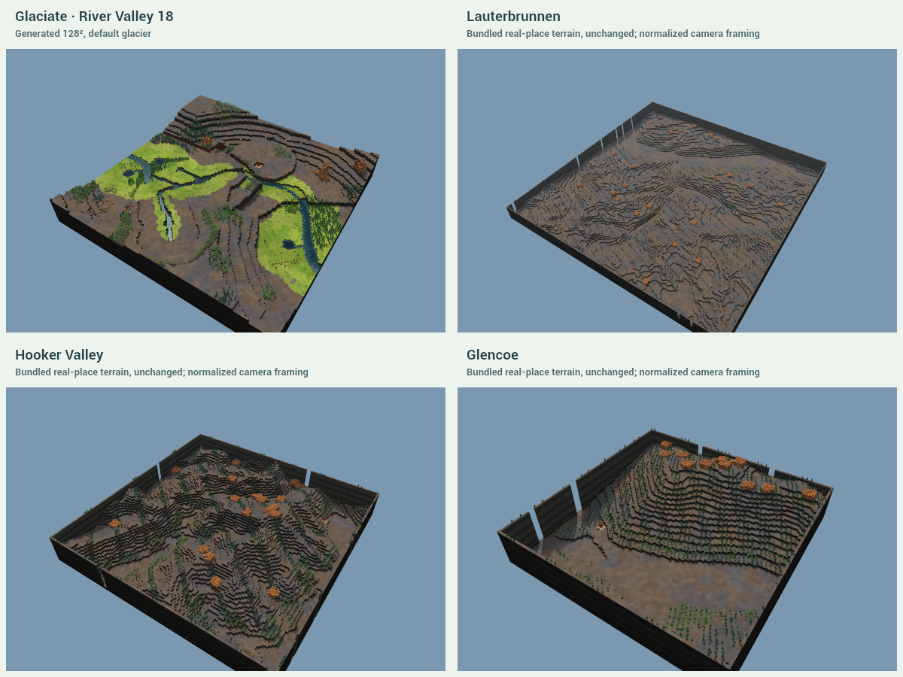
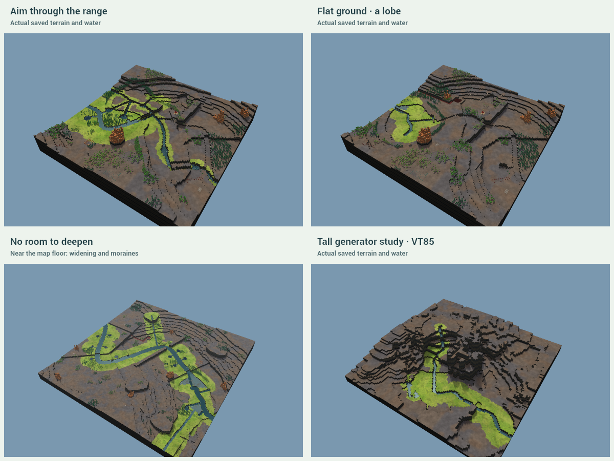
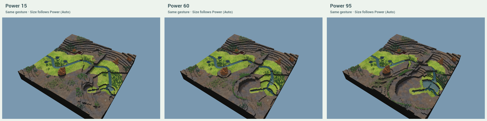
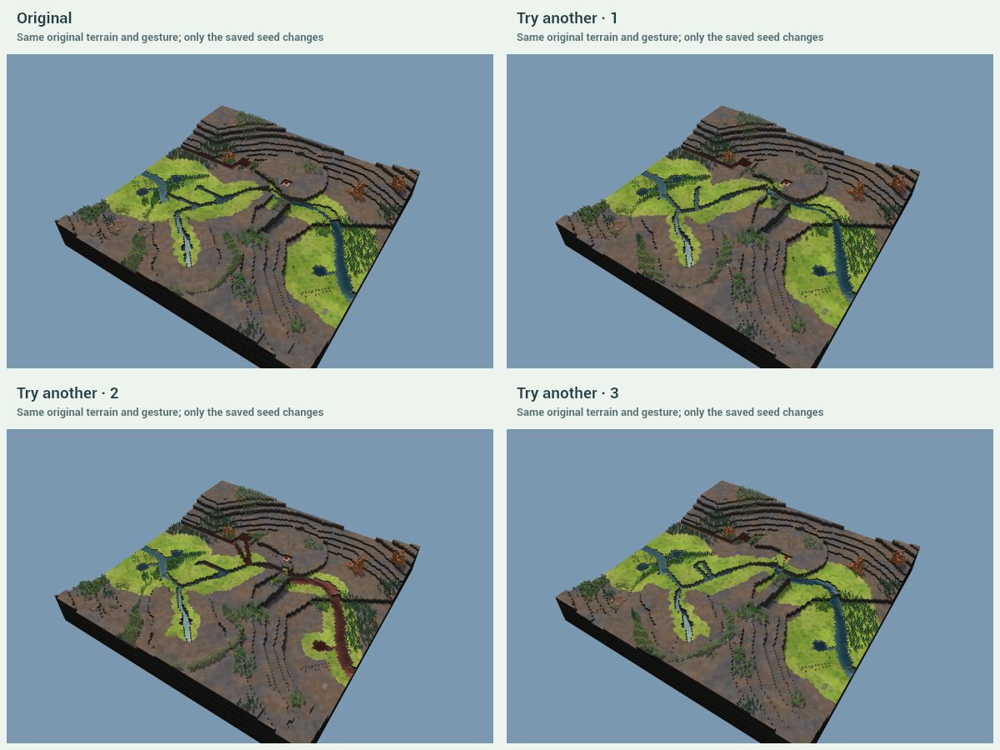

# Glaciate — Round 2, after Kyler's review

**The default now leaves a broad dry valley with a narrow stream.** On River Valley 18, 128², the same head (64,16), Flow / Power 60 / Size Auto / Meltwater on gives **2,149 dry, level floor tiles**, **13.0% of the trough under water**, and **+134 buildable tiles overall** in the affected region. Its centreline runs 75.7 tiles, 59.1% of the map width. The largest measured cardinal run on its curved outline is 11 tiles. This is a modest net land gain on an input valley that was already largely buildable, not thousands of newly created building sites.

Changed: the full-width stepped-basin recipe is gone. A dry bank datum follows the existing valley; a narrow, continuously draining channel lies below it. There is room for a small head tarn and one terminal ribbon lake, with lakes omitted on short, cramped tongues. The lobe sweeps forward into an open scoured area. Aim has a broad natural bend. Non-plants swept by the floor are removed rather than left on islands. The visible tongue has a travelling rounded nose and moving surface streaks; no radial swelling. Terrain is committed during advance, before retreat finishes at both tested sizes.

Kept: deterministic seeds, a literal result operation, exact replay/undo/cancellation, retained water, source feed, the floor/22 ceiling, one material ledger, moved trees, recorded CC0 foley, and the editor's chunk renderer. No production files changed. [Round 1 report](https://github.com/timbermods/dam-good-maps/blob/f63e4aea0d24b63088e1fe4556b95ee8f0cbf8d1/investigation/glaciate/REPORT.md) remains in history; its lake-chain goal is superseded.

## Kyler's Power 47 case

The review did not contain saved pointer coordinates. Running the old implementation at the original default head **(64,16), River Valley 18, Power 47, seed 891** reproduces the lake with ruin columns left in its floor. This is a matching reproduction, not recovered click telemetry. The same input now has **1812 dry floor tiles**, **12.7% water**, and **+57 buildable tiles**. Swept ruin columns are removed under the force's excavation policy. The exact pinned reference, coordinates and surviving Round 1 ruin IDs are recorded in [checks/kyler-reproduction.json](checks/kyler-reproduction.json); its large result stays in ignored local storage.

## Carve gives you water; Glaciate gives you land

Both start from the identical untouched River Valley 18 map and head. Carve uses the pinned Round 2 code at cd9225c: **Power 100, Width 24, Depth 12, Steep, Wander 5, Keep river**, seed 891. Glaciate uses the default settings above. The oracle is read-only and is not imported by the demo.

| Same input | Glaciate | Carve |
| --- | ---: | ---: |
| Net buildable tiles, whole affected region | +134 | -1431 |
| Cut blocks | 2638 | 18334 |
| Deposited blocks | 2638 | 0 |
| Changed terrain cells | 3024 | 2647 |

The visual difference is now the broad green floor and dry land beside the narrow stream, with receiving ground at the end. The cliffs remain recognisably related to Carve's block-scale cut. The small lakes are secondary. This comparison does not claim Carve cannot leave land, deposit sediment or retain oxbows in its other settings. [Full comparison evidence](checks/comparison.json).

## The two acts

A real pointer click starts the default event. Fixed ribbon geometry covers the valley; a rounded leading edge travels from head to snout, reaching the end at about three seconds. Advected surface bands make the downstream motion visible. Retreat removes the ice from snout back to head. The flat-ground lobe uses this same directional tongue. Ice does not grow by scaling a disc. The renderer remeshes changed integer chunks and adds the overlay; no terrain GPU morph is used.

The browser compares every displayed terrain height with the literal final plan. On 128², the terrain was exact **3056.9 ms after input**, before retreat ended at 5024.0 ms. On 256² it was exact at **3212.7 ms**, before retreat ended at 5164.6 ms. Terrain and object changes finish during advance; water may continue settling afterwards. The overlay animates on the main thread independently of water work. Esc and Undo are checked during advance, retreat and final settling, including rejection of a late completion.

## The land and its limits

Flow's priority-flood route follows existing low corridors. Power controls requested reach; boundaries and the protected start can shorten it. The default now covers a useful part of the 128² map. Auto width is 8 + 36 × Power/100, rounded, giving **30 tiles nominal at Power 60**; manual Size remains 4–64. Width varies along the land, and the tongue narrows near the boundary so its end is not clipped into a square. The player still gets only Mode, Power, Size and Meltwater, plus Try another.

The floor meets the original upper shoulder as a steep curved wall. Its longitudinal datum descends in terraces, above a separately incised stream. Existing wet tributary entrances get connections into that stream. Outlets reach the actual map boundary: stopping two rows inside the map had created accidental dams during development. Meltwater sources use real exported source entities, with strength 0.4 + 0.025 × nominal width, capped at 2. Wider existing 256² rivers get more channel capacity. Lakes, where there is room, are small pockets below the channel outlet and are stored in the operation.

Cut material first grades receiving ground where a dry forward fan fits; the stream remains open. Low terminal arcs and lateral ridges follow the footprint. Remaining material fills narrow ledges against existing terraces. Paired one-block cuts/fills join broken pads while conserving volume. There is no uniform circular outer apron. Trees move to actual supported edge positions, retaining IDs/species/components; swept non-plants are removed. Pinned objects and the start remain protected. Slopes whose connections are lost are pruned before export.

Glencoe is the clearest dry-floor composition reference. Lauterbrunnen and Hooker Valley are also shown as unchanged bundled heightfields at normalized framing; they are not photographs or identical physical scales. The generated floor is still more regular than the real valleys. River Coe is absent from this checkout's gallery, and Yosemite remains excluded. Elevation attribution is in [ATTRIBUTION.md](ATTRIBUTION.md).

Aim bends through the range and uses the same dry-bank/stream rules. The lobe is mostly dry scoured ground with a small wet pocket and an open moraine edge. Low ground widens and uses real shoulder material to raise dry land. A fan is not guaranteed when the glacier ends near an edge, a protected start, an existing river or rising ground. The table reports zero where no new dry fan was made; it does not relabel a side ridge as outwash.

Same Power-comparison input as Round 1: head (96,32), River Valley 18, Power 15/60/95, Auto Size. This head is close to the map boundary, so all three reaches are boundary-limited. Low and high Power can still lose building space there; the exact values are reported below. A universal positive-gain guarantee for every possible gesture is not claimed.

These are the same original terrain and gesture with three successors of seed 891. They vary widths, tarns and moraines without changing the underlying drainage route or stacking glaciers. All three default variations are required by tests to gain building space.

## Measurements that count dry land

A **buildable tile** is dry (water depth ≤0.05) and belongs to at least one level 2×2 pad. Trees are assumed clearable; other entity footprints and the start are excluded. This is building space, not a claim of path access from the start or an in-game construction probe. **Dry floor** applies this test only inside the broad trough footprint. Water share counts every footprint tile above the same depth threshold.

The before/after counts use exactly the same **affected region**: the trough, changed ground, wet/dry transitions and changed non-plant footprints, with a one-tile collar because a neighbouring edit changes a 2×2 pad. Tests require its net gain to equal the whole-map gain, preventing an omitted downstream loss from improving the result. The **direct-only** column separately counts just the trough and height-changed cells; large-map, Aim and another-2 gain overall despite losing building space inside those cells, because of drainage and adjacent-pad changes. Both figures are shown rather than hiding this distinction.

Length is the centreline arc length versus the portion of the valley followed. They are equal by construction for Flow; this is not the full length of the valley to the sea. The default sinuosity is 1.2941 versus 1.2941 for its followed route. Aim compares with its aimed curve, not a geographic valley. Wall run is the longest exact horizontal or vertical segment of the rasterized trough outline, including caps; it is not a guarantee about every diagonal or every pre-existing map wall. The regenerated captures were inspected for square ends and long straight cuts.

| Case | Dry level floor | Trough wet | Length / followed valley | Longest wall | Buildable before → after | Net affected | Direct-only net |
| --- | ---: | ---: | ---: | ---: | ---: | ---: | ---: |
| default | 2149 | 13.0% | 75.7 / 75.7 | 11 | 5105 → 5239 | +134 | +51 |
| small-map | 1579 | 11.9% | 48.6 / 48.6 | 8 | 5733 → 5811 | +78 | +45 |
| kyler | 1812 | 12.7% | 75.5 / 75.5 | 7 | 4244 → 4301 | +57 | +71 |
| side-valleys | 2132 | 17.4% | 76.6 / 76.6 | 12 | 6622 → 6829 | +207 | +177 |
| large-map | 1809 | 25.2% | 66.1 / 66.1 | 11 | 6371 → 6677 | +306 | -65 |
| lobe | 1278 | 11.1% | 36.2 / 36.2 | 7 | 4441 → 5231 | +790 | +261 |
| low-ground | 1798 | 28.4% | 50.8 / 50.8 | 11 | 7155 → 7230 | +75 | +86 |
| tall | 2608 | 9.3% | 88.1 / 88.1 | 10 | 8680 → 8819 | +139 | +92 |
| aim | 2557 | 14.6% | 87.8 / 87.8 | 10 | 8060 → 8180 | +120 | -138 |
| power-low | 394 | 21.4% | 36.9 / 36.9 | 7 | 1917 → 1860 | -57 | -45 |
| power-default | 1182 | 10.4% | 37.9 / 37.9 | 9 | 5007 → 5009 | +2 | +2 |
| power-high | 1642 | 17.8% | 38.9 / 38.9 | 12 | 8676 → 8389 | -287 | -282 |
| another-1 | 1915 | 14.0% | 75.7 / 75.7 | 9 | 4271 → 4456 | +185 | +98 |
| another-2 | 2283 | 15.0% | 75.7 / 75.7 | 8 | 5623 → 5634 | +11 | -9 |
| another-3 | 2085 | 13.8% | 75.7 / 75.7 | 12 | 4460 → 4542 | +82 | +81 |

| Case | Cut / deposited blocks | Ratio | Median dry bank width | New dry outwash tiles | Basin depths below outlet | Trees moved / non-plants removed |
| --- | ---: | ---: | ---: | ---: | --- | ---: |
| default | 2638 / 2638 | 1.000 | 11 | 798 | 1, 1 | 553 / 111 |
| small-map | 3834 / 3834 | 1.000 | 12 | 0 | none | 318 / 34 |
| kyler | 2164 / 2164 | 1.000 | 9 | 639 | 1, 1 | 455 / 109 |
| side-valleys | 2865 / 2865 | 1.000 | 11 | 0 | 1 | 637 / 36 |
| large-map | 3962 / 3962 | 1.000 | 10 | 0 | 1, 1 | 145 / 13 |
| lobe | 1492 / 1492 | 1.000 | 12 | 0 | 1 | 271 / 18 |
| low-ground | 2925 / 2925 | 1.000 | 11 | 344 | none | 237 / 9 |
| tall | 5296 / 5296 | 1.000 | 11 | 109 | none | 0 / 0 |
| aim | 5040 / 5040 | 1.000 | 12 | 274 | 1, 1 | 470 / 44 |
| power-low | 1336 / 1336 | 1.000 | 4 | 0 | 1 | 13 / 3 |
| power-default | 4369 / 4369 | 1.000 | 9 | 0 | none | 140 / 22 |
| power-high | 9200 / 9200 | 1.000 | 12 | 0 | none | 270 / 36 |
| another-1 | 2352 / 2352 | 1.000 | 10 | 826 | 1, 1 | 487 / 111 |
| another-2 | 2924 / 2924 | 1.000 | 11 | 670 | 1, 1 | 597 / 113 |
| another-3 | 2459 / 2459 | 1.000 | 10 | 698 | 1, 1 | 534 / 111 |

Dry bank width is the longest contiguous dry, equal-height run across each sampled normal section, then the median; the river splits the two banks. It is not the full nominal width, and submerged floor is no longer counted as building land. The raw record still includes cross-section range and flat share for comparison with Round 1. Every individual basin's floor, outlet, depth, area and feed reachability is in [checks/core.json](checks/core.json).

## Performance and verification

Chrome 153.0.8010.48, 1200×820, headless, **ANGLE (NVIDIA, NVIDIA GeForce RTX 4080 SUPER (0x00002702) Direct3D11 vs_5_0 ps_5_0, D3D11)**. Normal speed, warmed sound on; the performance run takes no screenshots. Values are requestAnimationFrame intervals on this host, not in-game FPS.

| Interval at 256² | Frames | Median ms | p95 ms | Worst ms |
| --- | ---: | ---: | ---: | ---: |
| Advance | 528 | 6.1 | 6.2 | 6.9 |
| Retreat | 320 | 6.1 | 6.2 | 18.2 |
| Whole run | 1177 | 6.1 | 6.2 | 18.2 |

Long tasks: **0**. Planning: 191.7 ms. First terrain commit: 296.3 ms. Full endpoint, including the final water solve: **7.2 seconds**, 2304 water ticks. The terrain timing above is measured separately from that endpoint. [Browser evidence](checks/browser.json).

The model suite passes **392 assertions**, plus 12 schema/malformed-operation checks and exported-file checks on 15 endpoints. Coverage retains determinism, exact literal replay, atomic invalid import, undo/cancel, material accounting, bounds, retained water/feed and alternate seeds. Round 2 adds dry-majority floors, few basins, no swept non-plant survivors, no invented water on previously dry advance tiles, final terrain by the end of advance, outline runs at most 12 tiles, correct region accounting, and positive gain for the default, Power 47, the near-edge default-Power case and three default variations. Browser checks cover the real click, both terrain deadlines and cancellation through final settling. Typecheck and Vite build pass; the standalone bundle retains the size advisory.

The standard-map exports pass the repository's load/design checks, including valid GUIDs, slopes and a 960×540 thumbnail. No Timberborn launch was performed. The tall VT85 pre-build still lacks a playable start, so its game download is refused. The tall solver can reach its tick cap; the UI and raw results say so rather than calling it settled. The existing dev editor has no Verticality control: this labelled generator pre-build remains a substitute study, not an editor acceptance test.

The five CC0 recordings and their provenance are unchanged. The actual recipe measures -17.1 dBFS in its loudest 100 ms window and -6.1 dBFS peak. Sound can be turned off; the low groan is still pitched wood foley, not a glacier field recording. [Manifest](bank.json), [audio checks](checks/audio.json).

Remaining limits: some constrained gestures lose land; outwash needs forward room; narrow or very steep terrain can leave shelves; source/catchment capacity is approximate; cliff regularity and sonic likeness still need Kyler's eye and ear. No fifth control was added. An ice-sheet mode remains a possible later investigation and is not built.

## Run and adopt

[README](README.md) runs the demo; [INTEGRATION](INTEGRATION.md) updates the adoption proposal. Everything changed is under investigation/glaciate/. Captures total **5.69 MiB**, largest **1.56 MiB**; large reference/results stay ignored. This round updates the existing investigation/glaciate branch and PR #69. No merge, approval, auto-merge, other branch, tag or release is part of this task.
