# Round 3: a mountain carver

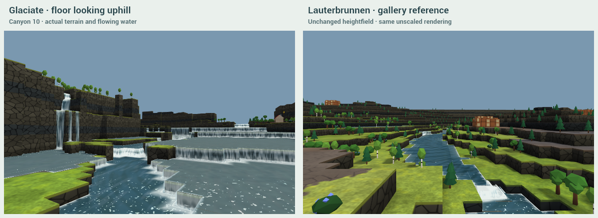

**This includes Kyler's addition after trying the early Round 3 demo.** Every tested click now carves, including all six random high-ground clicks, three modest-ground clicks and River Valley's flat floor. Click selects Flow; drag selects Aim. The Mode control and relief refusals are gone. Trees and objects are swept away, surviving objects stay put, and swept clean sources become flow at the cirque. Badwater strength is discarded. The former deep river slot and long collector ditches are removed.

**It remains an incomplete visual result.** The default Canyon 10, 128², click **22,22**, Power **60**, Auto Size **30**, Meltwater on, seed **891**, gives **2863 dry level floor tiles**, but only **221 (7.7%)** were not already buildable at those coordinates. Net affected building land is **-560**. There are **2** actual hanging falls, median/max walls **7/10**, and **19.3%** wet trough. The actual river widens to **19 tiles** in places and the conservative cross-section count reaches **4 wet passages**. These failures are not hidden by the passing lifecycle tests.

Lauterbrunnen is the repository's unchanged gallery heightfield, using the same materials and unscaled block heights. It is not a photograph or a modified success fixture. The before/after use the same overview camera; the low views look uphill from the actual new floor. The maps have different physical scales. The reference still has the more convincing composition.

## What changed

Glaciate cuts a broad floor far below the old mountain rim, with irregular single-level bars, rock-dependent cliffs/benches, a cirque/tarn, hanging mouths, scree and low terminal rubble. Power controls depth and reach; Auto Size follows Power. A modest mountain targets at least three levels of lowering where ground allows it. An existing lower river can force the whole terrace sequence deeper so the glacier does not dam it behind a raised floor. That means some walls exceed the half-relief target.

Flow follows original drainage, with eased bends. A flat neighbourhood with no useful descent chooses lower ground or an edge; Try another can select another direction there. Mountain variations preserve the underlying route. Aim follows the drag through intervening ridges. Pointer-down immediately gathers ice; movement beyond six pixels turns the pending gesture into the thin straight Aim arrow. Release starts the cut. There is no hover route, outline or wireframe.

Trees and objects in changed ground/river paths are removed, including sources. No trees are relocated to the edges. Surviving entities keep their full original data and coordinates. The start is the exception: it moves to the nearest unoccupied, level 3×3 ground outside the trough. Terrain and route are identical when the start is removed from the input. No paths, slopes, resources or start-quality repairs are added. Unsupported old slopes are removed.

The river's terrain is now a **shallow, one-voxel banked floor**, replacing the previous three-level slot. It winds toward selected waterfall pools, with no long excavated cross-floor collectors and no parallel fan braids. This still leaves its bed one level below the broad dry banks; it is **not literally flush with every dry floor tile**, and some low views still read as a channel. The requested natural river appearance is therefore not declared solved. Pools can be too wide, and surviving outside inflows can create extra wet reaches. There is no render-only water masking to conceal them.

The small tarn, source entities and waterfalls use the repository water solver and renderer. The local viewer now uploads the editor's existing waterfall geometry/material, which the shared study viewer omitted. No decorative waterfall is counted. Cut material supplies low moraine/scree/outwash; the rest is carried away. Conservation is not forced.

## Valley views first

### canyon-128 · click 22,22

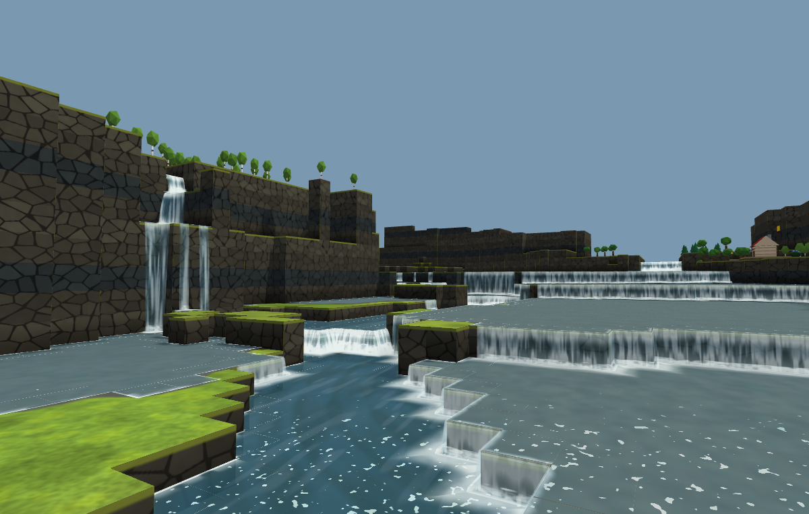

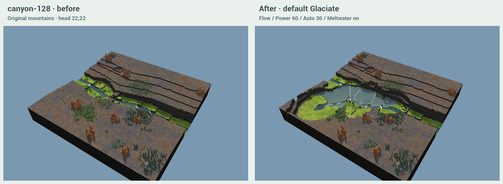

[Full before](captures/hero-canyon-before.png) · [Full after](captures/hero-canyon-after.png). **2863** dry floor tiles, **7.7%** newly buildable, net **-560**; **2** actual hanging falls. River width **1–19**, peak separate wet reaches **4**. Missed guardrails: **new land, wet share, river width, one river**.

### highlands-256 · click 150,20

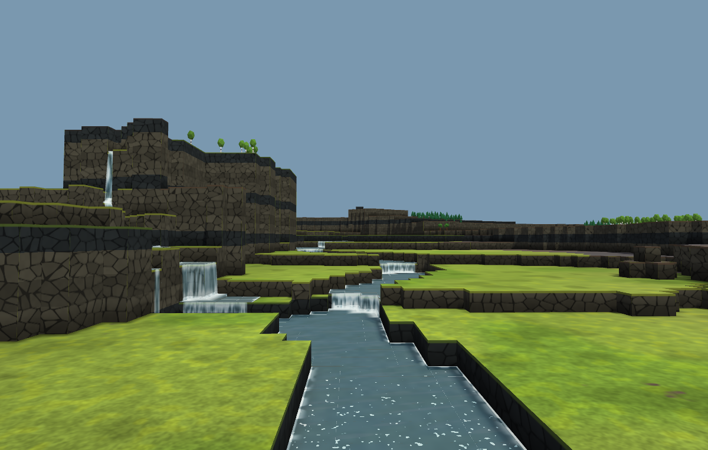

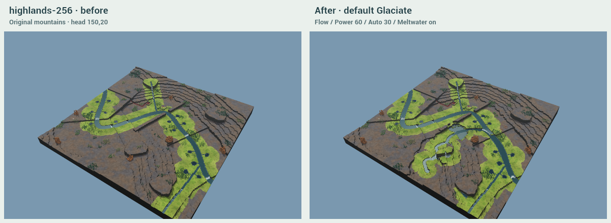

[Full before](captures/hero-highlands-before.png) · [Full after](captures/hero-highlands-after.png). **3955** dry floor tiles, **1.5%** newly buildable, net **-1150**; **1** actual hanging falls. River width **4–11**, peak separate wet reaches **2**. Missed guardrails: **new land, falls, river width, one river**.

### tall-128 · click 36,92

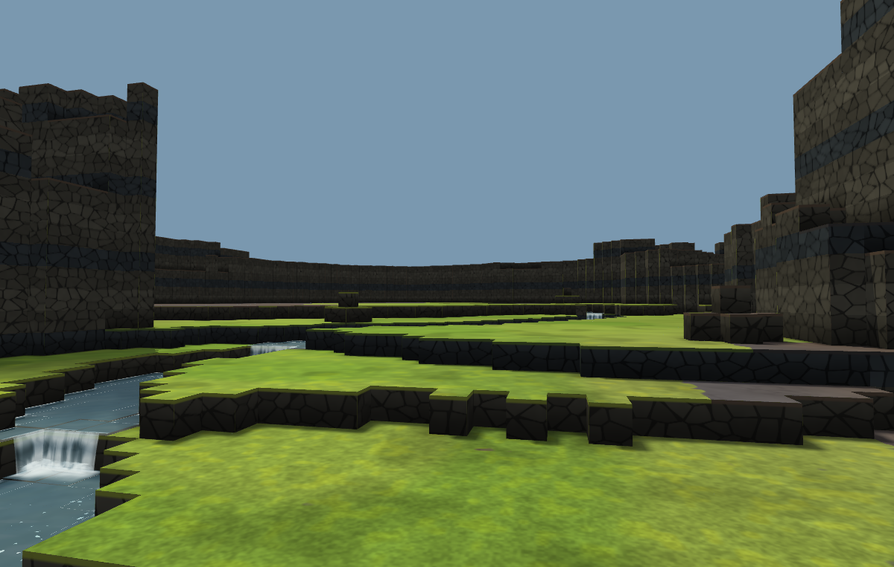

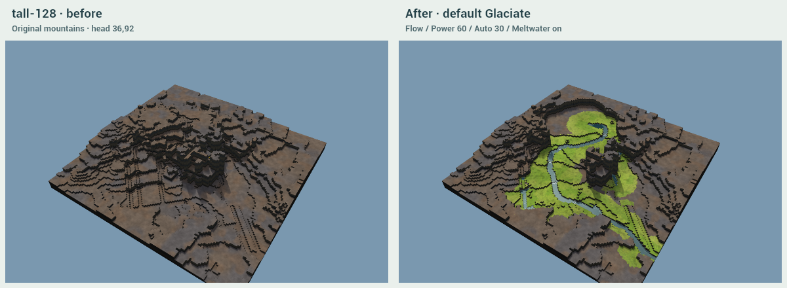

[Full before](captures/hero-tall-before.png) · [Full after](captures/hero-tall-after.png). **3415** dry floor tiles, **11.2%** newly buildable, net **-474**; **0** actual hanging falls. River width **2–14**, peak separate wet reaches **2**. Missed guardrails: **new land, falls, river width, one river**.

The Canyon view shows a stronger mountain cut and real falls, but broad pools and tiered cuts weaken the river picture. Highlands has the most legible long shallow river; some sections still look engineered. The tall study has the strongest wall enclosure but lacks sustained hanging waterfalls. The three heroes all miss the 70% new-land guardrail. These mountain generators contain broad level terraces: lowering an already buildable terrace does not create a newly buildable coordinate. The report keeps the original definition.

## Advance and retreat

This recording starts with a real default-settings click. The tongue travels downhill, then melts back uphill as the river and cliff water emerge. The camera follows the newly exposed ground vertically during advance so it does not stay inside the old mountain. The final view and water are actual stored terrain/simulation, not a staged illustration. Encoding can lower the recording frame rate; timings are separate runs without screenshots.

Across all **23** cases, every displayed height equals the literal final terrain at **2866.1–3156.6 ms** after input, before retreat ends. Canyon is exact at **2989.9 ms**; 256² Highlands at **3156.6 ms**. Water can continue settling afterwards; tick-cap cases remain labelled.

## Random high ground and modest ground

Sampling seed **3032026**. The six high-ground clicks are independent LCG draws over the original map's top height quartile, with a 12-tile inset, in the fixed map order Highlands128, Highlands256, Canyon128, tall128, Highlands128, Highlands256. No planner filtering or replacement is used. All now produce changed terrain.

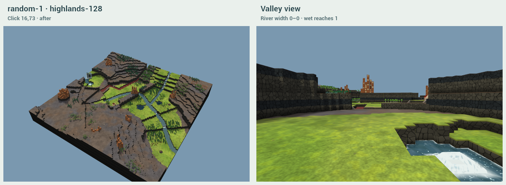

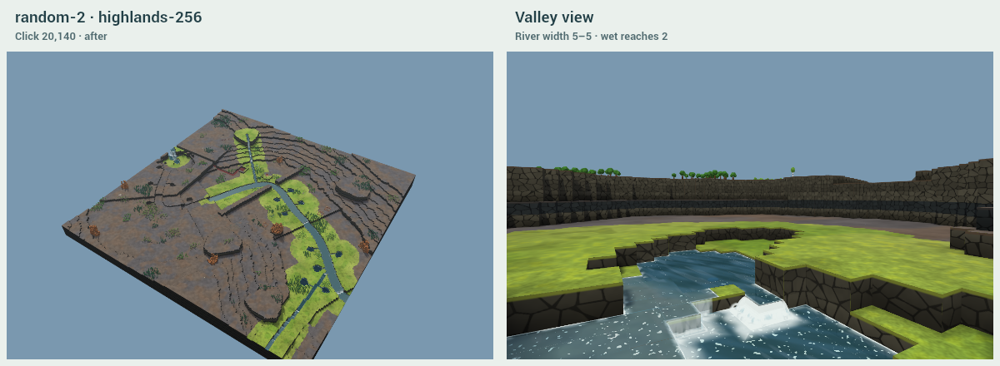

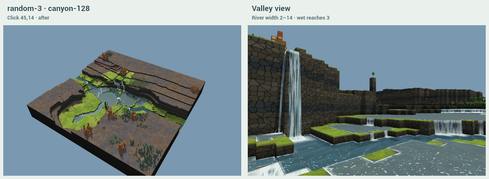

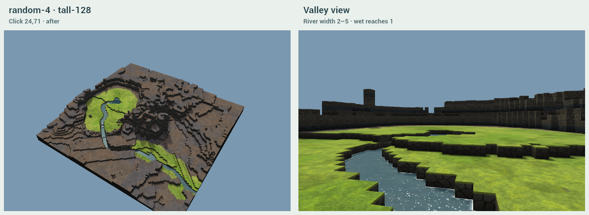

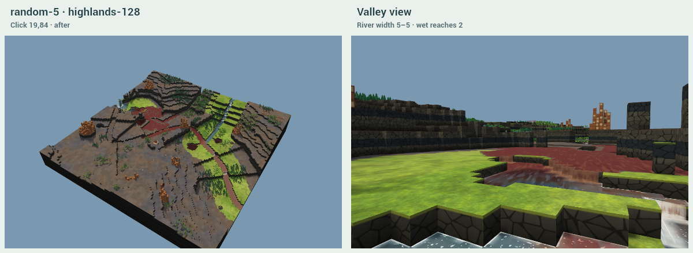

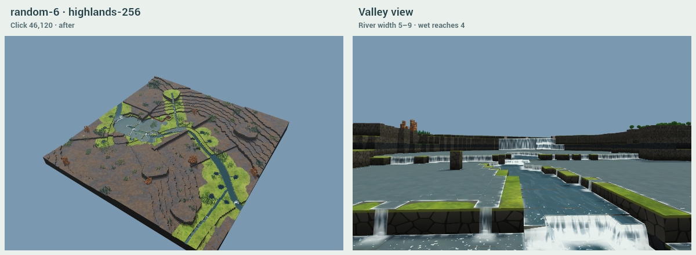

The additional three modest-ground clicks use the continued random sequence, over original 17×17 neighbourhoods whose max-minus-min relief is **two to four levels**, on Highlands128, Canyon128 and tall128. They are sampled before planning, not selected by their result. Their exact coordinates and relief are in [checks/core.json](checks/core.json). Local modest relief can lead into a much taller range farther down the route.

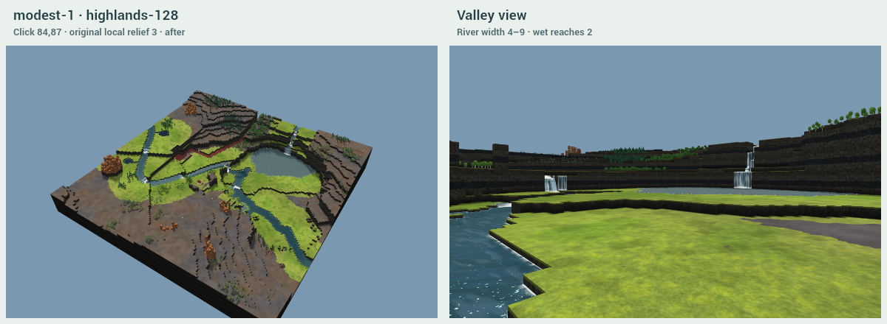

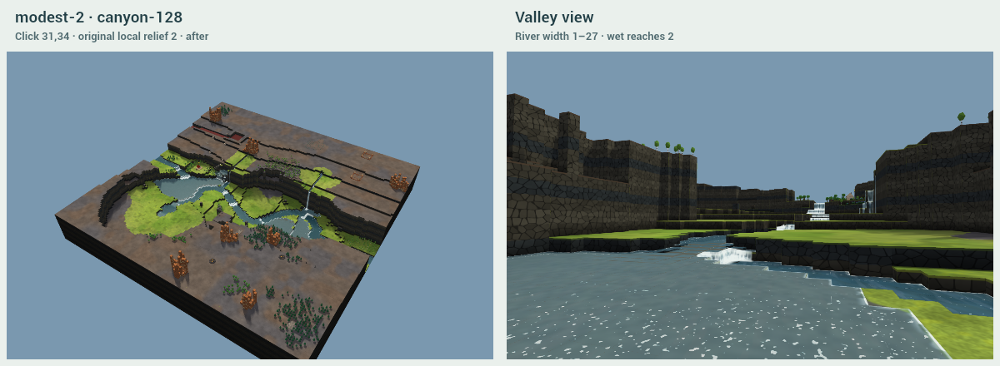

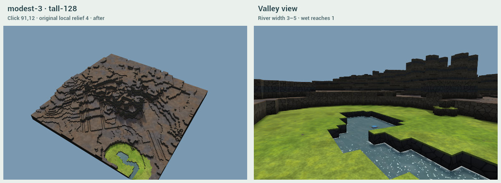

The random set still contains flooded, short and weak-wall results. In particular random-6 is mostly wet and lacks the required wall height. Never refusing has improved the interaction; it has not made every click a successful landscape. Each valley view should be judged for a thin channel or ditch network even when a numerical width happens to pass.

## Flat ground and absorbed springs

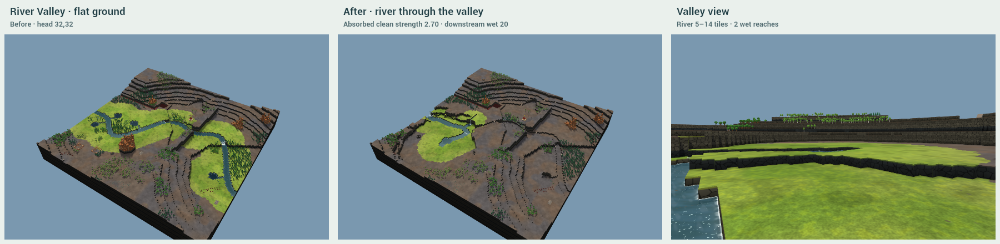

The former refusal case, River Valley 18 at **32,32**, now makes **2262** dry floor tiles and **+608** net building land. Power 0, 60 and 100 all change terrain. A separate uniform-plateau test verifies that Try another changes direction where there is no downhill route. Only true physical inability can show pointer text; there is no relief message or flat lobe substitute.

**The flat case exposes a source-transfer failure:** absorbed strength is conserved, but the new head drains toward a nearer outlet and much of the original downstream river dries. **572 previously clean wet tiles on unchanged ground become dry.** Thus the general promise that every swept river keeps its original downstream flow is not achieved. Some of its net building-land gain comes from that drying; it must not be presented as a pure success. The spring case below demonstrates one successful downstream connection, not a universal guarantee.

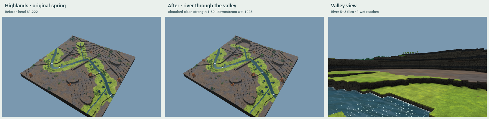

The real Highlands 256² spring at **61,222, level 15** is swept away. Its **1.80** clean strength is added to the cirque's normal 0.65 feed, with any eligible hanging springs separate. The river still has **1035 wet tiles beyond the trough/moraine** along its outgoing course. This is a changed head for the same downstream water, not a deleted river. Its final solve reaches the tick cap, so downstream flow is demonstrated in the saved endpoint rather than claimed permanently settled.

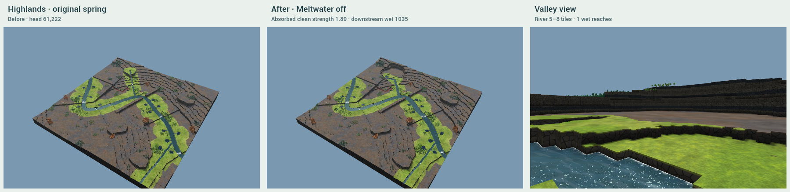

With Meltwater off the swept spring gets **no replacement source and no retained depth**. Untouched sources elsewhere in this real map still feed part of the affected river, so the result is **9.0% wet**, not wholly dry. The implementation preserves outside sources instead of secretly deleting them or suppressing their water. This is a remaining mismatch with a literal “dry valley” expectation on a map with surviving incoming rivers. Tests verify the absence of replacement sources and retained depth.

The ledger sums effective clean source strength under the repository's active-state and per-source cap rules. Swept badwater strength is never included. A head above the game's eight-per-source cap is represented by adjacent ordinary sources in one cirque head so no clean strength silently disappears. Surviving outside sources keep their original positions and strengths.

## Power, variation, Aim and the start

Low/default/high are **50/60/95**, with Auto Size **26/30/42**. The existing-river constraint can saturate the depth response at low/default Power; higher Power reaches farther and cuts more. Wider/deeper is not always a better valley.

All three use the original map and gesture, changing the saved seed without stacking glaciers. The mountain drainage route is unchanged. Rims, bars, bends toward pools and deposits vary. Actual widths and channel counts are reported below, including failed alternatives.

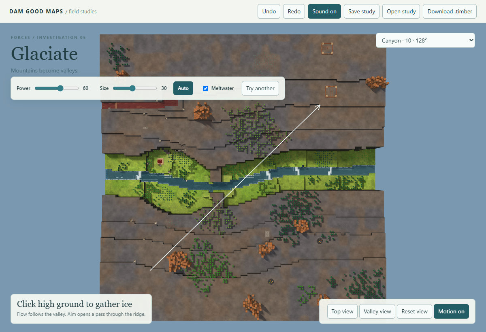

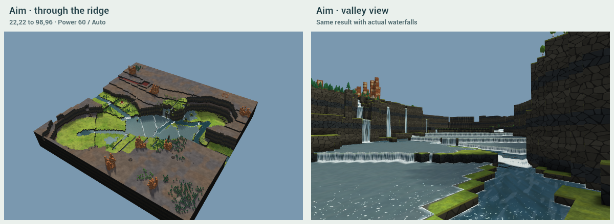

Drag **22,22 → 98,96** selects Aim without a dropdown. Release hides the arrow; the actual pointer gesture produces the independently checked result.

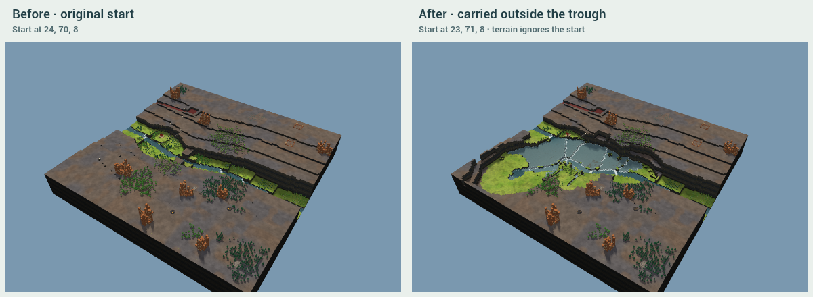

The real original start moves from **(24,70,8) to (23,71,8)**. Exactly one start remains on supported ground outside the trough. The editor may still report an unusable entrance; that is recorded below and does not veto the force.

## Measurements

Buildable means dry (**water depth ≤0.05**) and part of a level **2×2 pad**, excluding non-plant footprints; trees are assumed clearable. New floor counts only same-coordinate positions that failed that test before. Affected net includes all height, wet/dry and non-plant-footprint changes plus a one-tile pad collar; tests require equality with the whole-map net, including downstream losses.

Wall heights compare the old rim with the broad new dry-bank datum. Width samples include the wider cirque and boundary taper; these can exceed the body's requested ±30%. Straight wall means the longest exact cardinal run of the rasterized outline, including caps. Hanging falls are actual wet outside-to-inside cliff edges ≥3 levels high, with a wet landing; adjacent pixels within five tiles count as one. Main-river cascades and the outgoing river are excluded. The hanging-mouth count includes planned gullies and cannot be smaller than the observed falls.

| Case | Head | Dry floor | Newly buildable | Net affected | Wall med/max | Hanging/falls | Trough wet | Floor width / straight wall | Terrain final ms |
| --- | --- | ---: | ---: | ---: | ---: | ---: | ---: | ---: | ---: |
| hero-canyon | 22,22 | 2863 | 221 (7.7%) | -560 | 7/10 | 8/2 | 19.3% | 28–44/16 | 2989.9 |
| hero-highlands | 150,20 | 3955 | 61 (1.5%) | -1150 | 4/11 | 7/1 | 13.9% | 27–47/10 | 3156.6 |
| hero-tall | 36,92 | 3415 | 383 (11.2%) | -474 | 7/14 | 3/0 | 11.2% | 30–54/8 | 2931.6 |
| random-1 | 16,73 | 527 | 93 (17.6%) | +259 | 5/6 | 1/1 | 12.7% | 16–26/9 | 2940.9 |
| random-2 | 20,140 | 868 | 244 (28.1%) | +1228 | 5/6 | 1/1 | 12.2% | 13–33/12 | 3062.3 |
| random-3 | 45,14 | 2611 | 215 (8.2%) | -756 | 8/10 | 10/3 | 24.0% | 27–43/14 | 2929.7 |
| random-4 | 24,71 | 2180 | 275 (12.6%) | -313 | 4/9 | 0/0 | 9.5% | 29–49/8 | 2906.0 |
| random-5 | 19,84 | 733 | 50 (6.8%) | +370 | 6/6 | 1/1 | 18.3% | 16–27/7 | 2944.1 |
| random-6 | 46,120 | 1210 | 153 (12.6%) | -124 | 1/6 | 3/3 | 55.0% | 25–47/11 | 3075.1 |
| modest-1 | 84,87 | 2665 | 471 (17.7%) | -65 | 5/8 | 5/5 | 14.7% | 32–56/12 | 2923.7 |
| modest-2 | 31,34 | 3347 | 262 (7.8%) | -751 | 10/12 | 11/2 | 22.8% | 27–54/15 | 2952.2 |
| modest-3 | 91,12 | 544 | 14 (2.6%) | -127 | 2/5 | 0/0 | 18.9% | 14–23/12 | 2866.1 |
| power-low | 22,22 | 2125 | 139 (6.5%) | -923 | 7/9 | 6/4 | 30.1% | 24–42/21 | 2926.3 |
| power-high | 22,22 | 4533 | 376 (8.3%) | -1138 | 11/13 | 17/5 | 24.2% | 32–52/15 | 2994.9 |
| another-1 | 22,22 | 2909 | 266 (9.1%) | -744 | 8/10 | 10/7 | 22.7% | 26–45/12 | 2974.3 |
| another-2 | 22,22 | 2890 | 208 (7.2%) | -575 | 8/11 | 9/4 | 19.2% | 27–45/13 | 2966.8 |
| another-3 | 22,22 | 2479 | 132 (5.3%) | -1235 | 9/12 | 9/6 | 33.6% | 26–41/10 | 2981.0 |
| aim | 22,22 | 3444 | 188 (5.5%) | -1306 | 9/13 | 10/6 | 26.9% | 25–49/11 | 2975.8 |
| through-start | 22,22 | 2863 | 221 (7.7%) | -560 | 7/10 | 8/2 | 19.3% | 28–44/16 | 2946.8 |
| performance-256 | 150,20 | 3955 | 61 (1.5%) | -1150 | 4/11 | 7/1 | 13.9% | 27–47/10 | 3119.5 |
| flat | 32,32 | 2262 | 378 (16.7%) | +608 | 3/4 | 2/1 | 12.7% | 21–52/10 | 2929.5 |
| spring | 61,222 | 2359 | 86 (3.6%) | -525 | 5/5 | 2/1 | 8.9% | 32–52/8 | 3076.1 |
| spring-dry | 61,222 | 2357 | 86 (3.6%) | -500 | 5/5 | 2/0 | 9.0% | 32–52/8 | 3076.4 |

Actual river width is measured across wet sections (depth >0.05), rather than copied from the requested corridor. **Wet reaches** is the maximum separate wet spans across a floor section; it is conservative and can count a plunge pool or a meander crossing as another reach. It also exposes accidental parallel water. Width ranges include pool enlargements and bar spreads: they are not trimmed to make the 2–5 target pass. A one-tile value flags a visible narrowing even if most of the river is wider. Pool joining distance is planned open-ground gap, with no long joining cut when it exceeds five.

Every published low view and overview was visually inspected for thin channels and ditch networks. The [case-by-case visual audit](checks/visual.json) records all 23, including identical start/performance duplicates. Random-4 has the clearest single small river; random-6 fails as a flooded floor; several Canyon variants retain multiple pool passages. A **0–0** width in the short random-1 case means no qualifying marked-river section was sampled, not that its pictured outlet is dry.

| Case | Actual river width | Separate wet reaches (goal 1) | Max pool gap | Clean absorbed / bad swept | Missed guardrails |
| --- | ---: | ---: | ---: | ---: | --- |
| hero-canyon | 1–19 | 4 | 3.0 | 0.00 / 0.00 | new land, wet share, river width, one river |
| hero-highlands | 4–11 | 2 | 3.9 | 0.00 / 0.00 | new land, falls, river width, one river |
| hero-tall | 2–14 | 2 | 0.0 | 0.00 / 0.00 | new land, falls, river width, one river |
| random-1 | 0–0 | 1 | 2.5 | 2.16 / 0.00 | new land, river width |
| random-2 | 5–5 | 2 | 0.0 | 2.16 / 0.00 | new land, one river |
| random-3 | 2–14 | 3 | 4.0 | 0.00 / 0.00 | new land, wet share, river width, one river |
| random-4 | 2–5 | 1 | 0.0 | 0.00 / 0.00 | new land |
| random-5 | 5–5 | 2 | 0.0 | 2.16 / 0.00 | new land, wet share, one river |
| random-6 | 5–9 | 4 | 0.0 | 0.00 / 0.00 | new land, walls, wet share, river width, one river |
| modest-1 | 4–9 | 2 | 4.8 | 0.00 / 0.00 | new land, river width, one river |
| modest-2 | 1–27 | 2 | 3.0 | 0.00 / 0.00 | new land, wet share, river width, one river |
| modest-3 | 3–5 | 1 | 0.0 | 0.00 / 0.00 | new land, walls, wet share |
| power-low | 1–11 | 5 | 3.8 | 0.00 / 0.00 | new land, wet share, river width, one river |
| power-high | 2–22 | 6 | 5.2 | 0.00 / 0.00 | new land, wet share, river width, one river |
| another-1 | 1–9 | 4 | 4.5 | 0.00 / 0.00 | new land, wet share, river width, one river |
| another-2 | 1–14 | 3 | 4.8 | 0.00 / 0.00 | new land, wet share, river width, one river |
| another-3 | 4–27 | 4 | 4.2 | 0.00 / 0.00 | new land, wet share, river width, one river |
| aim | 3–18 | 4 | 1.6 | 0.00 / 0.00 | new land, wet share, river width, one river |
| through-start | 1–19 | 4 | 3.0 | 0.00 / 0.00 | new land, wet share, river width, one river |
| performance-256 | 4–11 | 2 | 3.9 | 0.00 / 0.00 | new land, falls, river width, one river |
| flat | 5–14 | 2 | 4.3 | 2.70 / 0.00 | new land, walls, falls, river width, one river |
| spring | 5–8 | 1 | 2.2 | 1.80 / 0.00 | new land, falls, river width |
| spring-dry | 5–8 | 1 | 0.0 | 1.80 / 0.00 | new land, falls |

Guardrails: ≥70% new floor, median wall ≥4, ≥2 falls where at least two hanging mouths exist, ≤15% wet trough, river 2–5 tiles and one wet reach. They are reported on every case; passing a conditional falls test with fewer than two mouths is not a claim that a fall exists. Meltwater-off river width/channel flags are not scored, but measured water is still shown.

| Case | Cut/deposit/carried away | New dry outwash | Trees/other objects swept | Median cross-floor range | Water |
| --- | ---: | ---: | ---: | ---: | --- |
| hero-canyon | 22593/55/22538 | 0 | 591/59 | 1 | settled · 640 |
| hero-highlands | 22936/0/22936 | 0 | 205/52 | 0 | settled · 2944 |
| hero-tall | 28870/268/28602 | 0 | 0/0 | 1 | tick cap · 3072 |
| random-1 | 4331/10/4321 | 0 | 35/4 | 1 | settled · 640 |
| random-2 | 5517/0/5517 | 0 | 18/5 | 0 | settled · 2560 |
| random-3 | 22956/31/22925 | 4 | 691/64 | 1 | settled · 512 |
| random-4 | 15219/3365/11854 | 780 | 0/0 | 0 | settled · 768 |
| random-5 | 5799/23/5776 | 0 | 131/6 | 0 | settled · 768 |
| random-6 | 10760/2/10758 | 0 | 147/6 | 1 | settled · 1280 |
| modest-1 | 15230/0/15230 | 0 | 593/52 | 1 | settled · 640 |
| modest-2 | 31567/9/31558 | 0 | 846/61 | 1 | settled · 512 |
| modest-3 | 2363/1/2362 | 0 | 0/0 | 0 | settled · 256 |
| power-low | 19448/46/19402 | 1 | 454/61 | 1 | settled · 896 |
| power-high | 49790/61/49729 | 0 | 973/75 | 0 | settled · 768 |
| another-1 | 25840/20/25820 | 9 | 602/73 | 0 | settled · 640 |
| another-2 | 25680/8/25672 | 6 | 615/60 | 0 | settled · 640 |
| another-3 | 28840/0/28840 | 0 | 579/68 | 1 | settled · 896 |
| aim | 44171/0/44171 | 0 | 666/59 | 0 | settled · 512 |
| through-start | 22593/55/22538 | 0 | 591/59 | 1 | settled · 640 |
| performance-256 | 22936/0/22936 | 0 | 205/52 | 0 | settled · 2944 |
| flat | 10183/0/10183 | 0 | 430/114 | 1 | settled · 384 |
| spring | 19071/6/19065 | 0 | 122/29 | 0 | tick cap · 3072 |
| spring-dry | 19043/6/19037 | 0 | 122/29 | 0 | settled · 2560 |

Cross-floor range excludes marked river cells but includes bars/scree reached by a section. A value above one is a failure of a strictly level section. The cirque can be clipped by a nearby map edge. Outwash zero means no qualifying lower receiving ground. Large pools, one-block banks, overshoot at bars and overlong straight runs remain visible limitations, not reasons to alter the counters.

## Verification and remaining limits

The suite passes **587 model assertions**, **12 schema/malformed-operation checks**, and structural export checks on all **23** endpoints with 960×540 thumbnails. It covers literal replay, water scheduling determinism, unchanged surviving objects, swept source strength, badwater exclusion, start-independent terrain, flat directions, one-step undo/redo, invalid import atomicity, physical bounds and actual exported water. Start-specific findings remain:

- **hero-canyon:** start.entrance: entrance tile (24,70) must be free ground at level 8, or no beavers spawn
- **hero-tall:** start.entrance: entrance tile (72,63) must be free ground at level 8, or no beavers spawn
- **random-4:** start.entrance: entrance tile (72,63) must be free ground at level 8, or no beavers spawn
- **modest-3:** start.entrance: entrance tile (72,63) must be free ground at level 8, or no beavers spawn
- **power-high:** start.entrance: entrance tile (22,76) must be free ground at level 9, or no beavers spawn
- **another-1:** start.entrance: entrance tile (23,76) must be free ground at level 13, or no beavers spawn
- **through-start:** start.entrance: entrance tile (24,70) must be free ground at level 8, or no beavers spawn

The tall input is the unchanged Round 1 VT85 heightfield, with one loader-only ordinary start at **71,64,8** on already level ground. No resources or terrain repairs were added. The dev editor still has no Verticality control. This is an explicitly labelled generator study, not a hand-sculpted hero.

Chrome **153.0.8010.48**, **ANGLE (NVIDIA, NVIDIA GeForce RTX 4080 SUPER (0x00002702) Direct3D11 vs_5_0 ps_5_0, D3D11)**, 1200×820. All accepted browser fingerprints match Node. Actual click/drag, no Mode control, flat click, undo including waterfall meshes, Esc during both acts and final settling, and rejection of late completion are checked. No browser exceptions. [Core evidence](checks/core.json), [browser evidence](checks/browser.json), [export findings](checks/export.json), [schema](checks/schema.json).

256² frame intervals: advance median **6.1 ms**, p95 **6.2 ms**, worst **9.1 ms**; retreat median **6.1 ms**, p95 **6.2 ms**, worst **6.3 ms**. Planning **154.3 ms**, full endpoint including water **8.8 s**. These are local browser timings, not in-game FPS. Typecheck and Vite build pass, with the existing bundle-size advisory. No Timberborn launch was performed.

The five CC0 clips and recipe are unchanged. The retained Round 2 offline measurement is **-17.1 dBFS** for the strongest 100 ms window, **-6.1 dBFS** peak; no new listening verdict is claimed. No game assets were extracted. [Attribution](ATTRIBUTION.md), [sound manifest](bank.json).

**The central failures remain:** all heroes miss newly buildable share and lose net land; hanging falls are unreliable; river widths and wet-reach counts often miss the new targets; some cuts flood or look engineered; absorbed flow can abandon the old downstream course; off mode cannot make untouched incoming rivers disappear. The pictures take precedence over numeric passes. This iteration implements the interaction and sweep/source changes and makes the shallow-river experiment inspectable, but does not claim the complete requested landscape has been achieved.

All changes stay inside investigation/glaciate/. Captures total **22.38 MiB**, largest **1.79 MiB**; large results remain ignored. [README](README.md) runs the demo; [INTEGRATION](INTEGRATION.md) describes a potential port. [Round 2](https://github.com/timbermods/dam-good-maps/blob/5d4154047edcc216c6df099a676969c908a00a03/investigation/glaciate/REPORT.md) and [Round 1](https://github.com/timbermods/dam-good-maps/blob/f63e4aea0d24b63088e1fe4556b95ee8f0cbf8d1/investigation/glaciate/REPORT.md) remain in history. Only the existing investigation/glaciate branch and PR #69 are updated; no merge, approval, auto-merge, tag or release.
