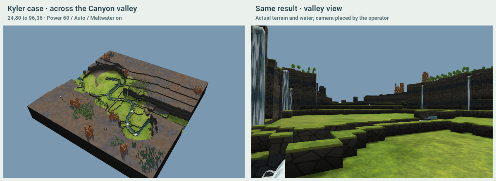

# Round 4: polish

Round 3's mountain carving, cirque, walls, click/drag gestures, arrow, object sweep, clean-source absorption and never-refuse behavior remain. This round changes the river's terrain and inlets, gives every eligible hanging mouth a spring, and removes automatic camera movement. **Net buildable land is information only; the 70% newly-buildable guardrail is retired.**

Flooding is substantially reduced, but **the one-river requirement is not yet met across the sample**. The heroes are **11.8%, 10.3%, 9.2% wet**, with **7, 7, 3 hanging falls** (Round 3: 2, 1, 0). Kyler's cross-valley Aim is **13.9% wet with 8 falls**. Random-3 remains **16.4% wet**. Long side joins, one-tile narrowings and multiple wet spans remain visible failures; no water is masked and no failing case is omitted.

| Case | Trough wet | River width range | Separate wet passages, goal 1 | Falls | Longest straight wall |
| --- | ---: | ---: | ---: | ---: | ---: |
| hero-canyon | 11.8% | 1–15 | 6 | 7 | 16 |
| hero-highlands | 10.3% | 2–10 | 4 | 7 | 10 |
| hero-tall | 9.2% | 2–13 | 4 | 3 | 8 |
| kyler-aim | 13.9% | 2–7 | 3 | 8 | 12 |

These are the unchanged, conservative Round 3 wet-cross-section counters, including pools and side feeds. They are not corridor design widths. The complete measurements and visual audit follow below.

## What changed in the land

The spreading had several causes. The river used an unshifted station floor while bars used an irregular shifted floor; river bends could meet a hidden uphill sill. A bank based only on its own local floor opened lateral spillways beside a higher bar. Corner-connected raster cells could strand a pool because the water solver flows through shared edges. Concave rims could interrupt a straight pool join. Outside wet terraces could enter at several places, and the old outgoing route could re-enter an Aim trough as a second river.

The main river now reads the actual bar field, keeps a non-increasing bed across its full width and protects that profile from joining cuts. Diagonal joins have explicit shared-edge connections. Small pools join through the floor to a draining reach at or below their level; nearby feeds can share a receiver. Connectivity is recomputed when a pool changes an earlier reach. Banks account for the higher side of a bar and the receiving outlet. Surviving outside inflows receive compact notches, and potential flow identifies outside terraces that may become wet. The outgoing river steps down at the moraine and stays outside the carved floor when the old route would re-enter it. Its destination remains the original receiving edge.

These are literal integer terrain edits, using the existing water solver, meshes and materials. There is no renderer water mask, depth threshold change, decorative water or modified simulation schedule. The river keeps the lowest floor datum, but some banks are now two levels above the bed and some joining reaches still look excavated. **That visual limitation is not dismissed by a passing wet-share number.** Pools generally occupy a few tiles; their joins are not consistently the requested few tiles long.

With Meltwater on, each selected hanging mouth with adjacent high ground behind it gets a real clean source at its lip. Catchment and variation seed set different strengths. Their combined strength is capped at `max(0.25, riverRadius × 0.7)`; absorbed clean river strength is preserved in full. Actual falls are counted after simulation, so planned springs can merge at a lip or produce a fall below the counting threshold. Try another changes the springs as well as the existing morphology.

The camera has no advance follow, automatic recenter or map-load reposition. Clicked view buttons, orbit, pan and zoom are player actions. A camera inside the old mountain stays there until the player moves it.

## Valley views

### canyon-128 · click 22,22

[Full before](captures/hero-canyon-before.png) · [Full after](captures/hero-canyon-after.png). **11.8% wet**, **7 falls**, river span **1–15**, maximum **6 wet passages**. Net buildable land **-432**, informational only. Missed guardrails: **river width, one river**.

### highlands-256 · click 150,20

[Full before](captures/hero-highlands-before.png) · [Full after](captures/hero-highlands-after.png). **10.3% wet**, **7 falls**, river span **2–10**, maximum **4 wet passages**. Net buildable land **-827**, informational only. Missed guardrails: **river width, one river**.

### tall-128 · click 36,92

[Full before](captures/hero-tall-before.png) · [Full after](captures/hero-tall-after.png). **9.2% wet**, **3 falls**, river span **2–13**, maximum **4 wet passages**. Net buildable land **-448**, informational only. Missed guardrails: **river width, one river**.

Lauterbrunnen above is the repository's unchanged gallery heightfield, with the same materials and unscaled heights. It is not a photograph, an edited hero or game-extracted artwork. The before/after panels share a camera. The low views are explicitly placed by the capture operator, looking uphill from the new floor. Maps retain their different physical scales.

## Kyler's cases and the two acts

The default Canyon 10 click **22,22**, Power **60**, Auto Size **30**, Meltwater on, seed **891**, is the first hero above. It is the unchanged default demo gesture.

For the unspecified cross-valley endpoints I chose **24,80 → 96,36**, before inspecting its result, across Canyon 10's existing valley. It uses Power **60**, Auto Size and Meltwater on. This is an additional case, not a replacement for the original ridge-crossing Aim. Both are also verified through real browser pointer drags.

The camera is positioned once before the event and never follows the ice or exposed ground. It can start inside the old mountain, as requested. The animation still advances for three seconds and retreats for two; water may settle afterwards. GIF frame delays preserve the actual capture intervals, and encoding happens after capture. Performance runs are separate and do not encode screenshots. The GIF and every timed force have frame-by-frame camera pose assertions.

Across **24** cases, every displayed height equals the literal endpoint at **2868.0–3189.8 ms** after input, before retreat ends. Canyon is exact at **3012.7 ms**; 256² Highlands at **3189.8 ms**.

## Random and modest ground

The six random high-ground heads are the same independent LCG draws as Round 3, seed **3032026**, over original top-quartile heights with a 12-tile inset. No planner filtering, reroll or replacement. The fixed map order is Highlands128, Highlands256, Canyon128, tall128, Highlands128, Highlands256.

Random-6, previously about 55% wet, is now **9.5% wet** with **1 measured passage**. Random-3 remains the flooding exception at **16.4%**, including **68 unmarked floor tiles** with water deeper than 0.05. The other cases are not substituted for it.

The three modest-ground clicks continue that random sequence over original 17×17 neighbourhoods with **two to four levels of relief**, before planning. Their coordinates and original relief remain in [core.json](checks/core.json).

## Flat ground, the spring and Meltwater off

River Valley 18, click **32,32**, still carves immediately: **2294 dry floor tiles**, **7.9% wet trough**. Power 0, 60 and 100 all change terrain, and a uniform-plateau check still verifies that Try another can choose a different direction. There is no relief refusal.

The prior downstream-course limitation remains: **622 old clean wet tiles on unchanged ground are dry afterwards**. Conserving source strength does not guarantee preservation of every old river segment. Do not treat land recovered by drying the old course as newly carved valley value.

The real Highlands 256² spring at **61,222**, level 15, is swept into the cirque head with **1.80 clean strength** preserved. The outgoing course has **695 wet tiles beyond the trough/moraine**. This endpoint settles under the canonical test.

Meltwater off adds no head or hanging sources and no retained water. This saved endpoint is **0.0% wet**. Untouched outside sources remain in the map; off mode does not secretly delete them or suppress any water they send into another result.

## Power, variation, Aim and the start

Low/default/high Power are **50/60/95**, Auto Size **26/30/42**. Variants reuse the original map and gesture without stacking glaciers; the mountain route remains unchanged.

The original Aim remains **22,22 → 98,96**. Release removes the arrow and starts the force. There is no Mode dropdown or predicted terrain footprint.

Exactly one start moves from **(24,70,8) to (23,71,8)** on level ground outside the trough. It has no effect on the carve. Surviving trees and objects keep their full original data and coordinates; swept sources and unsupported old slopes are removed. The editor's start findings remain information, not a force veto.

## Measurements for every case

Trough wet share is the fraction of `mask === 1` floor cells with actual simulated depth **>0.05**. River widths are contiguous wet runs touching the marked river along sampled normal cross-sections. Separate wet passages is the maximum number of disjoint wet runs across a whole floor section. This conservative measurement includes side feeds, plunge pools and another crossing of a meander; it also exposes unintended parallel water. It is unchanged from Round 3 and is not trimmed to make the goal pass. A one-tile width remains a narrowing warning, including the short random-1 sample.

Falls are actual wet outside-to-inside edges with a drop of at least three levels and a wet landing; edge pixels within five tiles count as one. Main-river cascades are excluded. Straight wall is the longest exact cardinal run of the rasterized outline, including caps. Off-channel wet counts actual wet floor cells outside the planned river/pool/feed footprint; zero does not mean that long planned joins look natural.

| Case | Head / Aim end | Wet share | River width | Wet passages | Falls / mouths | Straight wall | Off-channel wet tiles | Missed guardrails |
| --- | --- | ---: | ---: | ---: | ---: | ---: | ---: | --- |
| hero-canyon | 22,22 | 11.8% | 1–15 | 6 | 7 / 8 | 16 | 0 | river width, one river |
| hero-highlands | 150,20 | 10.3% | 2–10 | 4 | 7 / 7 | 10 | 0 | river width, one river |
| hero-tall | 36,92 | 9.2% | 2–13 | 4 | 3 / 3 | 8 | 0 | river width, one river |
| random-1 | 16,73 | 13.0% | 1–1 | 2 | 2 / 2 | 9 | 0 | river width, one river |
| random-2 | 20,140 | 11.2% | 3–4 | 1 | 1 / 1 | 12 | 0 | none |
| random-3 | 45,14 | 16.4% | 1–12 | 5 | 10 / 10 | 14 | 68 | wet share, river width, one river |
| random-4 | 24,71 | 6.6% | 2–3 | 1 | 0 / 0 | 8 | 0 | none |
| random-5 | 19,84 | 14.1% | 2–3 | 2 | 2 / 2 | 7 | 0 | one river |
| random-6 | 46,120 | 9.5% | 3–4 | 1 | 2 / 2 | 11 | 0 | walls |
| modest-1 | 84,87 | 9.5% | 2–8 | 2 | 5 / 5 | 12 | 0 | river width, one river |
| modest-2 | 31,34 | 11.9% | 2–12 | 3 | 10 / 11 | 15 | 0 | river width, one river |
| modest-3 | 91,12 | 13.0% | 3–3 | 1 | 0 / 0 | 12 | 0 | walls |
| power-low | 22,22 | 11.5% | 1–6 | 5 | 6 / 6 | 21 | 1 | river width, one river |
| power-high | 22,22 | 12.5% | 1–13 | 4 | 10 / 17 | 15 | 0 | river width, one river |
| another-1 | 22,22 | 13.0% | 2–16 | 4 | 9 / 10 | 12 | 0 | river width, one river |
| another-2 | 22,22 | 12.3% | 1–4 | 3 | 8 / 9 | 13 | 0 | river width, one river |
| another-3 | 22,22 | 12.6% | 1–5 | 5 | 8 / 9 | 10 | 0 | river width, one river |
| aim | 22,22 → 98,96 | 10.7% | 1–7 | 3 | 9 / 10 | 11 | 0 | river width, one river |
| kyler-aim | 24,80 → 96,36 | 13.9% | 2–7 | 3 | 8 / 8 | 12 | 0 | river width, one river |
| through-start | 22,22 | 11.8% | 1–15 | 6 | 7 / 8 | 16 | 0 | river width, one river |
| performance-256 | 150,20 | 10.3% | 2–10 | 4 | 7 / 7 | 10 | 0 | river width, one river |
| flat | 32,32 | 7.9% | 3–10 | 3 | 2 / 2 | 10 | 0 | walls, river width, one river |
| spring | 61,222 | 7.3% | 3–4 | 2 | 2 / 2 | 8 | 0 | one river |
| spring-dry | 61,222 | 0.0% | 0–0 | 0 | 0 / 2 | 8 | 0 | falls |

Wet share, river width, one river, falls and wall measurements remain visible. The ordinary width target is about 2–5 tiles; a large absorbed or incoming river may need more, but pool/confluence widening is not automatically excused as carrying a big river. The legacy width flag conservatively keeps the 2–5 check. The falls flag asks for at least two where at least two mouths exist; the median-wall flag remains four levels. No numeric straight-run limit was supplied, so every run is reported directly. The **70% new-land pass/fail is removed**.

Buildable means dry (depth ≤0.05) and part of a level **2×2 pad**, excluding non-plant footprints; trees are clearable. Affected net includes every height, wet/dry and non-plant footprint change plus a one-tile pad collar, and tests require equality with the whole-map net. Dry floor, net land, old/new land counts and wall/floor dimensions are informational. Pool join length below is the actual planned path length, replacing Round 3's straight-line gap estimate.

| Case | Dry floor | Net buildable, info | Wall med/max | Floor width range | Longest pool join | Terrain final ms | Water solve |
| --- | ---: | ---: | ---: | ---: | ---: | ---: | --- |
| hero-canyon | 2939 | -432 | 7/10 | 28–44 | 18.4 | 3012.7 | settled · 1024 |
| hero-highlands | 4100 | -827 | 4/11 | 27–47 | 23.2 | 3189.8 | settled · 2944 |
| hero-tall | 3467 | -448 | 7/14 | 30–54 | 18.4 | 2942.9 | tick cap · 3072 |
| random-1 | 457 | +169 | 5/6 | 16–26 | 5.7 | 2949.0 | settled · 640 |
| random-2 | 824 | +1186 | 5/6 | 13–33 | 0.0 | 3077.7 | settled · 2560 |
| random-3 | 2622 | -701 | 8/10 | 27–43 | 18.0 | 2957.1 | tick cap · 3072 |
| random-4 | 2258 | -172 | 4/9 | 29–49 | 0.0 | 2886.7 | settled · 768 |
| random-5 | 696 | +152 | 6/6 | 16–27 | 2.4 | 2934.5 | settled · 640 |
| random-6 | 2184 | +743 | 1/6 | 25–47 | 0.0 | 3116.2 | settled · 2816 |
| modest-1 | 2686 | -74 | 5/8 | 32–56 | 8.4 | 2947.7 | settled · 1024 |
| modest-2 | 3541 | -587 | 10/12 | 27–54 | 23.0 | 2938.6 | settled · 2560 |
| modest-3 | 583 | -88 | 2/5 | 14–23 | 0.0 | 2868.0 | settled · 256 |
| power-low | 2473 | -478 | 7/9 | 24–42 | 14.0 | 2955.5 | settled · 1280 |
| power-high | 4909 | -758 | 11/13 | 32–52 | 29.8 | 3027.9 | settled · 1152 |
| another-1 | 3016 | -529 | 8/10 | 26–45 | 17.6 | 2988.0 | settled · 1152 |
| another-2 | 2960 | -401 | 8/11 | 27–45 | 19.4 | 2978.5 | settled · 1280 |
| another-3 | 3075 | -557 | 9/12 | 26–41 | 24.2 | 3000.1 | settled · 768 |
| aim | 3966 | -771 | 9/13 | 25–49 | 17.9 | 3010.9 | tick cap · 3072 |
| kyler-aim | 3138 | -395 | 8/13 | 27–51 | 28.6 | 3002.3 | settled · 2432 |
| through-start | 2939 | -432 | 7/10 | 28–44 | 18.4 | 3007.6 | settled · 1024 |
| performance-256 | 4100 | -827 | 4/11 | 27–47 | 23.2 | 3183.1 | settled · 2944 |
| flat | 2294 | +639 | 3/4 | 21–52 | 7.0 | 2965.0 | settled · 384 |
| spring | 2323 | +226 | 5/5 | 32–52 | 19.4 | 3164.4 | settled · 2688 |
| spring-dry | 2526 | +980 | 5/5 | 32–52 | 0.0 | 3129.7 | settled · 2944 |

| Case | Cut / deposit / carried away | Trees / other objects swept | Clean absorbed / bad swept |
| --- | ---: | ---: | ---: |
| hero-canyon | 21982/108/21874 | 586/59 | 0.00/0.00 |
| hero-highlands | 22951/0/22951 | 182/51 | 0.00/0.00 |
| hero-tall | 28720/350/28370 | 0/0 | 0.00/0.00 |
| random-1 | 4018/14/4004 | 35/3 | 1.44/0.00 |
| random-2 | 5263/13/5250 | 18/4 | 1.44/0.00 |
| random-3 | 22045/98/21947 | 691/61 | 0.00/0.00 |
| random-4 | 14906/3549/11357 | 0/0 | 0.00/0.00 |
| random-5 | 5610/21/5589 | 131/6 | 1.44/0.00 |
| random-6 | 10614/276/10338 | 120/2 | 0.00/0.00 |
| modest-1 | 13582/144/13438 | 590/52 | 0.00/0.00 |
| modest-2 | 30455/59/30396 | 854/60 | 0.00/0.00 |
| modest-3 | 2324/1/2323 | 0/0 | 0.00/0.00 |
| power-low | 18464/122/18342 | 441/61 | 0.00/0.00 |
| power-high | 48221/142/48079 | 981/74 | 0.00/0.00 |
| another-1 | 24309/59/24250 | 598/66 | 0.00/0.00 |
| another-2 | 24591/49/24542 | 604/62 | 0.00/0.00 |
| another-3 | 27665/32/27633 | 572/66 | 0.00/0.00 |
| aim | 42328/39/42289 | 650/58 | 0.00/0.00 |
| kyler-aim | 26736/196/26540 | 637/70 | 0.00/2.34 |
| through-start | 21982/108/21874 | 586/59 | 0.00/0.00 |
| performance-256 | 22951/0/22951 | 182/51 | 0.00/0.00 |
| flat | 9710/12/9698 | 430/113 | 1.80/0.00 |
| spring | 20368/8/20360 | 90/28 | 1.80/0.00 |
| spring-dry | 20524/8/20516 | 90/28 | 1.80/0.00 |

## Verification and limits

**640 model assertions**, **12 schema/malformed-operation checks**, structural exports of all **24** endpoints, typecheck and Vite build pass. The build retains its bundle-size advisory. Tests cover deterministic planning and water scheduling, literal replay, exact undo/redo and Esc, atomic imports, source strength, swept objects, supported unique starts, physical bounds and exported displayed water. Structural exports have 960×540 thumbnails. Start-specific editor findings remain:

- **hero-canyon:** start.entrance: entrance tile (24,70) must be free ground at level 8, or no beavers spawn
- **hero-tall:** start.entrance: entrance tile (72,63) must be free ground at level 8, or no beavers spawn
- **random-4:** start.entrance: entrance tile (72,63) must be free ground at level 8, or no beavers spawn
- **modest-3:** start.entrance: entrance tile (72,63) must be free ground at level 8, or no beavers spawn
- **power-high:** start.entrance: entrance tile (22,76) must be free ground at level 9, or no beavers spawn
- **another-1:** start.entrance: entrance tile (23,76) must be free ground at level 13, or no beavers spawn
- **kyler-aim:** start.entrance: entrance tile (26,48) must be free ground at level 7, or no beavers spawn
- **through-start:** start.entrance: entrance tile (24,70) must be free ground at level 8, or no beavers spawn

Chrome **153.0.8010.48**, **ANGLE (NVIDIA, NVIDIA GeForce RTX 4080 SUPER (0x00002702) Direct3D11 vs_5_0 ps_5_0, D3D11)**, 1200×820. All browser endpoints match Node. Real default click, both Aim drags, the flat click, the single arrow, no Mode control, undo including fall meshes, Esc during both acts and final settling, and rejection of late completion pass. Camera position, target, orientation, FOV and zoom stay fixed throughout all timed frames and the GIF, and through undo, Esc and map loading. No browser exceptions.

256² frame intervals: advance median **6.1 ms**, p95 **6.2 ms**, worst **10.9 ms**; retreat median **6.0 ms**, p95 **6.3 ms**, worst **7.0 ms**. Planning **198.3 ms**. These are local browser timings, not Timberborn FPS. No game launch or in-game parity claim is made.

Every published valley view and overview was inspected for thin channels, long joins and ditch networks; see the [case-by-case audit](checks/visual.json). **The unresolved limits are the random-3 floor film, extra wet cross-sections, long/narrow side joins, some deep-looking banks, and old downstream-course drying.** The pictures take precedence over numeric passes. Round 4 substantially improves the original flooding and fall scarcity, and completes the fixed-camera and guardrail changes, but does not claim that every requested hydraulic or visual constraint is solved.

The tall input is Round 1's unchanged VT85 heightfield with the same loader-only start at **71,64,8**; no new terrain or resource repair. The five CC0 sound clips and recipe are unchanged. Retained Round 2 audio evidence is **-17.1 dBFS** strongest 100 ms and **-6.1 dBFS** peak; no new listening verdict. No game assets were extracted. [Attribution](ATTRIBUTION.md).

Captures total **21.84 MiB**, largest **1.30 MiB**. Large endpoints and experiments remain ignored. All changes are inside `investigation/glaciate/`. Only branch `investigation/glaciate` and existing PR #69 are updated, without merges, approvals, auto-merge, tags or releases.

[Core evidence](checks/core.json) · [Browser evidence](checks/browser.json) · [Export findings](checks/export.json) · [Schema](checks/schema.json) · [Run the demo](README.md) · [Integration notes](INTEGRATION.md) · [Round 3 in history](https://github.com/timbermods/dam-good-maps/blob/405e7e4307b045698eda1765a431609259297bd8/investigation/glaciate/REPORT.md).
