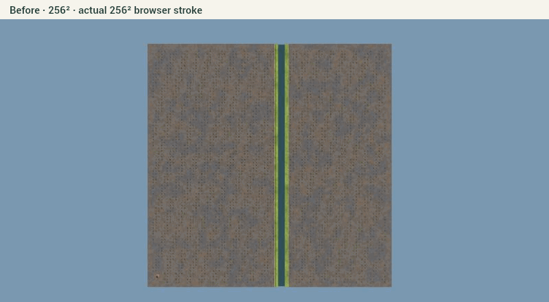
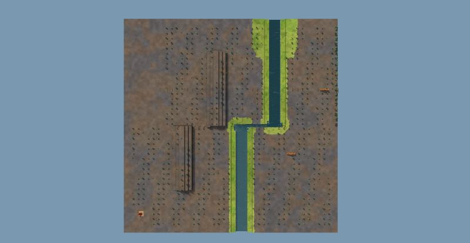
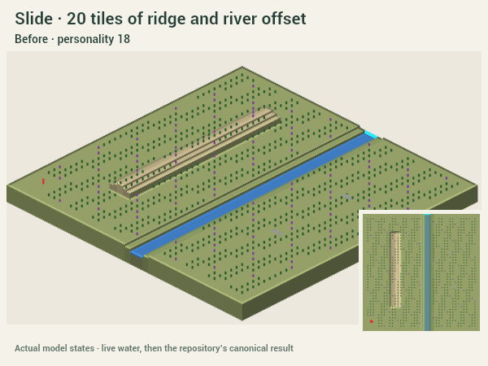
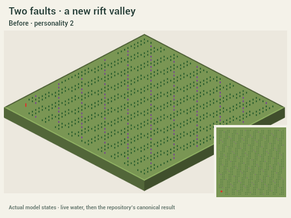
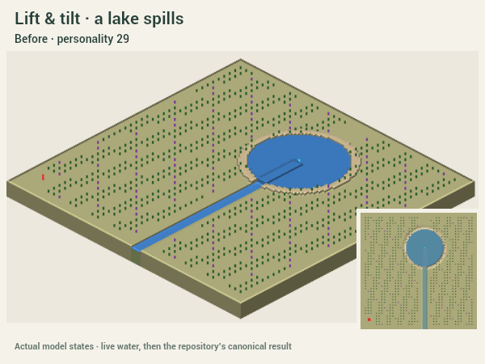
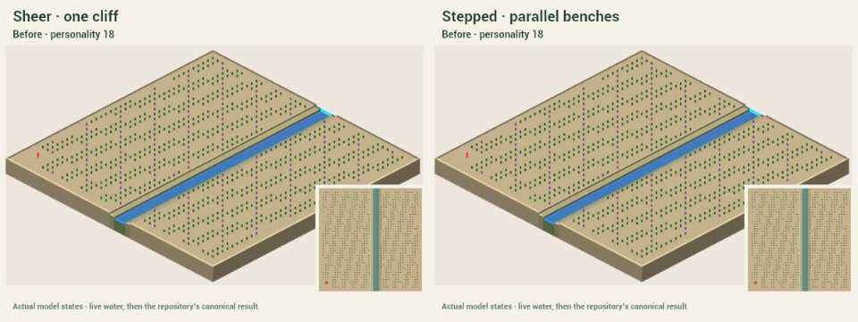

# Quake

Paint a fault. The land tears behind your hand, objects ride with it, and existing water finds a new way through.

## Slide displacement revision

The previous Slide could sample nearly stationary terrain because its three-pass inverse oscillated across the moving block boundary. A short stroke also lost most of its offset in endpoint tapering. Its test only required a changed height, so a one-level fallback scarp hid failed sideways movement.

Slide now transports the source ground forward by **3–20 tiles** (Power 0–100), using a coherent heading for the block and extending full-strength support beyond short stroke endpoints. Seeded bends define the crack; the heading follows the stroke's overall direction, with its longest chord used for closed strokes. Stepped divides the outside transition into three bands without reducing the main block's offset. Open edges use ground continuation. The unchanged bank keeps its old river course; a carved channel joins the displaced mouth. No extra water is added.

`test-slide.ts` follows actual original tiles to their destinations and compares heights, rather than counting arbitrary changes: **1,600 random Slide strokes, 1,351 accepted, 249 start refusals, minimum 30 tiles transported by at least the displayed Power in every accepted stroke**. Separate ridge and named-ruin checks cover six Powers, both sides and both scarp styles. All eight river cases remain connected in live and canonical water. The former mixed-mode test is retained for Lift and now checks Slide transport separately.

```sh
npm --prefix investigation/quake run demo
```

The launcher installs its own dependencies and prints a free local port. The picker includes generated 128² and 256² seeds, three Real places, and clearly labelled process studies. **Press, paint, release.** The left side moves by default, with a faint tint while drawing. **X** flips it mid-stroke; **Side** offers the same choice. Pick **Lift / Slide**, **Power**, and **Sheer / Stepped**. **Try another** changes the saved seed from the original ground.

**Esc or Undo restores the entire quake**, including objects and water, even during settling. Saved quakes replay their stored result exactly. Right-drag orbits, middle-drag pans, scroll zooms, and WASD moves. Camera follow and shake are optional. Reduced motion disables the effects and camera motion.

## Captures

The clean 3D demo, captured directly from its WebGL canvas:


The new recording below shows an actual curved 256² brush stroke, with the button held while the land changes. [Still image](captures/brush-paint.jpg).



Slide now joins the river's displaced mouths with a short channel along the fault:



The five refreshed sequences below use the growing brush path and live WaterSim states. Their last frame uses canonical water. They use Carve's CPU capture renderer; the browser recordings show the clean renderer and effects. Each GIF has a same-name PNG for reduced motion. [Settings and seeds](captures/scenarios.json).







## Checks

```sh
npm --prefix investigation/quake test
npm --prefix investigation/quake run typecheck
npm --prefix investigation/quake run build
npm --prefix investigation/quake run captures
```

All pass. [Model checks](captures/checks.json) cover whole levels, deterministic seeds/slices, unchanged inputs, buildable blocks, fault refusal, moving starts, object transport, edge continuity, rifts/ridges, scarps, dry ground, live waterfalls/lake spill, and exact or rejected replay. [Actual worker checks](captures/worker-checks.json) cover cancellation during planning, meshing and settling, one-step undo/redo, alternate personalities, and portable saved results. [All picker maps](captures/map-checks.json) pass both movement modes.

[Brush regressions](captures/brush-checks.json) exercise **1,200 random strokes: 861 quakes, 339 explicit start refusals, zero silent failures**. They include taps, sub-tile drags, bends, both sides and modes, low power, empty and height-capped ground. Eight river cases verify a continuous wet route from the moved sources through the fault to the old downstream course, both live and canonical. The actual worker also completed **81 random quakes with exact undo**, with 47 start refusals out of 128 candidates.

[Browser checks](captures/browser-brush.json) cover a held curved stroke at 256², one-pixel strokes, X mid-stroke, the options row, Esc, red start refusal, undo/redo, rapid consecutive strokes, Slide, and effects off. Open `/browser-check.html` on the local demo and click **Run brush checks** to reproduce them. It drives the actual DOM input handlers and worker; a native pointer drag was checked separately.

The unrecorded 256² held-stroke run measured **47 ms to changed terrain, 6.2 ms p95 frame time, and 7.1 ms maximum frame time**. The recorded run measured 78 ms, 6.2 ms p95, and 18.2 ms maximum, including canvas capture overhead. Rupture duration now follows the hand, rather than a fixed timer. These measurements describe this PC. Generation still takes several seconds in the worker. No Timberborn process was launched.

## Brush revision — supersedes the initial side-pick interaction

- The old pointer handler sampled two-tile moves, then constructed a fault whose minimum length was three tiles. That exception could stop the live line. A completed drag also waited for a separate side click. Both paths are removed. Short strokes and taps now make a small tear; flat Slide or height-capped ground receives a small whole-level scarp when displacement alone would leave no visible change.
- Picking uses the ray's continuous surface position against the stroke's original ground, avoiding tile snapping and feedback from the moving terrain. An 18 ms pen filter removes jitter. Reusable line/tint buffers update at display rate; a small GPU lurch and the dust head follow the cursor immediately. Primary pen/touch input belongs to painting, while right/middle input controls the camera.
- Worker updates coalesce to the latest growing path without starving visible ground changes. Each revision starts from the same base and seed; X recomputes the selected side rather than stacking another quake. Release drains the final revision and stores one operation. Additional strokes entered during settling are retained in order, each with its own undo.
- A start-crossing stroke turns red with “Start here” and restores any partial work. Esc also invalidates queued uploads and restores the complete view before worker acknowledgement. Lighting and surface-height bytes travel with terrain chunks so lowered ground is not mistaken for a dark cave.
- Slide identifies the original wet crossings and cuts between the transported river mouths, following the short fault offset at the existing bed level. It preserves sources and transports warm water without creating volume. Canonical water must also remain connected downstream; a dry trench alone does not pass the tests.

## Decisions and limits

- Started from dev `08039c5` in an isolated checkout; unrelated workspace work stays intact. All authored files stay here. The requested scope takes precedence over root-document/contact-sheet rules. No generator theme changed.
- Read Carve at `b14e23f` and Craterize's available local implementation based on `62a8b97`. Craterize was still being built and had no remote branch at task start. Reused their worker/cancellation pattern, clean shell and meshes, fixed effects pool, frozen geology, fallen-tree state and literal-result operation. No PR was reviewed.
- Long blocks continue to the edge; an early test caught an artificial upstream dam caused by fading displacement too soon. Short faults fade past their ends. Slide fills exposed edge terrain by nearest-ground continuation and resolves object collisions near their moved anchors.
- Terrain is always whole levels, bounded by the map limit and 22. The start keeps its footprint and entrance apron. Canonical water that would flood it causes the whole event to revert. Resource reach remains a quiet consequence check.
- Quake creates no source and does not prefill live water. The final water is the repository's canonical result. Source-free puddles can disappear at that handover. Fallen trees have a saved demo pose; production project/export support is an integration proposal.
- This is a terrain force, not a tectonic-physics model. History keeps render caches and literal water checkpoints in memory. [INTEGRATION.md](INTEGRATION.md) proposes one shared forces core and its production memory budget.

The initial foundation, model, live demo, and validation were committed separately. The brush revision adds separate model/channel, interaction, and capture/documentation commits on the same branch and PR. Large builds, dependencies and working captures are ignored. [A small saved quake](samples/tiny-quake.json) exercises portable replay.
