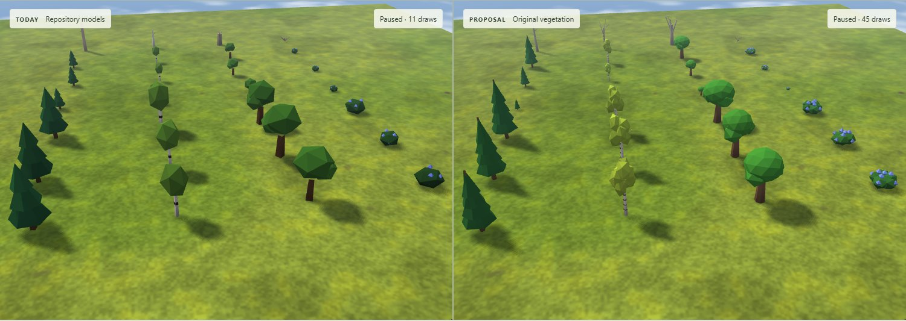

# Vegetation investigation

Prototype only, based on dev `f78d9a2`. Run `npm --prefix investigation/vegetation run demo`; the free localhost port is printed. First run installs this folder's locked dependencies. three.js is 0.186.0, the repository version.

## What to try

Drag either pane; both cameras follow. The map menu has three generated themes at 128² and 256², any seed, Victoria Falls, Yosemite and the Danube Delta. The specimen garden shows three variants, 8%/32%/66% growth and bare forms. Choose **Type lineup** and compare **Types · straight above** with **Types · low side**, then repeat in **Laptop mode**. Pick a shelf icon and hover to see the same model as a placement ghost. This previews appearance; it does not edit or export maps.

The clarity revision uses dark pointed pines, airy yellow-green birches on white trunks, broad round rich-green oaks on thick trunks, and low bushes with large blue berries above and outside the leaves. The palette is brighter and more saturated; bare dead branches are unchanged. The paired overhead and low side captures were checked visually in both detail modes. Roots vary by at most 0.07 tiles in each axis. Size, turn, hue, wind phase and rate are deterministic per tile. Roots stay still; sway increases toward the crown. Dead wood does not sway.

Every colour is editable, alongside roughness, leaf wrap, specular and ambient response. Save a tuning JSON for phase 1. No phase-1 lighting or material choice is assumed. Growth uses the stored `Growable.GrowthProgress`, including zero, rather than today's fixed half-size young flag. The scale curve is a proposed visual interpretation, not an in-game measurement; exact game stage/size matching still needs Kyler's comparison.

## Captures

Today's models are left, new models right, with the same camera and Map look 2 lighting/shadows. Compact JPEGs total about 2 MB; maps, builds and dependencies stay out of git.

- [Forest edge](captures/forest-edge.jpg), [grove close up](captures/grove.jpg).
- [Saplings and dead trees](captures/growth-and-dead.jpg), [the same on generated terrain](captures/map-growth-and-dead.jpg).
- [Whole 256² map from above](captures/whole-map-top-down.jpg), [each type from above](captures/types-top-down.jpg). Lineup columns: pine, birch, oak, berries. Bottom to top: mature, young, dead.
- [Each type from the side](captures/types-side.jpg); laptop mode [above](captures/types-top-down-laptop.jpg) and [side](captures/types-side-laptop.jpg). Blue fruit stays visible in both modes.
- [Models close up](captures/models-close.jpg), [three natural variants](captures/variants.jpg), [shelf and controls](captures/demo.jpg), [placement ghost](captures/placement-ghost.jpg).
- [Victoria Falls](captures/real-victoria-falls.jpg), [Yosemite](captures/real-yosemite.jpg), [Danube Delta](captures/real-danube-delta.jpg), [dense stress scene](captures/dense-forest-256.jpg).

## Speed and checks

**The 60-fps PC target is unverified. Keep the existing Standard path.** This environment exposes Chrome/SwiftShader, not a hardware GPU. A synthetic dense overlay puts **52,214 trees** on actual generated 256² terrain; it is a stress fixture, not the generator's normal forest placement. The normal map sweep includes three themes at both sizes, three Real places, and extra seeds 17 and 73.

The fresh single-view orbit measurement uses the same 1500 × 530 render size, a two-second warm-up and four-second sample per case. There are only 6–11 sample frames because software rendering is slow; differences are noisy. This does **not** establish hardware speed or integrated-laptop performance.

| Dense 256², software only | Median frame | FPS over sample |
|---|---:|---:|
| Today's models, soft shadows | 479 ms | 2.02 |
| New models, no sway | 752 ms | 1.15 |
| New models, sway | 758 ms | 1.14 |
| Laptop mode, no sway/detail/soft shadows | 382 ms | 2.61 |

In this sample sway adds roughly 6 ms to the median, but six frames are too few to infer a stable percentage. LOD changes during the orbit invalidate still shadows too. At rest, still shadows are cached; animated shadows redraw. [Full measurements and checks](captures/verification.json).

The separate Node test builds 52,224 trees in about 68 ms; LOD updates take 3.2 ms median / 10.6 ms p95. No per-tree CPU animation runs between frames. [CPU cost and triangle counts](captures/cpu-cost.json). Near/far triangles: pine 144/30, birch 328/28, oak 268/36, berries 164/48. Today's corresponding models are 26, 36, 48 and 52 triangles. The clarity revision cuts near oak triangles by 13% and near bush triangles by 49%; far bushes add 20 triangles for readable fruit but stay below today's 52. Instancing, LOD and wind code are unchanged. Near meshes cost more than today's; far geometry really submits fewer vertices. A moving forest uses at most 32 vegetation batches; far-only uses at most eight, including dead forms.

Laptop mode forces far meshes, no sway, DPR 1 and baked shadows. In the single new-tree pane, automatic fallback samples frames and first disables sway, then selects laptop mode if p95 stays above 22 ms. It never judges hardware from the paired workload. These are prototype fallbacks, not a claim that software rendering or every integrated GPU reaches 60 fps.

Six CPU tests pass: valid geometry, distinct variants, all 65,536 tile roots contained, actual growth parsing, lossless LOD partitioning and dense batching. Browser checks pass for bidirectional pointer camera sync, ghost rendering, wind moving both colour and depth, exactly static pixels with sway disabled, cached still shadows and laptop settings. No page/shader errors in the map sweep. TypeScript and production compilation pass. Exact source and licences: [ASSETS.md](ASSETS.md).

Reproduce after starting the demo: `npm --prefix investigation/vegetation run capture`. Use `run test`, `run check` and `run build` for local checks; fresh CPU timings go to ignored `out/cpu-cost.json`. The build verifies compilation; Real-place data is served by the local runner. The demo's **Measure** button runs six-second single-view samples; use it on the dense map on the PC, both with and without soft shadows, before deciding about Standard. [Adoption proposals](INTEGRATION.md).

## Decisions

- Keep production Standard unchanged until a real hardware comparison proves the new path is no slower. High is a proposal awaiting visual approval alongside phase 1.
- Species must read from above through shape as well as colour. Use a dark radial pine cone, light yellow-green birch clusters, a broad round rich-green oak crown, pale bare branches and low bushes with prominent blue fruit.
- Keep palette and material response adjustable. Use the existing renderer's lighting for both sides; phase 1 is not an approved dependency.
- Preserve actual stored growth progress in a demo-only sidecar. The production view currently carries only a young flag; it cannot faithfully express continuous growth.
- Use original geometry only. No Timberborn installation, files, models or textures are read.
- Work in an isolated checkout because the initial dev checkout has unrelated investigations. All committed changes stay here. Living product documents remain unchanged because this is a proposal and the user restricted scope.

## Steps

1. Read CLAUDE.md, docs/PERFECT.md, EDITOR_PLAN.md, PLAN §20, Map look 2 and current plant/ghost/icon rendering. Isolated the runner and licences. Baseline findings: current plants are instanced; young trees use a fixed half-scale; Map look 2's override depth shader needs the same wind deformation as the visible model.
2. Built the original species registry, three mature variants per species, shared young/dead forms, actual stored-growth sidecar, instancing, real geometry LOD and shared colour/depth wind. Built the worker-backed comparison, specimen garden, Real places, stress scene, tuning, shelf/ghost previews and single-view measurement. TypeScript and production compilation pass; visual and performance checks follow.
3. Corrected display-referred palette conversion, sharpened top-down categories, brought fruit onto the bush surfaces, framed actual tree groves, reduced far geometry, limited detailed offscreen casters and avoided unchanged uploads. Added CPU/browser checks and the paired captures. Measured dense software costs; documented the unverified hardware budget and kept Standard unchanged.
4. Finished adoption and phase-1 tuning proposals. The original checkout's local `dev` is older than the fetched base, so the exact `git diff --name-only dev...HEAD` publication check runs in an ignored bare audit clone with `dev` pointing at the fetched upstream base. This avoids changing the user's checked-out branch. Only `investigation/vegetation` is to be pushed, with one PR into `dev`, left open and unmerged.
5. Responded to the clarity feedback: brighter, more saturated species palettes; a cleaner pointed pine; retained white birch bark and airy clusters; a continuous broad oak crown and thicker live trunk; larger blue fruit on top and all sides of the bushes. Kept bare dead branches unchanged. Tightened the type lineup and added a low side view plus laptop-mode captures. Oak and bush near geometry is simpler than the first proposal; fresh capture and timing results follow in the next step.
6. Regenerated all paired captures, inspected normal and laptop silhouettes from above and the side, and reran the map sweep, browser checks, dense measurements, six CPU tests, type checking and build. No page or shader errors. Recorded the new geometry costs and measurements above; software timings remain too noisy to promise a hardware speed difference. Updated the existing PR only, leaving it open and unmerged.
