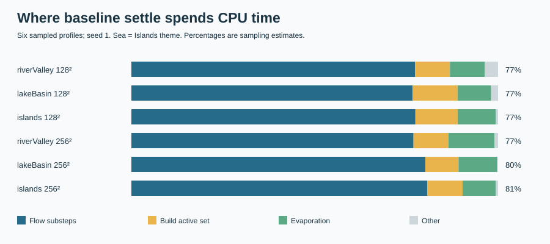
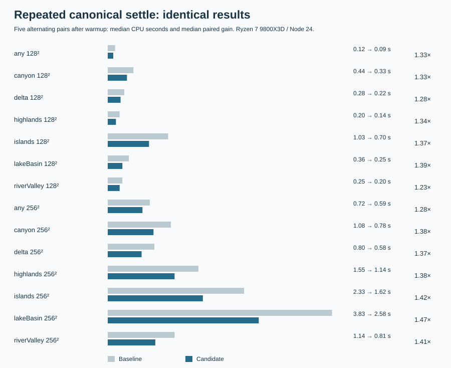

# Faster water: exact investigation

**Proposal:** adopt [water.ts](water.ts) through the milestone session; [INTEGRATION-typescript.md](INTEGRATION-typescript.md) has the proofs and regeneration commands. Product code is untouched. Reference: feature/m9b `b01f113c1d97f90de042b7cbe74d052c28f0342c`.

## Where time went and what changed

Six baseline CPU profiles (river, lake, broad sea; 128²/256²) put 77–81% in flow substeps, with active-set rebuilding and evaporation updates taking most of the remainder. The baseline already uses an active set. This proposal maintains membership and wet-neighbour counts incrementally, invalidates evaporation only where occupancy changed, caches neighbour indices, avoids redundant clearing and dry/no-inflow arithmetic, and sorts private tile indices every 64 ticks for locality. All per-tile arithmetic, reduction order, source order, starting water, two substeps and stopping checks stay intact. Extra persistent storage: 1.44 MiB at 256².

## Speed on this machine

AMD Ryzen 7 9800X3D 8-Core Processor, 16 logical CPUs; Windows, Node v24.13.0. Same input and machine before/after; clone/check time excluded. Both implementations warmed up; paired order alternated. The batch screen ran alongside verification; CPU time still includes cache/clock contention. Repeated samples were collected after this investigation's verification workers stopped; other host activity is uncontrolled. CPU and wall samples are retained in [evidence](evidence/selected.csv).

The 1,073-case one-pair screen has median speedup **1.25×**, geometric mean 1.23×. Generated 128²/256² medians: 1.24×/1.26×. Median/P90/max baseline CPU: 0.97/4.74/14.08 s; candidate: 0.78/3.78/11.41 s. These quantiles are separate distributions. The additional 96 pinned cases have a screened median of 1.42×.

Five paired observations per representative case (seed 1):

| Case | Baseline → candidate CPU seconds | Median paired gain |
|---|---:|---:|
| islands 128² | 1.03 → 0.70 | 1.37× |
| islands 256² | 2.33 → 1.62 | 1.42× |
| lakeBasin 128² | 0.36 → 0.25 | 1.39× |
| lakeBasin 256² | 3.83 → 2.58 | 1.47× |
| riverValley 128² | 0.25 → 0.20 | 1.23× |
| riverValley 256² | 1.14 → 0.81 | 1.41× |

Across these 14 cases, median paired gains for live edit/drought/badtide: **1.40×/1.33×/1.41×**. Full Normal 9-day drought and 8-day badtide measured. The three slowest and three lowest-ratio screened cases were remeasured with five pairs:

| Case | Baseline → candidate CPU seconds | Median paired gain |
|---|---:|---:|
| generated-highlands-128-15 | 0.14 → 0.11 | 1.27× |
| generated-lakeBasin-128-47 | 0.09 → 0.06 | 1.26× |
| generated-lakeBasin-128-68 | 0.03 → 0.02 | 1.94× |
| generated-islands-256-6 | 7.22 → 5.49 | 1.32× |
| generated-islands-256-10 | 8.78 → 7.20 | 1.21× |
| generated-islands-256-28 | 7.67 → 6.19 | 1.25× |

All 32 screened regressions were repeated. Four paired CPU medians remain below 1; wall gains below 1 mean slower too. Windows thread-CPU samples show coarse ~15 ms quantization, so small cases are noisy. This is not a universal performance win:

| Case | CPU gain | Wall gain |
|---|---:|---:|
| generated-riverValley-128-52 | 0.97× | 1.06× |
| generated-highlands-128-79 | 0.89× | 0.96× |
| generated-any-128-85 | 0.98× | 1.00× |
| generated-lakeBasin-256-9 | 0.99× | 1.08× |

## Exactness and limits

**Zero byte mismatches**: all 12 golden fixtures under game/legacy rules (23,400 every-tick checks plus 532 live slices), narrow/rectangular grids (3,584 ticks), 100 randomized fractional/edge/source scenes (10,000 ticks); all 19 official maps, two pinned projects and two saves; M9b's complete seven-theme seed batches (700 at 128², 350 at 256²). The matrix compared 2291 generator attempts and 329020 simulation checkpoints, including sliced canonical/live settling, every weather frame and return to normal. Water, contamination, momentum/settle.out, saturation, ticks, volume, hysteresis, accepted exports, decisions and reports matched. 93 generator refusals matched too; empty exports were never counted as successful exports.

Full product/candidate TypeScript checks pass. Chrome 154.0.8037.58: all fixtures plus six river/lake/sea models, both rules on fixtures, full weather; raw bytes agree and complete-state hashes match Node. Existing suite: **176 passed, two unchanged upstream failures** (D213 seed 23/96 has no badwater basin; historical day-one save depth error 0.0010567997879132873 exceeds 0.001). All 85 gallery pins pass; an additional 96-case matrix covers those maps, the ten determinism seeds and live seed 4242 through canonical/live/weather paths (28864 checkpoints). Four of those determinism seeds are refused identically by M9b (1000, 1037, 1111, 1185); these are water comparisons, not successful exports. Python water/basin checks pass. Independent Python oracle: 40 loads and round trips pass; 1122 generated verdicts plus 19 official maps have zero disagreements. Its commands exit nonzero solely for unchanged Any/3/128 and Islands/20/128 generator refusals; tested export hashes are bound to the final candidate.

No result-changing variant was adopted. Exact early equilibrium must preserve today's stopping tick. Cross-core work would need per-tick barriers and browser shared memory. Planned-level initialization and a longer cap require a separate decision; neither was offered as a measured proposal. Flow arithmetic still dominates. The milestone can decide how to apply this gain to #150. Bulk outputs stay in ignored local/; small evidence and chart generators are committed.
